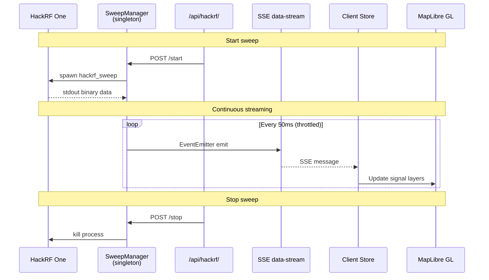
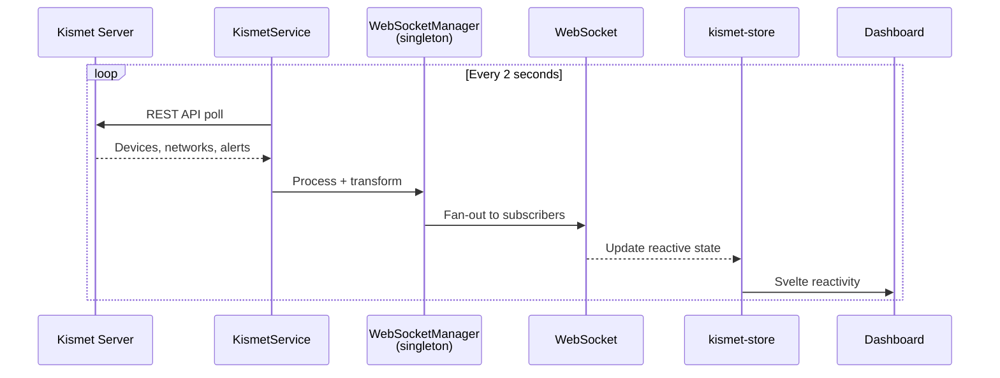
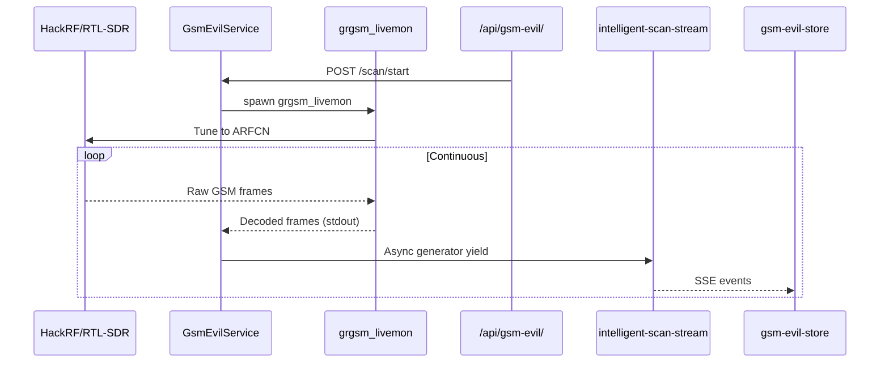
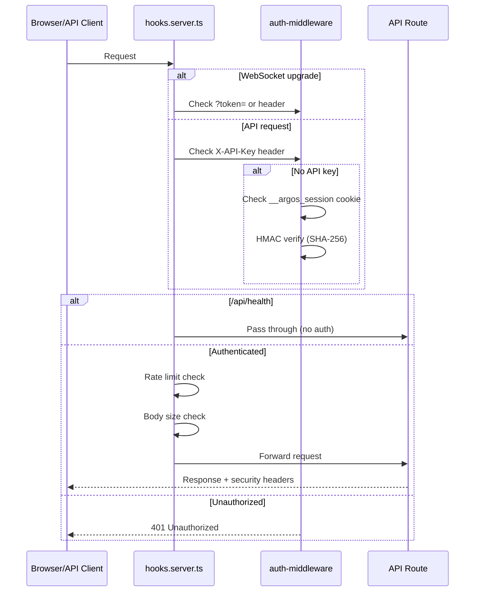

# Codebase Map

> Auto-generated by Cartographer. Last mapped: 2026-02-25T01:13:32Z

## System Overview

Argos is a **SvelteKit SDR & Network Analysis Console** deployed natively on Raspberry Pi 5 (Kali Linux) for Army EW training at NTC/JMRC. It wraps native CLI tools (hackrf_sweep, gpsd, Kismet, grgsm_livemon) into a real-time web dashboard with WebSocket push, MapLibre GL mapping, and MIL-STD-2525C symbology.

```mermaid
graph TB
    subgraph Hardware
        HackRF[HackRF One<br/>SDR Receiver]
        Alfa[Alfa WiFi<br/>Adapter]
        GPS[GPS Dongle<br/>gpsd]
        Serial[Serial Devices<br/>USB/UART]
    end

    subgraph "Server Services (src/lib/server/)"
        SweepMgr[SweepManager<br/>hackrf_sweep wrapper]
        KismetSvc[KismetService<br/>REST polling 2s]
        GsmEvil[GsmEvilService<br/>grgsm_livemon + GsmEvil2]
        GpsSvc[GpsService<br/>gpsd client, circuit breaker]
        TakSvc[TakService<br/>CoT over TLS]
        HwDetect[HardwareDetector<br/>USB/serial/network scan]
    end

    subgraph "Security Layer (hooks.server.ts)"
        Auth[Auth Gate<br/>API Key / HMAC Cookie]
        RateLimit[Rate Limiter<br/>200/min API, 30/min HW]
        BodyLimit[Body Size Limiter]
        CSP[CSP + Security Headers]
    end

    subgraph "API Layer (src/routes/api/)"
        HackRF_API[/api/hackrf/*<br/>+ /api/rf/*]
        Kismet_API[/api/kismet/*]
        GSM_API[/api/gsm-evil/*]
        GPS_API[/api/gps/*]
        TAK_API[/api/tak/*]
        System_API[/api/system/*<br/>+ /api/hardware/*]
        Signals_API[/api/signals/*]
        Health[/api/health<br/>unauthenticated]
    end

    subgraph "Real-time Transport"
        WS[WebSocketManager<br/>ws library upgrade]
        SSE_HackRF[SSE /api/hackrf/data-stream<br/>50ms throttle]
        SSE_GSM[SSE /api/gsm-evil/<br/>intelligent-scan-stream]
    end

    subgraph "Client (Browser)"
        Stores[Svelte Stores<br/>14 reactive stores]
        BaseWS[BaseWebSocket<br/>exponential backoff]
        Components[UI Components<br/>Lunaris design system]
        Map[MapLibre GL<br/>MIL-STD-2525C symbols]
    end

    subgraph "Data Layer"
        SQLite[(rf_signals.db<br/>better-sqlite3)]
        Zod[Zod Schemas<br/>6 schema files]
    end

    HackRF --> SweepMgr
    Alfa --> KismetSvc
    GPS --> GpsSvc
    Serial --> HwDetect

    SweepMgr --> HackRF_API
    KismetSvc --> Kismet_API
    GsmEvil --> GSM_API
    GpsSvc --> GPS_API
    TakSvc --> TAK_API
    HwDetect --> System_API

    HackRF_API --> SSE_HackRF
    GSM_API --> SSE_GSM
    Kismet_API --> WS

    Auth --> RateLimit --> BodyLimit --> CSP

    SSE_HackRF --> Stores
    SSE_GSM --> Stores
    WS --> BaseWS --> Stores
    Stores --> Components
    Components --> Map

    Signals_API --> SQLite
    Zod -.-> HackRF_API
    Zod -.-> Kismet_API
    Zod -.-> GSM_API
```

## Directory Structure

```
Argos/
├── src/                           # Application source (467k tokens)
│   ├── routes/                    # SvelteKit file-based routing
│   │   ├── api/                   # 19 REST API domains, 66 route files (43k tokens)
│   │   │   ├── hackrf/            # HackRF sweep control + SSE data stream
│   │   │   ├── rf/                # RF signal CRUD (shares sweepManager singleton)
│   │   │   ├── kismet/            # Kismet WiFi proxy (devices, networks, alerts, channels)
│   │   │   ├── gsm-evil/          # GSM monitoring (scan, towers, ARFCN, intelligent-scan-stream)
│   │   │   ├── gps/               # GPS position + satellite data
│   │   │   ├── tak/               # TAK server config + connection management
│   │   │   ├── signals/           # Signal database queries + statistics
│   │   │   ├── system/            # System info (memory, CPU, uptime, services)
│   │   │   ├── hardware/          # Hardware detection API
│   │   │   ├── agent/             # AI agent streaming endpoint
│   │   │   ├── terminal/          # Terminal session management
│   │   │   ├── weather/           # Weather data proxy
│   │   │   ├── cell-towers/       # Cell tower lookup
│   │   │   ├── database/          # Database admin queries
│   │   │   ├── db/                # DB health check
│   │   │   ├── map-tiles/         # Map tile proxy
│   │   │   ├── openwebrx/         # OpenWebRX proxy
│   │   │   ├── streaming/         # Stream status
│   │   │   └── health/            # Unauthenticated health check
│   │   ├── dashboard/             # Main dashboard page (keep-alive tab pattern)
│   │   ├── gsm-evil/              # GSM monitoring page (rendered as iframe)
│   │   └── +page.svelte           # Root page
│   ├── lib/
│   │   ├── server/                # Server-only code (179k tokens)
│   │   │   ├── services/          # Hardware/protocol service wrappers
│   │   │   │   ├── gps/           # GPS with circuit breaker (30s cooldown, 5s cache)
│   │   │   │   ├── gsm-evil/      # GSM Evil orchestrator (17 files, grgsm_livemon + GsmEvil2)
│   │   │   │   ├── kismet/        # Kismet REST API client (4 files)
│   │   │   │   └── cell-towers/   # OpenCelliD lookup (2 files, service + HTTP client)
│   │   │   ├── hackrf/            # SweepManager singleton (EventEmitter, SSE)
│   │   │   ├── hardware/          # USB/serial/network hardware detection
│   │   │   ├── auth/              # Auth middleware (API key + HMAC session token)
│   │   │   ├── security/          # Input sanitizer (6 validators), security utils
│   │   │   ├── db/                # RFDatabase singleton (better-sqlite3)
│   │   │   ├── kismet/            # WebSocketManager (Kismet polling → client fan-out)
│   │   │   ├── tak/               # TakService + TakBroadcast (CoT over TLS)
│   │   │   ├── mcp/               # 7 MCP diagnostic servers (HTTP API client)
│   │   │   ├── api/               # createHandler() factory + errMsg() utilities
│   │   │   ├── agent/             # AI agent runtime (Claude Sonnet 4) + tool definitions
│   │   │   ├── env.ts             # Zod-validated environment variables (centralized)
│   │   │   ├── exec.ts            # execFileAsync() — safe child process execution
│   │   │   ├── result.ts          # safe()/safeSync() Result tuple pattern
│   │   │   ├── retry.ts           # withRetry() higher-order function
│   │   │   └── timeout.ts         # withTimeout() higher-order function
│   │   ├── components/            # Svelte 5 components (116 files, 111k tokens)
│   │   │   ├── dashboard/         # Dashboard UI (map, panels, tabs, status bar)
│   │   │   │   ├── map/           # MapLibre GL integration, GeoJSON, cell towers, GPS derived state
│   │   │   │   ├── panels/        # Overview, Tools, Layers, Settings, Devices panels
│   │   │   │   └── tak/           # TAK server configuration (9 files, 3 new decomposed)
│   │   │   ├── gsm-evil/          # GSM monitoring (6 components)
│   │   │   ├── status/            # Status indicators, connection status
│   │   │   └── ui/                # 8 shadcn-svelte component families (35 files)
│   │   ├── stores/                # 17 Svelte store files (15k tokens)
│   │   │   ├── dashboard/         # dashboard-store, terminal-store, tools-store, map-settings, agent-context
│   │   │   ├── tactical-map/      # gps-store, kismet-store, hackrf-store, map-store
│   │   │   ├── gsm-evil-store.ts  # GSM towers, ARFCN data, scan state (232 lines)
│   │   │   ├── gsm-evil-types.ts  # GSM Evil state interfaces and constants (extracted)
│   │   │   ├── gsm-evil-persistence.ts  # GSM Evil localStorage helpers (extracted)
│   │   │   └── ...                # tak-store, theme-store, connection, persisted-writable
│   │   ├── hackrf/                # Client-side sweep manager modules (16k tokens)
│   │   │   └── sweep-manager/     # BufferManager, ProcessManager, ErrorTracker, ErrorRecovery
│   │   ├── themes/                # palettes.ts (13 MIL-STD accent palette definitions)
│   │   ├── data/                  # Static data (tool hierarchy, carrier mappings)
│   │   ├── types/                 # 13 TypeScript type definition files
│   │   ├── schemas/               # 6 Zod validation schemas
│   │   ├── map/                   # Map utilities (layers/, symbols/, visibility-engine)
│   │   ├── utils/                 # 19 files: logger, fetchJSON, validateForm, geo, delay, theme-colors, etc.
│   │   ├── websocket/             # BaseWebSocket decomposed into 4 files
│   │   └── styles/                # palantir-design-system.css (Lunaris token bridge), dashboard.css
│   ├── app.d.ts                   # Typed globalThis singletons (SweepManager, WSManager, etc.)
│   ├── hooks.server.ts            # Security middleware chain + WebSocket upgrade
│   ├── hooks.client.ts            # Client-side error handling
│   └── app.css                    # Global styles (Tailwind + Lunaris tokens, 257 lines)
├── tests/                         # Test suites (66k tokens)
│   ├── unit/                      # Unit tests
│   ├── integration/               # API + WebSocket integration tests
│   ├── security/                  # Auth, injection, rate-limit, property-based
│   ├── e2e/                       # Playwright end-to-end
│   ├── visual/                    # Puppeteer + pixelmatch visual regression
│   ├── performance/               # Performance benchmarks
│   ├── load/                      # Load tests
│   └── setup.ts                   # Global mocks (WebSocket, fetch, localStorage)
├── config/                        # Build & tool configuration
│   ├── vite.config.ts             # Tailwind + SvelteKit + terminal plugin + chunking
│   ├── eslint.config.js           # Cyclomatic ≤5, cognitive ≤5 as hard errors
│   ├── playwright.config.ts       # E2E test configuration
│   └── vite-plugin-terminal.ts    # Custom Vite plugin (node-pty, session persistence)
├── scripts/                       # Operations & dev scripts (26k tokens)
│   ├── ops/                       # setup-host.sh, install-services.sh, keepalive
│   └── dev/                       # vite-oom-protect.sh, kill-dev.sh
├── deployment/                    # 10 systemd service files (__PROJECT_DIR__ tokens)
├── static/
│   └── fonts/                     # Self-hosted fonts
│       ├── geist.css              # Geist Sans @font-face declarations (400/500/600)
│       ├── geist/                 # Geist woff2 files (Regular, Medium, SemiBold)
│       └── firacode-nerd-font.css # Fira Code Nerd Font for terminals
├── docs/                          # Documentation (163k tokens)
│   ├── General Documentation/     # 13 reference docs
│   ├── designs/                   # pencil-lunaris.pen (authoritative UI reference)
│   └── prompts/                   # 16 Claude Code prompt templates
├── specs/                         # Feature specifications (56k tokens)
│   ├── 016-code-expressiveness/   # Code quality refactor (complete)
│   └── 017-lunaris-ui-unification/ # Design system token migration (complete)
├── plans/                         # Integration & UI plans (238k tokens)
│   └── Argos_tools_integration/   # RF tool deployment matrix
└── _bmad/                         # BMAD framework tooling (not app code)
```

## Module Guide

### Server Services (`src/lib/server/services/`)

**Purpose**: Wrap native CLI tools and external APIs into managed TypeScript services.

| Module      | Key Files                                                                | Purpose                                 | Key Pattern                                      |
| ----------- | ------------------------------------------------------------------------ | --------------------------------------- | ------------------------------------------------ |
| GPS         | `gps/gps-position-service.ts`, `gps-satellite-service.ts` (7 files)      | gpsd client with circuit breaker        | 30s cooldown after 3 failures, 5s position cache |
| GSM Evil    | `gsm-evil/gsm-evil-control-service.ts`, `gsm-scan-service.ts` (17 files) | Orchestrates grgsm_livemon + GsmEvil2   | Child process spawning, stream parsing           |
| Kismet      | `kismet/kismet-control-service.ts` (4 files)                             | REST API client for Kismet WiFi scanner | Polling proxy, response transformation           |
| Cell Towers | `cell-towers/cell-tower-service.ts`, `opencellid-client.ts`              | OpenCelliD cell tower lookup            | HTTP client extraction, location cache           |

**Spec-016 decompositions** (new files extracted from oversized modules):

| Extracted File                       | Extracted From                       | Purpose                                     |
| ------------------------------------ | ------------------------------------ | ------------------------------------------- |
| `gsm-evil/gsm-evil-health-checks.ts` | `gsm-evil-health-service.ts`         | Health check logic (245 lines extracted)    |
| `gsm-evil/gsm-scan-events.ts`        | `gsm-scan-capture.ts`                | Scan event handling (138 lines extracted)   |
| `gsm-evil/gsm-grgsm-process.ts`      | `gsm-scan-frequency-analysis.ts`     | grgsm process spawning (59 lines extracted) |
| `kismet/kismet-geo-helpers.ts`       | `kismet-control-service-extended.ts` | Geo calculation helpers (45 lines)          |
| `kismet/kismet-status-checker.ts`    | `kismet.service.ts`                  | Status polling logic (88 lines)             |
| `cell-towers/opencellid-client.ts`   | `cell-tower-service.ts`              | HTTP client for OpenCelliD API (166 lines)  |

### HackRF Subsystem (`src/lib/server/hackrf/`)

**Purpose**: Manage HackRF One SDR hardware for spectrum analysis.

| File                         | Purpose                                                                                         |
| ---------------------------- | ----------------------------------------------------------------------------------------------- |
| `sweep-manager.ts`           | **Singleton** (globalThis). EventEmitter wrapping hackrf_sweep. SSE support with 50ms throttle. |
| `sweep-manager-lifecycle.ts` | Start/stop lifecycle management (extracted from sweep-manager.ts)                               |

Client-side counterpart at `src/lib/hackrf/sweep-manager/`:

| File                  | Purpose                                                  |
| --------------------- | -------------------------------------------------------- |
| `buffer-manager.ts`   | 1MB max buffer, 50% overflow trim                        |
| `process-manager.ts`  | Spawns `auto_sweep.sh`, manages lifecycle                |
| `error-tracker.ts`    | Error accumulation and reporting                         |
| `error-recovery.ts`   | Error recovery strategies (extracted from error-tracker) |
| `frequency-cycler.ts` | Frequency band rotation                                  |

### Auth & Security (`src/lib/server/auth/`, `security/`)

**Purpose**: Fail-closed authentication and input validation.

| File                          | Purpose                                                                     |
| ----------------------------- | --------------------------------------------------------------------------- |
| `auth-middleware.ts`          | API key header OR HMAC session cookie validation + `validateSessionToken()` |
| `security/input-sanitizer.ts` | 6 validators: IP, hostname, interface, PID, path, generic string            |

**Security hardening (spec-016)**: WebSocket `?token=` param now accepts only the HMAC-derived session token, NOT the raw API key. This prevents credential exposure in URLs, logs, and referrer headers per OWASP A07:2021.

### Database (`src/lib/server/db/`)

**Purpose**: Direct SQLite operations via better-sqlite3 singleton.

| File          | Purpose                                                  |
| ------------- | -------------------------------------------------------- |
| `database.ts` | RFDatabase singleton class. Prepared statements. No ORM. |

Migrations: `scripts/db-migrate.ts`

### WebSocket Infrastructure

**Server** (`src/lib/server/kismet/web-socket-manager.ts`):

- Polls Kismet REST API every 2 seconds
- Fans out to subscribed WebSocket clients
- globalThis singleton for HMR survival

**Client** (`src/lib/websocket/` — 4 files, decomposed from monolithic base.ts):

| File                     | Purpose                                         |
| ------------------------ | ----------------------------------------------- |
| `base.ts`                | BaseWebSocket class (281 lines, down from ~400) |
| `websocket-types.ts`     | Config types, defaults, WebSocket factory       |
| `websocket-heartbeat.ts` | Heartbeat start/stop with timeout detection     |
| `websocket-reconnect.ts` | Exponential backoff reconnection scheduling     |

### API Layer (`src/routes/api/`)

**Purpose**: 19 REST API domains behind auth + rate limiting.

| Domain      | Routes | Transport  | Notes                                              |
| ----------- | ------ | ---------- | -------------------------------------------------- |
| hackrf      | 6      | REST + SSE | `data-stream` uses SSE with 50ms throttle          |
| rf          | 5      | REST       | Shares sweepManager singleton with hackrf          |
| kismet      | 6      | REST       | Proxy to Kismet REST API                           |
| gsm-evil    | 12     | REST + SSE | `intelligent-scan-stream` uses async generator SSE |
| gps         | 3      | REST       | Circuit-breaker-protected                          |
| tak         | 6      | REST       | TLS certificate management                         |
| signals     | 4      | REST       | SQLite query endpoints                             |
| system      | 8      | REST       | Memory, CPU, services, uptime, logs                |
| hardware    | 3      | REST       | USB/serial/network detection                       |
| agent       | 2      | REST + SSE | AI agent streaming (Claude Sonnet 4)               |
| terminal    | 1      | REST       | node-pty session management                        |
| weather     | 1      | REST       | Weather data proxy                                 |
| cell-towers | 1      | REST       | Cell tower lookup                                  |
| database    | 3      | REST       | Database admin queries                             |
| db          | 1      | REST       | DB health check                                    |
| map-tiles   | 1      | REST       | Map tile proxy                                     |
| openwebrx   | 1      | REST       | OpenWebRX proxy                                    |
| streaming   | 1      | REST       | Stream status                                      |
| health      | 1      | REST       | **Only unauthenticated endpoint**                  |

**Route handler patterns**:

- `createHandler()` factory used in **53 of 66 routes** (migrated in spec-016 Phase 18). Provides: automatic try-catch, structured logging, JSON wrapping, optional Zod body validation.
- 9 routes use manual handlers: SSE streams (4), WebSocket proxy (1), health check (1), tile proxy (1), streaming status (1), RF data-stream (1) — all require custom Response handling.

### Svelte Stores (`src/lib/stores/`)

**Purpose**: Client-side reactive state management using Svelte 5 runes.

| Store                                   | Purpose                                                  |
| --------------------------------------- | -------------------------------------------------------- |
| `dashboard/dashboard-store.ts`          | Active panel, tab state, layout preferences              |
| `dashboard/terminal-store.ts`           | Terminal session state                                   |
| `dashboard/terminal-session-helpers.ts` | Terminal session lifecycle helpers (extracted)           |
| `dashboard/tools-store.ts`              | Tool hierarchy navigation                                |
| `dashboard/map-settings-store.ts`       | Map layer and view settings                              |
| `dashboard/agent-context-store.ts`      | AI agent conversation context (type-safe devices)        |
| `tactical-map/gps-store.ts`             | GPS position, satellite data                             |
| `tactical-map/kismet-store.ts`          | WiFi devices, networks, alerts                           |
| `tactical-map/hackrf-store.ts`          | HackRF sweep state                                       |
| `tactical-map/map-store.ts`             | Map instance and viewport state                          |
| `tak-store.ts`                          | TAK server connection, CoT entities                      |
| `gsm-evil-store.ts`                     | GSM towers, ARFCN data, scan state (232 lines)           |
| `gsm-evil-types.ts`                     | GSM Evil state interfaces and constants (extracted)      |
| `gsm-evil-persistence.ts`               | GSM Evil localStorage helpers (extracted)                |
| `theme-store.svelte.ts`                 | Theme selection (dark only, 13 Lunaris MIL-STD palettes) |
| `connection.ts`                         | WebSocket connection status                              |
| `persisted-writable.ts`                 | Persistent store factory (localStorage)                  |

### UI Components (`src/lib/components/`)

**Purpose**: Svelte 5 component library following Lunaris design system.

**Layout hierarchy**:

```
TopStatusBar (40px command bar)
├── IconRail (48px left rail)
├── PanelContainer (280px overview panel)
│   ├── OverviewPanel
│   ├── ToolsPanel
│   ├── LayersPanel
│   └── SettingsPanel
├── DashboardMap (fill, MapLibre GL)
│   ├── GeoJSON signal layers
│   ├── MIL-STD-2525C symbols (SymbolFactory)
│   └── Cell tower markers (OpenCelliD)
└── ResizableBottomPanel (240px)
```

**GSM Evil** (`components/gsm-evil/`): ScanConsole, TowerTable, LiveFramesConsole, ErrorDialog, GsmHeader, ScanResultsTable

**TAK** (`components/dashboard/tak/`): 9 files — TakConfigView, TakServerForm (extracted), TakAuthMethodPicker (extracted), TakAuthEnroll, TakAuthImport, TakDataPackage, TakStatusSection, TakTruststore, tak-config-logic.ts

**shadcn-svelte primitives** (`components/ui/`): 8 component families (35 files) — AlertDialog, Badge, Button, Input, Select, Separator, Switch, Table. Direct imports (no barrel files).

### Map System (`src/lib/map/` + `components/dashboard/map/`)

| File                                   | Purpose                                                                       |
| -------------------------------------- | ----------------------------------------------------------------------------- |
| `symbols/symbol-factory.ts`            | MIL-STD-2525C military symbol rendering                                       |
| `layers/satellite-layer.ts`            | Google Hybrid tile source                                                     |
| `layers/symbol-layer.ts`               | Map symbol layer management                                                   |
| `visibility-engine.ts`                 | Layer visibility state machine                                                |
| `components/.../map/map-colors.ts`     | Map paint color constants (CSS var + hex fallback pairs, `resolveMapColor()`) |
| `components/.../map/map-helpers.ts`    | Map GeoJSON builders and utility functions (259 lines)                        |
| `components/.../map/map-overrides.css` | MapLibre GL CSS overrides for Lunaris theme (56 lines)                        |

### Terminal Theme (`src/lib/components/dashboard/terminal/`)

| File                | Purpose                                                                                                |
| ------------------- | ------------------------------------------------------------------------------------------------------ |
| `terminal-theme.ts` | xterm.js ITheme builder — resolves CSS vars for cursor, selection, chrome; fixed ANSI 16-color palette |

### Schemas (`src/lib/schemas/`)

| File          | Validates                   |
| ------------- | --------------------------- |
| `api.ts`      | API request/response shapes |
| `database.ts` | Database record shapes      |
| `hardware.ts` | Hardware detection results  |
| `kismet.ts`   | Kismet API responses        |
| `rf.ts`       | RF signal data              |
| `stores.ts`   | Store state shapes          |

### MCP Servers (`src/lib/server/mcp/`)

7 diagnostic servers built on a dynamic server framework (`dynamic-server.ts`). They communicate with Argos via HTTP API (localhost:5173) — **cannot import SvelteKit internals**.

| Server              | Purpose                            |
| ------------------- | ---------------------------------- |
| hardware-debugger   | Hardware detection diagnostics     |
| system-inspector    | System resource monitoring         |
| streaming-inspector | WebSocket/SSE stream diagnostics   |
| database-inspector  | SQLite query and schema inspection |
| api-debugger        | API endpoint testing               |
| test-runner         | Test execution and results         |
| gsm-evil            | GSM Evil service diagnostics       |

### Shared Server Utilities

**`src/lib/server/api/`**:

| File                | Exports                        | Purpose                                       |
| ------------------- | ------------------------------ | --------------------------------------------- |
| `error-utils.ts`    | `errMsg()`, `normalizeError()` | Error message extraction, error normalization |
| `create-handler.ts` | `createHandler()`              | Route handler factory (used by 53/66 routes)  |

**`src/lib/server/agent/`**:

| File                           | Purpose                                        |
| ------------------------------ | ---------------------------------------------- |
| `runtime.ts`                   | AI agent runtime (Claude Sonnet 4, streaming)  |
| `frontend-tools.ts`            | Agent tool execution logic                     |
| `frontend-tool-definitions.ts` | Tool schema definitions (extracted, 294 lines) |

**`src/lib/server/tak/`**:

| File               | Purpose                                           |
| ------------------ | ------------------------------------------------- |
| `tak-service.ts`   | TakService (CoT over TLS, exponential reconnect)  |
| `tak-broadcast.ts` | CoT broadcast helper (extracted from tak-service) |

**`src/lib/server/`** (top-level utilities):

| File         | Exports                | Purpose                                                        |
| ------------ | ---------------------- | -------------------------------------------------------------- |
| `exec.ts`    | `execFileAsync()`      | Safe child process execution (no shell, argument arrays only)  |
| `env.ts`     | `env`                  | Centralized Zod-validated env vars (all URLs, API keys, paths) |
| `result.ts`  | `safe()`, `safeSync()` | Result tuple pattern `[data, null] \| [null, error]`           |
| `retry.ts`   | `withRetry()`          | Higher-order retry wrapper with exponential backoff            |
| `timeout.ts` | `withTimeout()`        | Higher-order timeout wrapper                                   |

### Client Utilities (`src/lib/utils/`)

**Purpose**: Shared client-side utilities (19 files).

| File                  | Purpose                                                                  |
| --------------------- | ------------------------------------------------------------------------ |
| `theme-colors.ts`     | `resolveThemeColor()` — resolves CSS custom properties to hex at runtime |
| `signal-utils.ts`     | RSSI → signal band mapping using Lunaris CSS tokens (5 bands + none)     |
| `fetch-json.ts`       | Typed `fetchJSON<T>()` wrapper — replaces scattered fetch                |
| `validate-form.ts`    | Form validation helper with error accumulation                           |
| `geo.ts`              | Geographic calculations (distance, bearing, MGRS)                        |
| `delay.ts`            | Promise-based `delay()` utility                                          |
| `logger.ts`           | Structured logger (server + client)                                      |
| `validation-error.ts` | Typed validation error class                                             |

## Data Flow

### Spectrum Analysis (HackRF)



### WiFi Monitoring (Kismet)



### GSM Monitoring



### Authentication Flow



## Conventions

### Singleton Pattern

Server-side singletons use `globalThis` for HMR survival, now typed via `src/app.d.ts`:

```typescript
// src/app.d.ts declares: var __argos_sweepManager: SweepManager | undefined;
// Usage in modules — no more unsafe `as Record<string, unknown>` casts:
export const sweepManager: SweepManager =
	globalThis.__argos_sweepManager ?? (globalThis.__argos_sweepManager = new SweepManager());
```

Used by: SweepManager, WebSocketManager, RateLimiter, RFDatabase

### Error Handling

Two patterns in use (consolidated from three):

1. **`createHandler()`** — Route handler factory with built-in try-catch, logging, and optional Zod validation. **Primary pattern** (53/66 routes).
2. **`safe()`/`safeSync()`** — Result tuple: `[data, null] | [null, error]` (used in service-layer code).

Legacy `errMsg()` utility is still exported but rarely used directly — `createHandler()` calls it internally.

### Circular Dependency Resolution

8 cycles broken by extracting shared types into dedicated files:

- `*-types.ts` files contain interfaces/types shared between service and consumer
- Import the types file instead of the service file when only types are needed

### File Naming

- `kebab-case.ts` for all files
- `+page.svelte`, `+server.ts` for SvelteKit routes
- `.test.ts` suffix for test files

### Component Patterns (Svelte 5)

- All components use runes: `$state`, `$derived`, `$effect`, `$props`, `$bindable`
- Namespace pattern for compound components: `const Table = { Root, Header, Row, ... }`
- Direct imports from source (no barrel files anywhere)

### CSS Token Architecture (spec-017)

Three-layer token system — all hex, no oklch:

```
Layer 1: Base Tokens (app.css :root)
  └── --background, --card, --border, --primary, --success, --warning, ...
  └── --signal-very-strong, --signal-strong, --signal-good, --signal-fair, --signal-weak
  └── --widget-bg, --hover-tint, --separator, --bar-track, --switch-off
  └── --success-bg, --warning-bg, --error-bg, --info-bg
  └── --chart-1..5, --feature-rf, --feature-drone, --feature-radio

Layer 2: Palantir Bridge (palantir-design-system.css)
  └── --palantir-bg-*, --palantir-text-*, --palantir-accent-*, --palantir-signal-*
  └── Maps --palantir-* → var(--base-token) so dashboard components use semantic names
  └── Also defines spacing (--space-1..12), typography scale (--text-hero..section), radius

Layer 3: Tailwind Utilities (app.css @theme inline)
  └── --color-* mappings → enables bg-success, text-warning, border-border etc.
```

**Palette switching**: 13 MIL-STD themes defined as `[data-palette='...']` selectors, each overriding only `--primary`. Applied via `data-palette` attribute on `<html>`. FOUC prevention in `app.html` sync script.

**Font system**: Dual-font with Geist (sans) as body default, Fira Code (mono) for data. Dashboard layout tokens: `--font-primary: var(--font-mono)`, `--font-secondary: var(--font-sans)`.

**Runtime resolution**: `src/lib/utils/theme-colors.ts` exports `resolveThemeColor(varName, fallback)` for contexts where CSS vars aren't available (MapLibre GL, xterm.js, Leaflet markers). Used by `map-colors.ts`, `signal-utils.ts`, `terminal-theme.ts`.

## Gotchas

### Dual API Namespaces

Both `/api/hackrf/` and `/api/rf/` control the same `sweepManager` singleton. Changes to sweep state via one namespace affect the other.

### Memory Pressure

RPi 5 has 8GB RAM with ~2.7GB effective headroom. `svelte-check` uses ~650MB — never run multiple instances. Lock file at `/tmp/argos-typecheck.lock` enforces single instance.

### WebSocket Auth

WebSocket connections require auth via HMAC-derived session `?token=` param OR `X-API-Key` header — cookies are NOT checked for WebSocket upgrades. Raw API keys in query strings are rejected (OWASP A07:2021).

### Rate Limit Tiers

- Standard API: 200 req/min
- Hardware control: 30 req/min
- Tailscale clients: 60 req/min (elevated for GSM Evil rapid calls)

### GPS Circuit Breaker

GPS service enters 30-second cooldown after 3 consecutive failures. During cooldown, returns cached position (5s TTL) or null.

### GSM Evil Iframe Isolation

The GSM Evil page renders inside an iframe on the dashboard for process isolation. The `gsm-evil-store` was decomposed from 321 → 232 lines (types + persistence extracted to separate files).

### globalThis Singletons

All server singletons persist across HMR via `globalThis.__argos_*` properties, now type-safe via `src/app.d.ts` declarations. State survives Vite hot reloads but NOT server restarts.

### Three-Layer Token System

All components now reference CSS custom properties (no hardcoded hex). However, the system has three layers:

- **Base tokens** (`--background`, `--primary`, etc.) in `app.css` — the source of truth
- **Palantir bridge** (`--palantir-bg-*`, `--palantir-text-*`) in `palantir-design-system.css` — maps to base tokens, used by dashboard components
- **Tailwind utilities** (`bg-background`, `text-primary`) in `app.css @theme inline` — maps to base tokens

When adding new colors: define in `:root`, add bridge alias if dashboard needs it, add `@theme inline` mapping if Tailwind classes are needed.

### Runtime Color Resolution

MapLibre GL, xterm.js, and Leaflet markers can't read CSS variables directly. These use `resolveThemeColor()` from `theme-colors.ts` to get computed hex at render time. Map and terminal colors update when the palette changes, but only on re-render (not via CSS cascade).

### Oversized Functions

Reduced by spec-016 decomposition but some remain. Previously ~13 functions exceeded 50-line limit; worst offenders were addressed by extracting health checks, scan events, tool definitions, lifecycle management, and store types into separate files. Remaining oversized files: `kismet-control-service-extended.ts` (241 lines), `sweep-manager.ts` (299 lines), `tak-service.ts` (298 lines).

### Test Safety

Running `npm run test:unit` (full suite) is unsafe while VS Code Server (Antigravity) is active — combined memory exceeds available headroom. Use targeted tests: `npx vitest run --no-coverage <specific files>`.

### No Barrel Files

All barrel files (`index.ts`) were eliminated. Import directly from source files. No exceptions.

## Navigation Guide

**To add a new API endpoint**:

1. Create `src/routes/api/<domain>/+server.ts`
2. Add Zod schema in `src/lib/schemas/` if needed
3. Use `createHandler()` (standard) — only use manual handlers for SSE/streaming endpoints
4. Auth is automatic via `hooks.server.ts` (all routes except `/api/health`)
5. Add tests in `tests/unit/` or `tests/integration/`

**To add a new Svelte component**:

1. Create in `src/lib/components/<area>/<component-name>.svelte`
2. Use Svelte 5 runes (`$state`, `$derived`, `$effect`, `$props`)
3. Use `--palantir-*` tokens for dashboard, or Tailwind `bg-*`/`text-*` utilities
4. For colors outside CSS context (canvas, map markers), use `resolveThemeColor()` from `theme-colors.ts`
5. Handle all states: Empty, Loading, Default, Active, Error, Success, Disabled, Disconnected
6. Max 300 lines per file

**To add a new hardware service**:

1. Create service in `src/lib/server/services/<service>/`
2. Use `safe()` result tuples for error handling
3. Consider circuit breaker pattern (see GPS service)
4. Use `globalThis` singleton if state must survive HMR
5. Register API routes in `src/routes/api/<domain>/`
6. Add hardware detection in `src/lib/server/hardware/`

**To add a new store**:

1. Create in `src/lib/stores/<name>-store.ts`
2. Use Svelte 5 runes for reactive state
3. Add Zod schema in `src/lib/schemas/stores.ts`
4. Connect to WebSocket or API as needed via `BaseWebSocket`

**To modify authentication**:

1. Auth middleware: `src/lib/server/auth/auth-middleware.ts`
2. Auth gate: `src/hooks.server.ts` (search for "auth")
3. WebSocket auth: `src/lib/server/middleware/ws-connection-handler.ts`
4. Env validation: `src/lib/server/env.ts` (centralized — all URLs, keys, paths)
5. Session cookie: HMAC-derived `__argos_session`
6. Rate limits: configured in `hooks.server.ts`

**To add a new design token**:

1. Define base token in `src/app.css` `:root` block
2. Add `--palantir-*` bridge alias in `src/lib/styles/palantir-design-system.css` (if dashboard components need it)
3. Add `--color-*` Tailwind mapping in `src/app.css` `@theme inline` block (if Tailwind classes needed)
4. If used by map/terminal/canvas, add entry in `map-colors.ts` or use `resolveThemeColor()` directly
5. For palette-sensitive values, ensure the token references `var(--primary)` or another palette-swapped base

**To add map layers**:

1. GeoJSON builder in `src/lib/components/dashboard/map/`
2. Color definitions in `src/lib/components/dashboard/map/map-colors.ts` (use CSS var + hex fallback pairs)
3. Symbol definition in `src/lib/map/symbols/symbol-factory.ts`
4. Layer visibility in `src/lib/map/visibility-engine.ts`
5. Tile sources in `src/lib/map/layers/satellite-layer.ts`

**To run tests safely on RPi**:

```bash
# Targeted (safe, low memory)
npx vitest run --no-coverage src/lib/server/services/gps/gps-service.test.ts

# Full unit suite (only when Antigravity/VS Code is stopped)
npm run test:unit

# Security suite
npm run test:security

# E2E (requires running dev server)
npm run test:e2e
```
