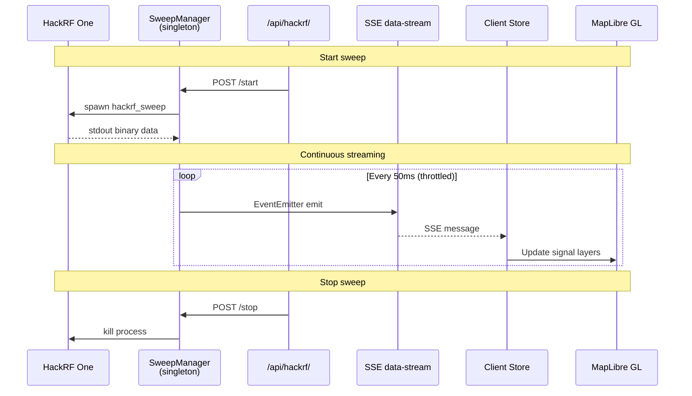
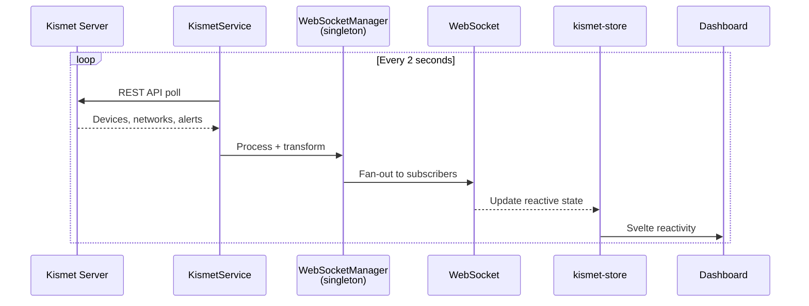
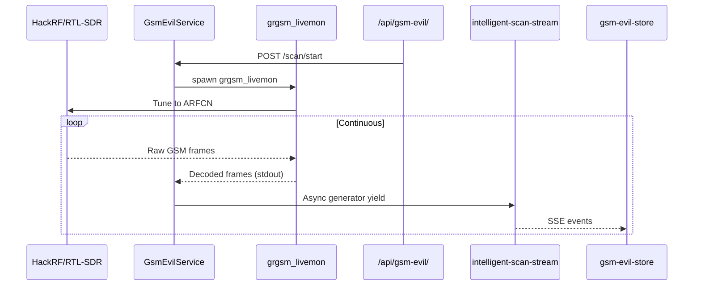
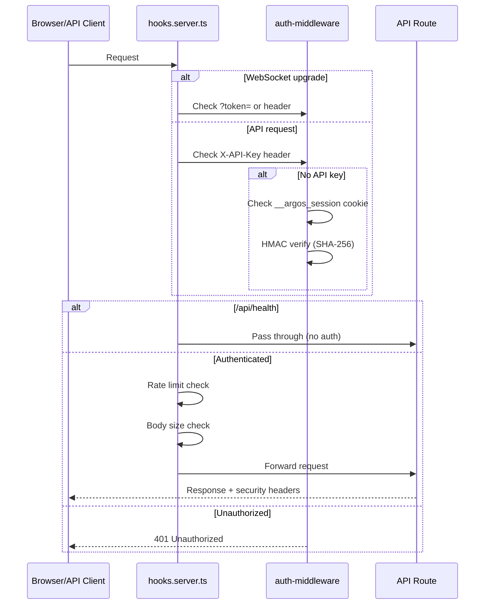

# Codebase Map

> Auto-generated by Cartographer. Last mapped: 2026-02-26T20:31:49Z

## System Overview

Argos is a **SvelteKit SDR & Network Analysis Console** deployed natively on Raspberry Pi 5 (Kali Linux) for Army EW training at NTC/JMRC. It wraps native CLI tools (hackrf_sweep, gpsd, Kismet, grgsm_livemon) into a real-time web dashboard with WebSocket push, MapLibre GL mapping, and MIL-STD-2525C symbology.

```mermaid
graph TB
    subgraph Hardware
        HackRF[HackRF One<br/>SDR Receiver]
        Alfa[Alfa WiFi<br/>Adapter]
        GPS[GPS Dongle<br/>gpsd]
        Serial[Serial Devices<br/>USB/UART]
    end

    subgraph "Server Services (src/lib/server/)"
        SweepMgr[SweepManager<br/>hackrf_sweep wrapper]
        KismetSvc[KismetService<br/>REST polling 2s]
        GsmEvil[GsmEvilService<br/>grgsm_livemon + GsmEvil2]
        GpsSvc[GpsService<br/>gpsd client, circuit breaker]
        TakSvc[TakService<br/>CoT over TLS]
        HwDetect[HardwareDetector<br/>USB/serial/network scan]
    end

    subgraph "Security Layer (hooks.server.ts)"
        Auth[Auth Gate<br/>API Key / HMAC Cookie]
        RateLimit[Rate Limiter<br/>200/min API, 30/min HW]
        BodyLimit[Body Size Limiter]
        CSP[CSP + Security Headers]
    end

    subgraph "API Layer (src/routes/api/)"
        HackRF_API[/api/hackrf/*<br/>+ /api/rf/*]
        Kismet_API[/api/kismet/*]
        GSM_API[/api/gsm-evil/*]
        GPS_API[/api/gps/*]
        TAK_API[/api/tak/*]
        System_API[/api/system/*<br/>+ /api/hardware/*]
        Signals_API[/api/signals/*]
        Health[/api/health<br/>unauthenticated]
    end

    subgraph "Real-time Transport"
        WS[WebSocketManager<br/>ws library upgrade]
        SSE_HackRF[SSE /api/hackrf/data-stream<br/>50ms throttle]
        SSE_GSM[SSE /api/gsm-evil/<br/>intelligent-scan-stream]
    end

    subgraph "Client (Browser)"
        Stores[Svelte Stores<br/>20 reactive stores]
        BaseWS[BaseWebSocket<br/>exponential backoff]
        Components[UI Components<br/>Lunaris design system]
        Map[MapLibre GL<br/>MIL-STD-2525C symbols]
    end

    subgraph "Data Layer"
        SQLite[(rf_signals.db<br/>better-sqlite3)]
        Zod[Zod Schemas<br/>6 schema files]
    end

    HackRF --> SweepMgr
    Alfa --> KismetSvc
    GPS --> GpsSvc
    Serial --> HwDetect

    SweepMgr --> HackRF_API
    KismetSvc --> Kismet_API
    GsmEvil --> GSM_API
    GpsSvc --> GPS_API
    TakSvc --> TAK_API
    HwDetect --> System_API

    HackRF_API --> SSE_HackRF
    GSM_API --> SSE_GSM
    Kismet_API --> WS

    Auth --> RateLimit --> BodyLimit --> CSP

    SSE_HackRF --> Stores
    SSE_GSM --> Stores
    WS --> BaseWS --> Stores
    Stores --> Components
    Components --> Map

    Signals_API --> SQLite
    Zod -.-> HackRF_API
    Zod -.-> Kismet_API
    Zod -.-> GSM_API
```

## Directory Structure

```
Argos/
├── src/                           # Application source (475k tokens)
│   ├── routes/                    # SvelteKit file-based routing
│   │   ├── api/                   # 20 REST API domains, 68 route files (43k tokens)
│   │   │   ├── hackrf/            # HackRF sweep control + SSE data stream
│   │   │   ├── rf/                # RF signal CRUD (shares sweepManager singleton)
│   │   │   ├── kismet/            # Kismet WiFi proxy (devices, networks, alerts, channels)
│   │   │   ├── gsm-evil/          # GSM monitoring (scan, towers, ARFCN, intelligent-scan-stream)
│   │   │   ├── gps/               # GPS position + satellite data
│   │   │   ├── tak/               # TAK server config + connection management
│   │   │   ├── signals/           # Signal database queries + statistics
│   │   │   ├── system/            # System info (memory, CPU, uptime, services)
│   │   │   ├── hardware/          # Hardware detection API
│   │   │   ├── agent/             # AI agent streaming endpoint
│   │   │   ├── terminal/          # Terminal session management
│   │   │   ├── weather/           # Weather data proxy
│   │   │   ├── cell-towers/       # Cell tower lookup
│   │   │   ├── database/          # Database admin queries
│   │   │   ├── db/                # DB health check
│   │   │   ├── map-tiles/         # Map tile proxy
│   │   │   ├── openwebrx/         # OpenWebRX proxy
│   │   │   ├── streaming/         # Stream status
│   │   │   ├── viewshed/          # Terrain viewshed analysis + DTED visualization
│   │   │   └── health/            # Unauthenticated health check
│   │   ├── dashboard/             # Main dashboard page (DashboardShell snippet-slot pattern)
│   │   ├── gsm-evil/              # GSM monitoring page (standalone + iframe target)
│   │   └── +page.svelte           # Root redirect to /dashboard
│   ├── lib/
│   │   ├── server/                # Server-only code (179k tokens)
│   │   │   ├── services/          # Hardware/protocol service wrappers
│   │   │   │   ├── gps/           # GPS with circuit breaker (30s cooldown, 5s cache)
│   │   │   │   ├── gsm-evil/      # GSM Evil orchestrator (17 files, grgsm_livemon + GsmEvil2)
│   │   │   │   ├── kismet/        # Kismet REST API client (4 files)
│   │   │   │   └── cell-towers/   # OpenCelliD lookup (2 files, service + HTTP client)
│   │   │   ├── hackrf/            # SweepManager singleton (EventEmitter, SSE)
│   │   │   ├── hardware/          # USB/serial/network hardware detection
│   │   │   ├── auth/              # Auth middleware (API key + HMAC session token)
│   │   │   ├── security/          # Input sanitizer (6 validators), security utils
│   │   │   ├── db/                # RFDatabase singleton (better-sqlite3, 14 files)
│   │   │   ├── kismet/            # WebSocketManager (Kismet polling → client fan-out)
│   │   │   ├── tak/               # TakService + TakBroadcast (CoT over TLS)
│   │   │   ├── terrain/           # Terrain/DTED services (viewshed compute, tile indexing, parsing)
│   │   │   ├── mcp/               # 7 MCP diagnostic servers + 4 utility server tools (HTTP API client)
│   │   │   ├── middleware/         # Rate limiting, security headers, WS connection handler (3 files)
│   │   │   ├── api/               # createHandler() factory + errMsg() utilities
│   │   │   ├── agent/             # AI agent runtime (Claude Sonnet 4) + tool definitions
│   │   │   ├── env.ts             # Zod-validated environment variables (centralized)
│   │   │   ├── exec.ts            # execFileAsync() — safe child process execution
│   │   │   ├── result.ts          # safe()/safeSync() Result tuple pattern
│   │   │   ├── retry.ts           # withRetry() higher-order function
│   │   │   └── timeout.ts         # withTimeout() higher-order function
│   │   ├── components/            # Svelte 5 components (113 Svelte files)
│   │   │   ├── dashboard/         # Dashboard UI — DashboardShell, map, panels, status, widgets
│   │   │   │   ├── map/           # MapLibre GL integration, GeoJSON, cell towers, GPS derived state
│   │   │   │   ├── panels/        # Overview, Tools, Layers, Settings, Hardware, OnnetTools, Captures
│   │   │   │   │   ├── overview/  # SystemInfoCard, HardwareCard, GpsCard, ServicesCard, WifiInterfacesCard
│   │   │   │   │   └── devices/   # DeviceTable, DeviceToolbar, DeviceWhitelist, DeviceSubRows
│   │   │   │   ├── status/        # Hardware dropdown indicators (GPS, SDR, WiFi, Weather, Coords)
│   │   │   │   ├── widgets/       # SpeedTest, NetworkLatency, Weather, NodeMesh widgets (NEW spec-018)
│   │   │   │   ├── views/         # Full-screen tool views (Kismet, OpenWebRX, Logs, ToolUnavailable)
│   │   │   │   ├── shared/        # ToolCard, ToolCategoryCard
│   │   │   │   ├── tak/           # TAK server config (9 files)
│   │   │   │   └── terminal/      # terminal-theme.ts (xterm.js ITheme builder)
│   │   │   ├── gsm-evil/          # GSM monitoring (6 components)
│   │   │   ├── status/            # TAKIndicator.svelte
│   │   │   └── ui/                # 8 shadcn-svelte component families (35 files)
│   │   ├── stores/                # 20 Svelte store files
│   │   │   ├── dashboard/         # dashboard-store, terminal-store, tools-store, map-settings, agent-context
│   │   │   ├── tactical-map/      # gps-store, kismet-store, hackrf-store, map-store
│   │   │   ├── gsm-evil-store.ts  # GSM towers, ARFCN data, scan state (232 lines)
│   │   │   ├── gsm-evil-types.ts  # GSM Evil state interfaces and constants (extracted)
│   │   │   ├── gsm-evil-persistence.ts  # GSM Evil localStorage helpers (extracted)
│   │   │   └── ...                # tak-store, theme-store, connection, persisted-writable
│   │   ├── hackrf/                # Client-side sweep manager modules (16k tokens)
│   │   │   └── sweep-manager/     # BufferManager, ProcessManager, ErrorTracker, ErrorRecovery
│   │   ├── themes/                # palettes.ts (13 MIL-STD accent palette definitions)
│   │   ├── data/                  # Static data (15 files: tool hierarchy, carrier mappings)
│   │   ├── types/                 # 14 TypeScript type definition files
│   │   ├── schemas/               # 6 Zod validation schemas + 1 test
│   │   ├── map/                   # Map utilities (layers/, symbols/, visibility-engine)
│   │   ├── utils/                 # 14 source files: logger, fetchJSON, geo, rf-propagation, theme-colors, etc.
│   │   ├── websocket/             # BaseWebSocket decomposed into 4 files
│   │   └── styles/                # dashboard-utilities.css (utility classes), dashboard.css
│   ├── app.d.ts                   # Typed globalThis singletons (SweepManager, WSManager, etc.)
│   ├── hooks.server.ts            # Security middleware chain + WebSocket upgrade
│   ├── hooks.client.ts            # Client-side error handling
│   └── app.css                    # Global styles (Tailwind + Lunaris tokens)
├── tests/                         # Test suites (70k tokens)
│   ├── unit/                      # Unit tests (includes 6 new spec-018 component tests)
│   ├── integration/               # API + WebSocket integration tests
│   ├── security/                  # Auth, injection, rate-limit, property-based
│   ├── e2e/                       # Playwright end-to-end
│   ├── visual/                    # Puppeteer + pixelmatch visual regression
│   ├── performance/               # Performance benchmarks
│   ├── load/                      # Load tests
│   └── setup.ts                   # Global mocks (WebSocket, fetch, localStorage)
├── config/                        # Build & tool configuration
│   ├── vite.config.ts             # Tailwind + SvelteKit + terminal plugin + chunking
│   ├── eslint.config.js           # Cyclomatic ≤5, cognitive ≤5 as hard errors
│   ├── playwright.config.ts       # E2E test configuration
│   └── vite-plugin-terminal.ts    # Custom Vite plugin (node-pty, session persistence)
├── scripts/                       # Operations & dev scripts (27k tokens)
│   ├── ops/                       # setup-host.sh, install-services.sh, keepalive
│   ├── dev/                       # vite-oom-protect.sh, detect-alfa-adapter.sh
│   └── tmux/                      # tmux config, systemd service, session scripts
├── deployment/                    # 11 systemd service files (__PROJECT_DIR__ tokens)
├── static/
│   └── fonts/                     # Self-hosted fonts
│       ├── geist.css              # Geist Sans @font-face declarations (400/500/600)
│       ├── geist/                 # Geist woff2 files (Regular, Medium, SemiBold)
│       └── firacode-nerd-font.css # Fira Code Nerd Font for terminals
├── docs/                          # Documentation (165k tokens)
│   ├── General Documentation/     # 13 reference docs
│   ├── designs/                   # pencil-lunaris.pen (authoritative UI reference)
│   └── prompts/                   # 16 Claude Code prompt templates
├── specs/                               # Feature specifications
│   ├── 016-code-expressiveness/         # Code quality refactor (complete)
│   ├── 017-lunaris-ui-unification/      # Design system token migration (complete)
│   ├── 018-lunaris-layout-structure/    # Layout structure — 88-task UI restructuring (complete)
│   ├── 019-design-parity/               # Lunaris design parity — CSS migration (complete)
│   ├── 020-los-rf-range/                # Friis RF range overlay — 4-band map rings (complete)
│   ├── 021-gstreamer-media-pipeline/    # GStreamer media service — transcription, WebRTC, YOLOX (planning)
│   └── 022-terrain-viewshed/            # DTED terrain viewshed — replaces Friis rings (active)
├── plans/                         # Integration & UI plans (238k tokens)
│   └── Argos_tools_integration/   # RF tool deployment matrix
└── _bmad/                         # BMAD framework tooling (not app code)
```

## Module Guide

### Server Services (`src/lib/server/services/`)

**Purpose**: Wrap native CLI tools and external APIs into managed TypeScript services.

| Module      | Key Files                                                                | Purpose                                 | Key Pattern                                      |
| ----------- | ------------------------------------------------------------------------ | --------------------------------------- | ------------------------------------------------ |
| GPS         | `gps/gps-position-service.ts`, `gps-satellite-service.ts` (7 files)      | gpsd client with circuit breaker        | 30s cooldown after 3 failures, 5s position cache |
| GSM Evil    | `gsm-evil/gsm-evil-control-service.ts`, `gsm-scan-service.ts` (17 files) | Orchestrates grgsm_livemon + GsmEvil2   | Child process spawning, stream parsing           |
| Kismet      | `kismet/kismet-control-service.ts` (4 files)                             | REST API client for Kismet WiFi scanner | Polling proxy, response transformation           |
| Cell Towers | `cell-towers/cell-tower-service.ts`, `opencellid-client.ts`              | OpenCelliD cell tower lookup            | HTTP client extraction, location cache           |

**Spec-016 decompositions** (files extracted from oversized modules):

| Extracted File                       | Extracted From                       | Purpose                                     |
| ------------------------------------ | ------------------------------------ | ------------------------------------------- |
| `gsm-evil/gsm-evil-health-checks.ts` | `gsm-evil-health-service.ts`         | Health check logic (245 lines extracted)    |
| `gsm-evil/gsm-scan-events.ts`        | `gsm-scan-capture.ts`                | Scan event handling (138 lines extracted)   |
| `gsm-evil/gsm-grgsm-process.ts`      | `gsm-scan-frequency-analysis.ts`     | grgsm process spawning (59 lines extracted) |
| `kismet/kismet-geo-helpers.ts`       | `kismet-control-service-extended.ts` | Geo calculation helpers (45 lines)          |
| `kismet/kismet-status-checker.ts`    | `kismet.service.ts`                  | Status polling logic (88 lines)             |
| `cell-towers/opencellid-client.ts`   | `cell-tower-service.ts`              | HTTP client for OpenCelliD API (166 lines)  |

### HackRF Subsystem (`src/lib/server/hackrf/`)

**Purpose**: Manage HackRF One SDR hardware for spectrum analysis.

| File                         | Purpose                                                                                         |
| ---------------------------- | ----------------------------------------------------------------------------------------------- |
| `sweep-manager.ts`           | **Singleton** (globalThis). EventEmitter wrapping hackrf_sweep. SSE support with 50ms throttle. |
| `sweep-manager-lifecycle.ts` | Start/stop lifecycle management (extracted from sweep-manager.ts)                               |

Client-side counterpart at `src/lib/hackrf/sweep-manager/` (14 files):

| File                       | Purpose                                                  |
| -------------------------- | -------------------------------------------------------- |
| `buffer-manager.ts`        | 1MB max buffer, 50% overflow trim                        |
| `buffer-parser.ts`         | Sweep data buffer parsing                                |
| `process-manager.ts`       | Spawns `auto_sweep.sh`, manages lifecycle                |
| `process-manager-types.ts` | TypeScript types for process manager                     |
| `process-lifecycle.ts`     | Process lifecycle state machine                          |
| `error-tracker.ts`         | Error accumulation and reporting                         |
| `error-recovery.ts`        | Error recovery strategies (extracted from error-tracker) |
| `error-analysis.ts`        | Error pattern analysis                                   |
| `frequency-cycler.ts`      | Frequency band rotation                                  |
| `frequency-utils.ts`       | Frequency calculation helpers                            |
| `sweep-health-checker.ts`  | Sweep process health monitoring                          |
| `sweep-utils.ts`           | Sweep utility functions                                  |
| `auto_sweep.sh`            | Shell script for automated sweep execution               |
| `mock_sweep.sh`            | Mock sweep script for testing without hardware           |

### Auth & Security (`src/lib/server/auth/`, `security/`)

**Purpose**: Fail-closed authentication and input validation.

| File                          | Purpose                                                                     |
| ----------------------------- | --------------------------------------------------------------------------- |
| `auth-middleware.ts`          | API key header OR HMAC session cookie validation + `validateSessionToken()` |
| `security/input-sanitizer.ts` | 6 validators: IP, hostname, interface, PID, path, generic string            |

**Security hardening (spec-016)**: WebSocket `?token=` param now accepts only the HMAC-derived session token, NOT the raw API key. This prevents credential exposure in URLs, logs, and referrer headers per OWASP A07:2021.

### Database (`src/lib/server/db/`)

**Purpose**: Direct SQLite operations via better-sqlite3 singleton. 14 files + migrations directory.

| File          | Purpose                                                  |
| ------------- | -------------------------------------------------------- |
| `database.ts` | RFDatabase singleton class. Prepared statements. No ORM. |

Repositories: signal, network, spatial, device, geo. Plus: cleanup, optimizer, health, migrations.

### WebSocket Infrastructure

**Server** (`src/lib/server/kismet/web-socket-manager.ts`):

- Polls Kismet REST API every 2 seconds
- Fans out to subscribed WebSocket clients
- globalThis singleton for HMR survival

**Client** (`src/lib/websocket/` — 4 files, decomposed from monolithic base.ts):

| File                     | Purpose                                         |
| ------------------------ | ----------------------------------------------- |
| `base.ts`                | BaseWebSocket class (281 lines, down from ~400) |
| `websocket-types.ts`     | Config types, defaults, WebSocket factory       |
| `websocket-heartbeat.ts` | Heartbeat start/stop with timeout detection     |
| `websocket-reconnect.ts` | Exponential backoff reconnection scheduling     |

### API Layer (`src/routes/api/`)

**Purpose**: 20 REST API domains behind auth + rate limiting.

| Domain      | Routes | Transport  | Notes                                              |
| ----------- | ------ | ---------- | -------------------------------------------------- |
| hackrf      | 6      | REST + SSE | `data-stream` uses SSE with 50ms throttle          |
| rf          | 5      | REST       | Shares sweepManager singleton with hackrf          |
| kismet      | 6      | REST       | Proxy to Kismet REST API                           |
| gsm-evil    | 12     | REST + SSE | `intelligent-scan-stream` uses async generator SSE |
| gps         | 3      | REST       | Circuit-breaker-protected                          |
| tak         | 6      | REST       | TLS certificate management                         |
| signals     | 4      | REST       | SQLite query endpoints                             |
| system      | 8      | REST       | Memory, CPU, services, uptime, logs                |
| hardware    | 3      | REST       | USB/serial/network detection                       |
| agent       | 2      | REST + SSE | AI agent streaming (Claude Sonnet 4)               |
| terminal    | 1      | REST       | node-pty session management                        |
| weather     | 1      | REST       | Weather data proxy                                 |
| cell-towers | 1      | REST       | Cell tower lookup                                  |
| database    | 3      | REST       | Database admin queries                             |
| db          | 1      | REST       | DB health check                                    |
| map-tiles   | 1      | REST       | Map tile proxy                                     |
| openwebrx   | 1      | REST       | OpenWebRX proxy                                    |
| streaming   | 1      | REST       | Stream status                                      |
| health      | 1      | REST       | **Only unauthenticated endpoint**                  |

**Route handler patterns**:

- `createHandler()` factory used in **59 of 68 routes** (migrated in spec-016 Phase 18). Provides: automatic try-catch, structured logging, JSON wrapping, optional Zod body validation.
- 9 routes use manual handlers: SSE streams (4), WebSocket proxy (1), health check (1), tile proxy (1), streaming status (1), RF data-stream (1) — all require custom Response handling.

### Svelte Stores (`src/lib/stores/`)

**Purpose**: Client-side reactive state management using Svelte 5 runes.

| Store                                   | Purpose                                                                                                    |
| --------------------------------------- | ---------------------------------------------------------------------------------------------------------- |
| `dashboard/dashboard-store.ts`          | Active panel, active view, bottom tab (terminal/chat/logs/captures/devices), layout prefs                  |
| `dashboard/terminal-store.ts`           | Terminal session state                                                                                     |
| `dashboard/terminal-session-helpers.ts` | Terminal session lifecycle helpers (extracted)                                                             |
| `dashboard/tools-store.ts`              | Tool hierarchy navigation                                                                                  |
| `dashboard/map-settings-store.ts`       | Map provider selection, tile sources, MapSettings panel sub-navigation (hub/provider/layers/line-of-sight) |
| `dashboard/rf-range-store.ts`           | RF range config (preset, custom profile, frequency source). Persisted, Zod-validated. **NEW spec-020.**    |
| `dashboard/agent-context-store.ts`      | AI agent conversation context (type-safe devices)                                                          |
| `tactical-map/gps-store.ts`             | GPS position, satellite data                                                                               |
| `tactical-map/kismet-store.ts`          | WiFi devices, networks, alerts                                                                             |
| `tactical-map/hackrf-store.ts`          | HackRF sweep state                                                                                         |
| `tactical-map/map-store.ts`             | Map instance and viewport state                                                                            |
| `tak-store.ts`                          | TAK server connection, CoT entities                                                                        |
| `gsm-evil-store.ts`                     | GSM towers, ARFCN data, scan state (232 lines)                                                             |
| `gsm-evil-types.ts`                     | GSM Evil state interfaces and constants (extracted)                                                        |
| `gsm-evil-persistence.ts`               | GSM Evil localStorage helpers (extracted)                                                                  |
| `theme-store.svelte.ts`                 | Theme palette (13 MIL-STD), rail position (left/right/top/bottom)                                          |
| `connection.ts`                         | WebSocket connection status                                                                                |
| `persisted-writable.ts`                 | Persistent store factory (localStorage)                                                                    |

**Spec-018 change**: `dashboard-store.ts` — `BottomTab` type updated: `gsm-evil` removed, `captures` and `devices` added. Graceful deserialize fallback for removed `gsm-evil` tab value.

### UI Components (`src/lib/components/`)

**Purpose**: Svelte 5 component library following Lunaris design system. 113 Svelte files.

**Layout hierarchy** (spec-018 DashboardShell snippet-slot architecture):

```
src/routes/dashboard/+page.svelte
  └── DashboardShell.svelte              (mode: 'sidebar' | 'full-width')
        ├── IconRail.svelte                (48px nav rail, position: left|right|top|bottom)
        ├── TopStatusBar.svelte            (40px command bar)
        │     ├── LatencyDropdown.svelte
        │     ├── MeshDropdown.svelte
        │     └── WeatherDropdown.svelte
        ├── [sidebar slot]                 (mode=sidebar only, when activeView='map')
        │     └── PanelContainer.svelte    (280px collapsible, activePanel switch)
        │           ├── OverviewPanel.svelte
        │           │     ├── SystemInfoCard, HardwareCard, ServicesCard
        │           │     ├── TOOLS section (bettercap, gsm-evil, kismet, openwebrx)
        │           │     └── LOGS section (24h event/warning/error counts)
        │           ├── ToolsPanel.svelte → ToolsPanelHeader + ToolsNavigationView
        │           ├── MapSettingsPanel.svelte (hub → 3 subviews)
        │           │     ├── MapProviderView.svelte
        │           │     ├── MapLayersView.svelte
        │           │     └── LineOfSightView.svelte
        │           ├── SettingsPanel.svelte → [nav] HardwareConfigPanel
        │           ├── HardwareConfigPanel.svelte  (NEW spec-018)
        │           └── OnnetToolsPanel.svelte       (NEW spec-018)
        ├── [content slot]                 (mode=sidebar, main fill area)
        │     ├── DashboardMap.svelte      (activeView='map')
        │     │     └── DeviceOverlay, TowerPopup
        │     ├── KismetView.svelte        (activeView='kismet')
        │     ├── OpenWebRXView.svelte     (activeView='openwebrx')
        │     ├── ToolViewWrapper.svelte   (bettercap, gsm-evil iframe)
        │     ├── ToolUnavailableView.svelte
        │     └── LogsAnalyticsView.svelte
        ├── [fullWidth slot]               (mode=full-width: tak-config, gsm-evil)
        │     └── TakConfigView.svelte | ToolViewWrapper (GSM Evil iframe)
        └── [bottomPanel slot]
              └── ResizableBottomPanel.svelte
                    ├── BottomPanelTabs.svelte   (Terminal|Chat|Logs|Captures|Devices) [in src/routes/dashboard/]
                    ├── TerminalPanel.svelte
                    ├── AgentChatPanel.svelte
                    ├── LogsPanel.svelte
                    ├── CapturesPanel.svelte       (NEW spec-018)
                    └── DevicesPanel.svelte
                          └── DeviceToolbar, DeviceTable, DeviceWhitelist
```

**Component inventory by directory**:

`dashboard/` (top-level — 15 .svelte, 3 .css, 2 .svelte.ts):

| File                            | Purpose                                                                                                                                                                                               |
| ------------------------------- | ----------------------------------------------------------------------------------------------------------------------------------------------------------------------------------------------------- |
| `DashboardShell.svelte`         | Layout shell: IconRail + TopStatusBar + snippet slots (sidebar, content, fullWidth, bottomPanel). Two modes: `sidebar` (default map+panel) and `full-width` (TAK config, GSM Evil). **NEW spec-018.** |
| `IconRail.svelte`               | 48px vertical nav rail. 7 buttons: Overview, Devices, Tools (top), Terminal, Chat, Layers, Settings (bottom). Configurable position.                                                                  |
| `TopStatusBar.svelte`           | 40px command bar: brand mark "ARGOS", REC collection dot, callsign "ARGOS-1", latency pill (LatencyDropdown), mesh count (MeshDropdown), weather (WeatherDropdown), UTC date, zulu clock.             |
| `PanelContainer.svelte`         | Collapsible 280px sidebar. Hosts 6 sub-panels (overview/tools/map-settings/settings/hardware/onnet-tools) based on `$activePanel`. Drag-resize for top/bottom rail positions.                         |
| `DashboardMap.svelte`           | MapLibre GL map with TAK markers, Kismet device dots, cell tower markers, GPS position.                                                                                                               |
| `TerminalPanel.svelte`          | Multi-tab xterm.js terminal via node-pty.                                                                                                                                                             |
| `TerminalTabBar.svelte`         | Tab strip for terminal sessions.                                                                                                                                                                      |
| `TerminalTabContent.svelte`     | Individual xterm terminal instance.                                                                                                                                                                   |
| `TerminalToolbar.svelte`        | Terminal toolbar: split/unsplit toggle, more-menu (Clear, Split Right, Kill Terminal), maximize/restore, system-logs shortcut, close panel.                                                           |
| `TerminalErrorOverlay.svelte`   | Error state overlay for terminal connection failures. **NEW spec-018.**                                                                                                                               |
| `ResizableBottomPanel.svelte`   | Bottom panel with drag-to-resize handle. Wraps BottomPanelTabs + tab content.                                                                                                                         |
| `LogsPanel.svelte`              | System log viewer (bottom panel tab).                                                                                                                                                                 |
| `AgentChatPanel.svelte`         | Claude AI agent chat interface (bottom panel tab).                                                                                                                                                    |
| `AgentChatMessage.svelte`       | Individual chat message bubble with Markdown rendering.                                                                                                                                               |
| `AgentChatToolbar.svelte`       | Input bar and controls for agent chat.                                                                                                                                                                |
| `command-bar.css`               | TopStatusBar styles — `.command-bar`, brand/callsign/segments/weather/zulu. **NEW spec-018.**                                                                                                         |
| `icon-rail.css`                 | Position-specific overrides for IconRail (right/top/bottom modes).                                                                                                                                    |
| `panel-container.css`           | Drag handle styles for PanelContainer.                                                                                                                                                                |
| `agent-chat-logic.svelte.ts`    | Agent chat store/logic extracted from AgentChatPanel.                                                                                                                                                 |
| `dashboard-map-logic.svelte.ts` | Map interaction logic extracted from DashboardMap.                                                                                                                                                    |

`dashboard/panels/` (13 .svelte, 3 .css):

| File                         | Purpose                                                                                                                                                          |
| ---------------------------- | ---------------------------------------------------------------------------------------------------------------------------------------------------------------- |
| `OverviewPanel.svelte`       | System overview: SystemInfoCard, HardwareCard, ServicesCard + TOOLS section (4 tool-launch buttons) + LOGS section (24h counts). Polls system/hardware every 5s. |
| `MapSettingsPanel.svelte`    | Hub-and-subview navigation for map settings. Hub shows 3 cards: Provider, Layers, Line of Sight. **NEW spec-020.**                                               |
| `MapProviderView.svelte`     | Map provider subview: Tactical/Satellite toggle + custom XYZ URL input. **NEW spec-020.**                                                                        |
| `MapLayersView.svelte`       | Map layers subview: visibility mode (Dynamic/All/Manual) + per-layer and signal-band toggles. **NEW spec-020.**                                                  |
| `LineOfSightView.svelte`     | LOS subview: RF range config — preset selector, TX sliders, frequency source, computed range + band legend. **NEW spec-020.**                                    |
| `DevicesPanel.svelte`        | Kismet device browser (bottom panel tab): DeviceToolbar + DeviceTable + DeviceWhitelist.                                                                         |
| `SettingsPanel.svelte`       | Settings: Appearance (palette + rail position), Connectivity (TAK), Hardware (nav to HardwareConfigPanel).                                                       |
| `HardwareConfigPanel.svelte` | Hardware sub-panel: 3 device cards (GPS, SDR, WiFi) with status dots + details. **NEW spec-018.**                                                                |
| `CapturesPanel.svelte`       | RF signal captures table (bottom panel tab). Polls `/api/signals?limit=100` every 10s. **NEW spec-018.**                                                         |
| `OnnetToolsPanel.svelte`     | Onnet tools drill-down sub-panel. Back button returns to 'tools'. **NEW spec-018.**                                                                              |
| `ToolsPanel.svelte`          | Tool browser: ToolsPanelHeader + ToolsNavigationView.                                                                                                            |
| `ToolsPanelHeader.svelte`    | Header with breadcrumb navigation for tools panel.                                                                                                               |
| `ToolsNavigationView.svelte` | Grid of tool category cards.                                                                                                                                     |
| `map-settings-shared.css`    | Shared CSS for MapSettings subviews — toggle, section, provider, visibility-filter primitives. **NEW spec-020.**                                                 |
| `settings-panel.css`         | SettingsPanel styles. **NEW spec-018.**                                                                                                                          |
| `hardware-config-panel.css`  | HardwareConfigPanel styles. **NEW spec-018.**                                                                                                                    |

`dashboard/panels/overview/` (6 .svelte, 1 .ts):

| File                        | Purpose                                                                                                           |
| --------------------------- | ----------------------------------------------------------------------------------------------------------------- |
| `SystemInfoCard.svelte`     | CPU, disk, memory, power, network metrics with color-shifting progress bars.                                      |
| `HardwareCard.svelte`       | SDR (HackRF) and WiFi (Alfa) dot-indicator rows with device label and status.                                     |
| `GpsCard.svelte`            | GPS fix display (lat/lon, MGRS, satellites). **Orphaned** — not imported by OverviewPanel after spec-019 rewrite. |
| `ServicesCard.svelte`       | gpsd service status: running-state dot + uptime string.                                                           |
| `WifiInterfacesCard.svelte` | WiFi interface list. **Orphaned** — not imported by OverviewPanel after spec-019 rewrite.                         |
| `HardwareDeviceRow.svelte`  | Single expandable device row (used by HardwareConfigPanel, not OverviewPanel).                                    |
| `types.ts`                  | `HardwareDetails`, `HardwareStatus`, `formatUptime()`, `formatBytes()`.                                           |

`dashboard/panels/devices/` (4 .svelte, 1 .css, 2 .ts):

| File                     | Purpose                                                    |
| ------------------------ | ---------------------------------------------------------- |
| `DeviceTable.svelte`     | Sortable Kismet device table with AP/client row hierarchy. |
| `DeviceSubRows.svelte`   | Expandable client rows under an AP row.                    |
| `DeviceToolbar.svelte`   | Search, filter, band filter buttons, isolation indicator.  |
| `DeviceWhitelist.svelte` | MAC whitelist management UI.                               |
| `device-table-cells.css` | Cell alignment and column-width styles.                    |
| `device-filters.ts`      | Pure filter/sort logic.                                    |
| `device-formatters.ts`   | Display formatters (MAC, RSSI, frequency, etc.).           |

`dashboard/widgets/` (4 .svelte, 1 .css) — **ALL NEW spec-018**:

| File                          | Purpose                                                                                                          |
| ----------------------------- | ---------------------------------------------------------------------------------------------------------------- |
| `SpeedTestWidget.svelte`      | Network speed test: download/upload bars, retest button. Props-driven.                                           |
| `NetworkLatencyWidget.svelte` | Latency bar, jitter, packet loss, quality label.                                                                 |
| `WeatherWidget.svelte`        | Temperature, conditions, wind, humidity, visibility, sunrise/sunset.                                             |
| `NodeMeshWidget.svelte`       | TAK server + peer mesh status, mesh health.                                                                      |
| `widget.css`                  | Shared widget styles: `.widget`, `.widget-header`, `.metric-block`, `.progress-track`. Zero `--palantir-*` refs. |

`dashboard/status/` (8 .svelte, 1 .css, 2 .ts):

| File                     | Purpose                                                                                            |
| ------------------------ | -------------------------------------------------------------------------------------------------- |
| `LatencyDropdown.svelte` | Latency pill popover (ms RTT, jitter, packet loss). Used by TopStatusBar. **NEW spec-019.**        |
| `MeshDropdown.svelte`    | Mesh count popover (TAK peers, mesh health). Used by TopStatusBar. **NEW spec-019.**               |
| `WeatherDropdown.svelte` | Weather detail popover. Used by TopStatusBar.                                                      |
| `GpsDropdown.svelte`     | GPS status dropdown (sats, fix, speed, accuracy). **Not currently used by TopStatusBar.**          |
| `SdrDropdown.svelte`     | SDR/HackRF status dropdown (make, model, serial, FW). **Not currently used by TopStatusBar.**      |
| `WifiDropdown.svelte`    | WiFi adapter status dropdown (interface, chipset, driver). **Not currently used by TopStatusBar.** |
| `CoordsDisplay.svelte`   | GPS coordinate display with MGRS format.                                                           |
| `SatelliteTable.svelte`  | Satellite signal/elevation/azimuth table.                                                          |
| `dropdown.css`           | Shared dropdown styles. **NEW spec-018.**                                                          |
| `status-bar-data.ts`     | Data fetching for TopStatusBar.                                                                    |
| `weather-helpers.ts`     | WMO weather code → SVG string lookup.                                                              |

`dashboard/map/` (2 .svelte, 2 .css, 10 .ts):

| File                         | Purpose                                                                                                                                                  |
| ---------------------------- | -------------------------------------------------------------------------------------------------------------------------------------------------------- |
| `DeviceOverlay.svelte`       | MapLibre device dots/markers overlay.                                                                                                                    |
| `TowerPopup.svelte`          | Cell tower map popup with signal details.                                                                                                                |
| `map-markers.css`            | Custom CSS for map marker elements.                                                                                                                      |
| `map-overrides.css`          | MapLibre GL control overrides for dark theme.                                                                                                            |
| `map-setup.ts`               | MapLibre GL map initialization.                                                                                                                          |
| `map-handlers.ts`            | Map event handlers (click, hover, zoom).                                                                                                                 |
| `map-handlers-helpers.ts`    | Helper functions for map events.                                                                                                                         |
| `map-handler-types.ts`       | TypeScript types for map handlers.                                                                                                                       |
| `map-helpers.ts`             | Map utility functions + layer ID map (includes `rfRange` layer group).                                                                                   |
| `map-geojson.ts`             | GeoJSON data builders for device/tower/RF-range layers.                                                                                                  |
| `map-geojson-helpers.ts`     | Helper functions for GeoJSON construction.                                                                                                               |
| `map-colors.ts`              | Signal strength color scale constants.                                                                                                                   |
| `map-gps-derived.svelte.ts`  | Svelte 5 `$derived` state for GPS position on map.                                                                                                       |
| `rf-range-derived.svelte.ts` | Svelte 5 runes factory: computes RF range GeoJSON from GPS + HackRF + store. Memoized with 11m position delta. 30s GPS stale fallback. **NEW spec-020.** |

`dashboard/views/` (5 .svelte):

| File                         | Purpose                                              |
| ---------------------------- | ---------------------------------------------------- |
| `KismetView.svelte`          | Full-screen Kismet web UI iframe wrapper.            |
| `OpenWebRXView.svelte`       | Full-screen OpenWebRX iframe wrapper.                |
| `LogsAnalyticsView.svelte`   | System logs and analytics full-screen view.          |
| `ToolUnavailableView.svelte` | Placeholder for unimplemented tools.                 |
| `ToolViewWrapper.svelte`     | Generic full-screen iframe wrapper with back button. |

`dashboard/tak/` (8 .svelte, 1 .css, 1 .ts):

| File                         | Purpose                                        |
| ---------------------------- | ---------------------------------------------- |
| `TakConfigView.svelte`       | Full-width TAK server configuration view.      |
| `TakServerForm.svelte`       | Server hostname/port/TLS form.                 |
| `TakStatusSection.svelte`    | TAK connection status and disconnect controls. |
| `TakAuthMethodPicker.svelte` | Auth method selection.                         |
| `TakAuthImport.svelte`       | Data package import flow.                      |
| `TakAuthEnroll.svelte`       | TAK server enrollment flow.                    |
| `TakDataPackage.svelte`      | Data package file upload/parse UI.             |
| `TakTruststore.svelte`       | Trust store certificate management.            |
| `tak-config-view.css`        | TAK config styles. **NEW spec-018.**           |
| `tak-config-logic.ts`        | Server-side logic helpers.                     |

`dashboard/shared/` (2 .svelte):

| File                      | Purpose                                                |
| ------------------------- | ------------------------------------------------------ |
| `ToolCard.svelte`         | Individual tool card with name, status, install state. |
| `ToolCategoryCard.svelte` | Category card for tool hierarchy navigation.           |

`gsm-evil/` (7 .svelte):

| File                       | Purpose                                |
| -------------------------- | -------------------------------------- |
| `GsmHeader.svelte`         | GSM Evil scanner page header.          |
| `ScanConsole.svelte`       | grgsm_livemon output console.          |
| `ScanResultsTable.svelte`  | Table of scanned GSM frequencies.      |
| `TowerTable.svelte`        | GSM cell tower data table.             |
| `LiveFramesConsole.svelte` | Live GSM frame display.                |
| `GsmEvilContent.svelte`    | GSM Evil main content (untracked).     |
| `ErrorDialog.svelte`       | Error dialog using shadcn AlertDialog. |

`status/` (1 .svelte):

| File                  | Purpose                                                             |
| --------------------- | ------------------------------------------------------------------- |
| `TAKIndicator.svelte` | TAK connection status dot in command bar. Uses Lunaris base tokens. |

`ui/` — shadcn-svelte primitives (35 files): AlertDialog (11), Badge, Button, Input, Select (11), Separator, Switch, Table (8). Direct imports, no barrel files.

### Map System (`src/lib/map/` + `components/dashboard/map/`)

| File                                   | Purpose                                                                       |
| -------------------------------------- | ----------------------------------------------------------------------------- |
| `symbols/symbol-factory.ts`            | MIL-STD-2525C military symbol rendering                                       |
| `layers/satellite-layer.ts`            | Google Hybrid tile source                                                     |
| `layers/symbol-layer.ts`               | Map symbol layer management                                                   |
| `visibility-engine.ts`                 | Layer visibility state machine                                                |
| `components/.../map/map-colors.ts`     | Map paint color constants (CSS var + hex fallback pairs, `resolveMapColor()`) |
| `components/.../map/map-helpers.ts`    | Map GeoJSON builders and utility functions                                    |
| `components/.../map/map-overrides.css` | MapLibre GL CSS overrides for Lunaris theme                                   |

### Terminal Theme (`src/lib/components/dashboard/terminal/`)

| File                | Purpose                                                                                                |
| ------------------- | ------------------------------------------------------------------------------------------------------ |
| `terminal-theme.ts` | xterm.js ITheme builder — resolves CSS vars for cursor, selection, chrome; fixed ANSI 16-color palette |

### Schemas (`src/lib/schemas/`)

| File          | Validates                   |
| ------------- | --------------------------- |
| `api.ts`      | API request/response shapes |
| `database.ts` | Database record shapes      |
| `hardware.ts` | Hardware detection results  |
| `kismet.ts`   | Kismet API responses        |
| `rf.ts`       | RF signal data              |
| `stores.ts`   | Store state shapes          |

**`src/lib/types/`** — TypeScript type definitions:

| File          | Purpose                                                                                                                                                                    |
| ------------- | -------------------------------------------------------------------------------------------------------------------------------------------------------------------------- |
| `rf-range.ts` | RF range types: `RFRangeProfile`, `RFRangeBand`, `RFRangeState`, `RF_RANGE_PRESETS` (3 hardware presets), `RF_PROFILE_LIMITS`, `DEFAULT_CUSTOM_PROFILE`. **NEW spec-020.** |

### MCP Servers (`src/lib/server/mcp/`)

7 diagnostic servers built on a dynamic server framework (`dynamic-server.ts`). They communicate with Argos via HTTP API (localhost:5173) — **cannot import SvelteKit internals**.

| Server              | Purpose                            |
| ------------------- | ---------------------------------- |
| hardware-debugger   | Hardware detection diagnostics     |
| system-inspector    | System resource monitoring         |
| streaming-inspector | WebSocket/SSE stream diagnostics   |
| database-inspector  | SQLite query and schema inspection |
| api-debugger        | API endpoint testing               |
| test-runner         | Test execution and results         |
| gsm-evil            | GSM Evil service diagnostics       |

### Shared Server Utilities

**`src/lib/server/api/`**:

| File                | Exports                        | Purpose                                       |
| ------------------- | ------------------------------ | --------------------------------------------- |
| `error-utils.ts`    | `errMsg()`, `normalizeError()` | Error message extraction, error normalization |
| `create-handler.ts` | `createHandler()`              | Route handler factory (used by 59/68 routes)  |

**`src/lib/server/agent/`**:

| File                           | Purpose                                        |
| ------------------------------ | ---------------------------------------------- |
| `runtime.ts`                   | AI agent runtime (Claude Sonnet 4, streaming)  |
| `frontend-tools.ts`            | Agent tool execution logic                     |
| `frontend-tool-definitions.ts` | Tool schema definitions (extracted, 294 lines) |

**`src/lib/server/tak/`**:

| File               | Purpose                                           |
| ------------------ | ------------------------------------------------- |
| `tak-service.ts`   | TakService (CoT over TLS, exponential reconnect)  |
| `tak-broadcast.ts` | CoT broadcast helper (extracted from tak-service) |

**`src/lib/server/`** (top-level utilities):

| File         | Exports                | Purpose                                                        |
| ------------ | ---------------------- | -------------------------------------------------------------- |
| `exec.ts`    | `execFileAsync()`      | Safe child process execution (no shell, argument arrays only)  |
| `env.ts`     | `env`                  | Centralized Zod-validated env vars (all URLs, API keys, paths) |
| `result.ts`  | `safe()`, `safeSync()` | Result tuple pattern `[data, null] \| [null, error]`           |
| `retry.ts`   | `withRetry()`          | Higher-order retry wrapper with exponential backoff            |
| `timeout.ts` | `withTimeout()`        | Higher-order timeout wrapper                                   |

### Client Utilities (`src/lib/utils/`)

**Purpose**: Shared client-side utilities (14 source files, 6 test files).

| File                  | Purpose                                                                                                                                                      |
| --------------------- | ------------------------------------------------------------------------------------------------------------------------------------------------------------ |
| `theme-colors.ts`     | `resolveThemeColor()` — resolves CSS custom properties to hex at runtime                                                                                     |
| `signal-utils.ts`     | RSSI → signal band mapping using Lunaris CSS tokens (5 bands + none)                                                                                         |
| `fetch-json.ts`       | Typed `fetchJSON<T>()` wrapper — replaces scattered fetch                                                                                                    |
| `validate-form.ts`    | Form validation helper with error accumulation                                                                                                               |
| `geo.ts`              | Geographic calculations (distance, bearing, MGRS)                                                                                                            |
| `delay.ts`            | Promise-based `delay()` utility                                                                                                                              |
| `logger.ts`           | Structured logger (server + client)                                                                                                                          |
| `validation-error.ts` | Typed validation error class                                                                                                                                 |
| `rf-propagation.ts`   | Friis free-space propagation math: `calculateFriisRange()`, `buildRFRangeBands()`, `clampDisplayRange()`. Pure functions, no browser APIs. **NEW spec-020.** |
| `cot-parser.ts`       | Cursor-on-Target XML parsing utilities                                                                                                                       |
| `country-detector.ts` | MCC/country code detection for GSM towers                                                                                                                    |
| `css-loader.ts`       | Dynamic CSS stylesheet loading utility                                                                                                                       |
| `gsm-tower-utils.ts`  | GSM cell tower data formatting and helpers                                                                                                                   |
| `mgrs-converter.ts`   | Military Grid Reference System coordinate conversion                                                                                                         |

### Infrastructure & Operations (`scripts/`)

**`scripts/ops/`** — Provisioning and runtime management (12 files):

| File                      | Purpose                                                                                                                                                                         |
| ------------------------- | ------------------------------------------------------------------------------------------------------------------------------------------------------------------------------- |
| `setup-host.sh`           | Bootstrap script (128 lines). Installs Node.js 22, prepares @clack/prompts, launches Node.js UI                                                                                 |
| `setup-host-ui.mjs`       | Interactive installer (371 lines). @clack/prompts CLI with Express/Customize modes. Handles component selection, API key prompts, runs install functions, extracts bundled data |
| `setup-host-functions.sh` | Install function library (1209 lines). 26 `install_*` functions covering 26 components across 4 groups (Core, SDR, Development, System)                                         |
| `components.json`         | Component registry (26 items, 4 groups). Defines id, description, core status, function name for each installable component                                                     |
| `install-services.sh`     | Installs systemd service files from `deployment/`                                                                                                                               |
| `keepalive-dev.sh`        | Dev server monitor — auto-restarts Vite (port 5173), Chromium (9224), socat (99). Circuit breaker after 10 failures                                                             |
| `mem-guard.sh`            | Pre-flight memory check + concurrency lock wrapper for heavy processes                                                                                                          |
| `fix-claude-mem.sh`       | Claude-mem plugin repair script (daemon cleanup, hook fixes)                                                                                                                    |
| `import-celltowers.sh`    | OpenCelliD cell tower database import                                                                                                                                           |
| `extract-dted.sh`         | DTED terrain data extraction and processing                                                                                                                                     |
| `mcp-config.ts`           | MCP server configuration generator                                                                                                                                              |
| `mcp-install.ts`          | MCP server installation script                                                                                                                                                  |

**`scripts/tmux/`** — Tmux configuration and session management:

| File                      | Purpose                                                                                                                                                                                                                                                     |
| ------------------------- | ----------------------------------------------------------------------------------------------------------------------------------------------------------------------------------------------------------------------------------------------------------- |
| `tmux.conf`               | Lunaris-themed tmux config (gold/amber on dark chrome). Installed to `~/.tmux.conf` by `install_zsh_dotfiles()`. Includes TPM, resurrect (`@resurrect-processes 'false'` for OOM safety), continuum (`@continuum-boot 'off'` — custom service handles boot) |
| `tmux.service`            | Systemd user unit — creates `dev1`/`dev2`/`dev3`/`argos-logs` sessions on boot. Installed to `~/.config/systemd/user/tmux.service` by `install_tmux_sessions()`                                                                                             |
| `tmux-zsh-wrapper.sh`     | Zsh wrapper for terminal store default shell                                                                                                                                                                                                                |
| `tmux-0.sh` … `tmux-3.sh` | Web terminal session launch scripts (used by Vite terminal plugin)                                                                                                                                                                                          |
| `tmux-logs.sh`            | Argos logs session launch script                                                                                                                                                                                                                            |

**Tmux session architecture:**

| Session            | Created by            | Purpose                           | SSH access                            |
| ------------------ | --------------------- | --------------------------------- | ------------------------------------- |
| `dev1`             | `tmux.service` (boot) | Primary SSH dev workspace         | Auto-attach via `.zshrc` on plain SSH |
| `dev2`             | `tmux.service` (boot) | Secondary SSH dev workspace       | `ssh host -t "tmux attach -t dev2"`   |
| `dev3`             | `tmux.service` (boot) | Tertiary SSH dev workspace        | `ssh host -t "tmux attach -t dev3"`   |
| `argos-logs`       | `tmux.service` (boot) | Web terminal logs tab             | Managed by web UI                     |
| `tmux-0`, `tmux-1` | Vite dev server       | Web terminal interactive sessions | Managed by web UI                     |

Boot persistence: `tmux.service` (systemd user unit, `WantedBy=default.target`) + `loginctl enable-linger` ensures sessions exist before first SSH login. tmux-resurrect saves/restores pane layouts; tmux-continuum auto-saves every 15 min. `@continuum-boot` is deliberately `off` — the custom service creates named sessions, while continuum's boot feature would overwrite it with a generic single-session unit.

**`scripts/dev/`** — Development tooling (7 files):

| File                        | Purpose                                                     |
| --------------------------- | ----------------------------------------------------------- |
| `vite-oom-protect.sh`       | Wrapper that sets `oom_score_adj=-500` on Vite process tree |
| `detect-alfa-adapter.sh`    | Alfa WiFi adapter detection script                          |
| `auto-start-kismet.sh`      | Auto-start Kismet with detected adapter                     |
| `start-kismet-with-alfa.sh` | Start Kismet with specific Alfa adapter                     |
| `start-headless-debug.sh`   | Start headless Chromium for debug (port 9224)               |
| `debug-headless.sh`         | Debug headless browser sessions                             |
| `capture-screenshots.ts`    | Screenshot capture utility for visual testing               |

## Data Flow

### Spectrum Analysis (HackRF)



### WiFi Monitoring (Kismet)



### GSM Monitoring



### Authentication Flow



## Conventions

### Singleton Pattern

Server-side singletons use `globalThis` for HMR survival, now typed via `src/app.d.ts`:

```typescript
// src/app.d.ts declares: var __argos_sweepManager: SweepManager | undefined;
// Usage in modules — no more unsafe `as Record<string, unknown>` casts:
export const sweepManager: SweepManager =
	globalThis.__argos_sweepManager ?? (globalThis.__argos_sweepManager = new SweepManager());
```

Used by: SweepManager, WebSocketManager, RateLimiter, RFDatabase

### Error Handling

Two patterns in use (consolidated from three):

1. **`createHandler()`** — Route handler factory with built-in try-catch, logging, and optional Zod validation. **Primary pattern** (59/68 routes).
2. **`safe()`/`safeSync()`** — Result tuple: `[data, null] | [null, error]` (used in service-layer code).

Legacy `errMsg()` utility is still exported but rarely used directly — `createHandler()` calls it internally.

### Circular Dependency Resolution

8 cycles broken by extracting shared types into dedicated files:

- `*-types.ts` files contain interfaces/types shared between service and consumer
- Import the types file instead of the service file when only types are needed

### File Naming

- `kebab-case.ts` for all files
- `+page.svelte`, `+server.ts` for SvelteKit routes
- `.test.ts` suffix for test files

### Component Patterns (Svelte 5)

- All components use runes: `$state`, `$derived`, `$effect`, `$props`, `$bindable`
- Namespace pattern for compound components: `const Table = { Root, Header, Row, ... }`
- Direct imports from source (no barrel files anywhere)
- DashboardShell uses Svelte 5 snippet slots for layout composition

### CSS Token Architecture (spec-017 → spec-019 complete)

Three-layer token system — all hex, no oklch. The palantir bridge layer was **eliminated by spec-019 Phase 6b** — all 292 `var(--palantir-*)` references migrated to direct Lunaris base tokens.

```
Layer 1: Base Tokens (app.css :root) — SOURCE OF TRUTH
  ├── Surface: --background (#111111), --card (#1A1A1A), --border (#2E2E2E), --sidebar (#18181b)
  ├── Depth: --surface-elevated (#151515), --surface-hover (#1E1E1E), --surface-header (#181818),
  │          --surface-inset (#0D0D0D), --surface-terminal (#0A0A0A)
  ├── Accent: --primary (#A8B8E0 default Blue ★), --interactive (#4A8AF4), --accent-muted (color-mix)
  ├── Text: --foreground, --text-secondary (#BBBBBB), --text-tertiary (#888888), --text-inactive (#555555)
  ├── Foreground: --foreground-secondary (#888888), --foreground-tertiary (#999999), --foreground-muted (#BBBBBB)
  ├── Status: --success (#8BBFA0), --warning (#D4A054), --destructive (#FF5C33), --error-desat (#C45B4A)
  ├── Status BG: --success-bg, --warning-bg, --error-bg, --info-bg
  ├── Signals: --signal-very-strong → --signal-none (6 steps)
  ├── Widget: --widget-bg, --hover-tint, --separator, --bar-track, --switch-off
  ├── Charts: --chart-1..5, --feature-rf, --feature-drone, --feature-radio
  ├── Spacing: --space-1 (4px) through --space-12 (48px)
  ├── Typography: --text-hero (24px) through --text-section (9px)
  ├── Font weights, letter-spacing, radius tokens
  └── 13 palette themes: [data-palette='ash|blue|blush|...'] each overrides --primary

Layer 2: Tailwind Utilities (app.css @theme inline)
  └── --color-* mappings → enables bg-success, text-warning, border-border etc.

Layer 3: Dashboard Layout (dashboard.css)
  ├── Font stacks: --font-sans: 'Geist', --font-mono: 'Fira Code'
  ├── Layout dims: --icon-rail-width: 48px, --panel-width: 280px, --top-bar-height: 40px
  └── Dashboard-scope overrides

Layer 4: Dashboard Utilities (dashboard-utilities.css)
  └── Utility classes: .map-popup, .status-dot-*, .bg-surface, .bg-elevated, .text-tertiary, .tactical-sidebar
```

**Palette switching**: 13 MIL-STD themes defined as `[data-palette='...']` selectors, each overriding only `--primary`. Applied via `data-palette` attribute on `<html>`. FOUC prevention in `app.html` sync script.

**Font system**: Dual-font with Geist (sans) as body default, Fira Code (mono) for data. Dashboard layout tokens: `--font-primary: var(--font-mono)`, `--font-secondary: var(--font-sans)`.

**Runtime resolution**: `src/lib/utils/theme-colors.ts` exports `resolveThemeColor(varName, fallback)` for contexts where CSS vars aren't available (MapLibre GL, xterm.js, Leaflet markers). Used by `map-colors.ts`, `signal-utils.ts`, `terminal-theme.ts`.

### Palantir Reference Audit (spec-019 — COMPLETE)

The palantir bridge layer has been **fully eliminated** by spec-019 Phase 6b. All 292 `var(--palantir-*)` references across 33 files were migrated to direct Lunaris base tokens. Zero `palantir` references remain in `src/`. The bridge file `palantir-design-system.css` was deleted; utility classes were preserved in `dashboard-utilities.css`.

## Gotchas

### Dual API Namespaces

Both `/api/hackrf/` and `/api/rf/` control the same `sweepManager` singleton. Changes to sweep state via one namespace affect the other.

### Memory Pressure

RPi 5 has 8GB RAM with ~2.7GB effective headroom. `svelte-check` uses ~650MB — never run multiple instances. Lock file at `/tmp/argos-typecheck.lock` enforces single instance.

### WebSocket Auth

WebSocket connections require auth via HMAC-derived session `?token=` param OR `X-API-Key` header — cookies are NOT checked for WebSocket upgrades. Raw API keys in query strings are rejected (OWASP A07:2021).

### Rate Limit Tiers

- Standard API: 200 req/min
- Hardware control: 30 req/min
- Tailscale clients: 60 req/min (elevated for GSM Evil rapid calls)

### GPS Circuit Breaker

GPS service enters 30-second cooldown after 3 consecutive failures. During cooldown, returns cached position (5s TTL) or null.

### GSM Evil Iframe Isolation

The GSM Evil page renders inside an iframe on the dashboard for process isolation. The `gsm-evil-store` was decomposed from 321 → 232 lines (types + persistence extracted to separate files).

### globalThis Singletons

All server singletons persist across HMR via `globalThis.__argos_*` properties, now type-safe via `src/app.d.ts` declarations. State survives Vite hot reloads but NOT server restarts.

### Token System (spec-019 complete)

All components reference CSS custom properties directly from `app.css :root` (no hardcoded hex, no bridge layer). The palantir bridge (`palantir-design-system.css`) was eliminated by spec-019 Phase 6b — all 292 `var(--palantir-*)` references migrated, non-palantir tokens (spacing, typography, radius) moved to `app.css :root`, and utility classes moved to `dashboard-utilities.css`.

When adding new colors: define in `:root`, add `@theme inline` mapping if Tailwind classes are needed.

### Runtime Color Resolution

MapLibre GL, xterm.js, and Leaflet markers can't read CSS variables directly. These use `resolveThemeColor()` from `theme-colors.ts` to get computed hex at render time. Map and terminal colors update when the palette changes, but only on re-render (not via CSS cascade).

### Oversized Functions

Reduced by spec-016 decomposition but some remain. Remaining oversized files: `kismet-control-service-extended.ts` (241 lines), `sweep-manager.ts` (299 lines), `tak-service.ts` (298 lines).

### Test Safety

Running `npm run test:unit` (full suite) is unsafe while VS Code Server (Antigravity) is active — combined memory exceeds available headroom. Use targeted tests: `npx vitest run --no-coverage <specific files>`.

### No Barrel Files

All barrel files (`index.ts`) were eliminated. Import directly from source files. No exceptions.

## Navigation Guide

**To add a new API endpoint**:

1. Create `src/routes/api/<domain>/+server.ts`
2. Add Zod schema in `src/lib/schemas/` if needed
3. Use `createHandler()` (standard) — only use manual handlers for SSE/streaming endpoints
4. Auth is automatic via `hooks.server.ts` (all routes except `/api/health`)
5. Add tests in `tests/unit/` or `tests/integration/`

**To add a new Svelte component**:

1. Create in `src/lib/components/<area>/<component-name>.svelte`
2. Use Svelte 5 runes (`$state`, `$derived`, `$effect`, `$props`)
3. Use Lunaris base tokens directly (`--surface-elevated`, `--foreground-secondary`, etc.) or Tailwind `bg-*`/`text-*` utilities. **Do NOT use `--palantir-*` tokens.**
4. For colors outside CSS context (canvas, map markers), use `resolveThemeColor()` from `theme-colors.ts`
5. Handle all states: Empty, Loading, Default, Active, Error, Success, Disabled, Disconnected
6. Max 300 lines per file

**To add a new hardware service**:

1. Create service in `src/lib/server/services/<service>/`
2. Use `safe()` result tuples for error handling
3. Consider circuit breaker pattern (see GPS service)
4. Use `globalThis` singleton if state must survive HMR
5. Register API routes in `src/routes/api/<domain>/`
6. Add hardware detection in `src/lib/server/hardware/`

**To add a new store**:

1. Create in `src/lib/stores/<name>-store.ts`
2. Use Svelte 5 runes for reactive state
3. Add Zod schema in `src/lib/schemas/stores.ts`
4. Connect to WebSocket or API as needed via `BaseWebSocket`

**To modify authentication**:

1. Auth middleware: `src/lib/server/auth/auth-middleware.ts`
2. Auth gate: `src/hooks.server.ts` (search for "auth")
3. WebSocket auth: `src/lib/server/middleware/ws-connection-handler.ts`
4. Env validation: `src/lib/server/env.ts` (centralized — all URLs, keys, paths)
5. Session cookie: HMAC-derived `__argos_session`
6. Rate limits: configured in `hooks.server.ts`

**To add a new design token**:

1. Define base token in `src/app.css` `:root` block
2. Add `--color-*` Tailwind mapping in `src/app.css` `@theme inline` block (if Tailwind classes needed)
3. If used by map/terminal/canvas, add entry in `map-colors.ts` or use `resolveThemeColor()` directly
4. For palette-sensitive values, ensure the token references `var(--primary)` or another palette-swapped base
5. **Do NOT use `--palantir-*` tokens** — the bridge has been eliminated (spec-019)

**To add map layers**:

1. GeoJSON builder in `src/lib/components/dashboard/map/`
2. Color definitions in `src/lib/components/dashboard/map/map-colors.ts` (use CSS var + hex fallback pairs)
3. Symbol definition in `src/lib/map/symbols/symbol-factory.ts`
4. Layer visibility in `src/lib/map/visibility-engine.ts`
5. Tile sources in `src/lib/map/layers/satellite-layer.ts`

**To run tests safely on RPi**:

```bash
# Targeted (safe, low memory)
npx vitest run --no-coverage src/lib/server/services/gps/gps-service.test.ts

# Full unit suite (only when Antigravity/VS Code is stopped)
npm run test:unit

# Security suite
npm run test:security

# E2E (requires running dev server)
npm run test:e2e
```
