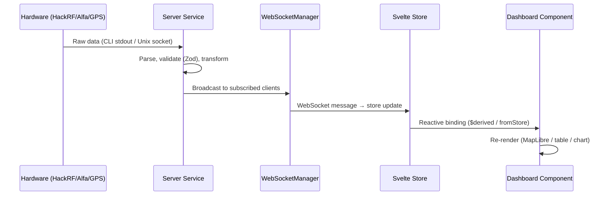
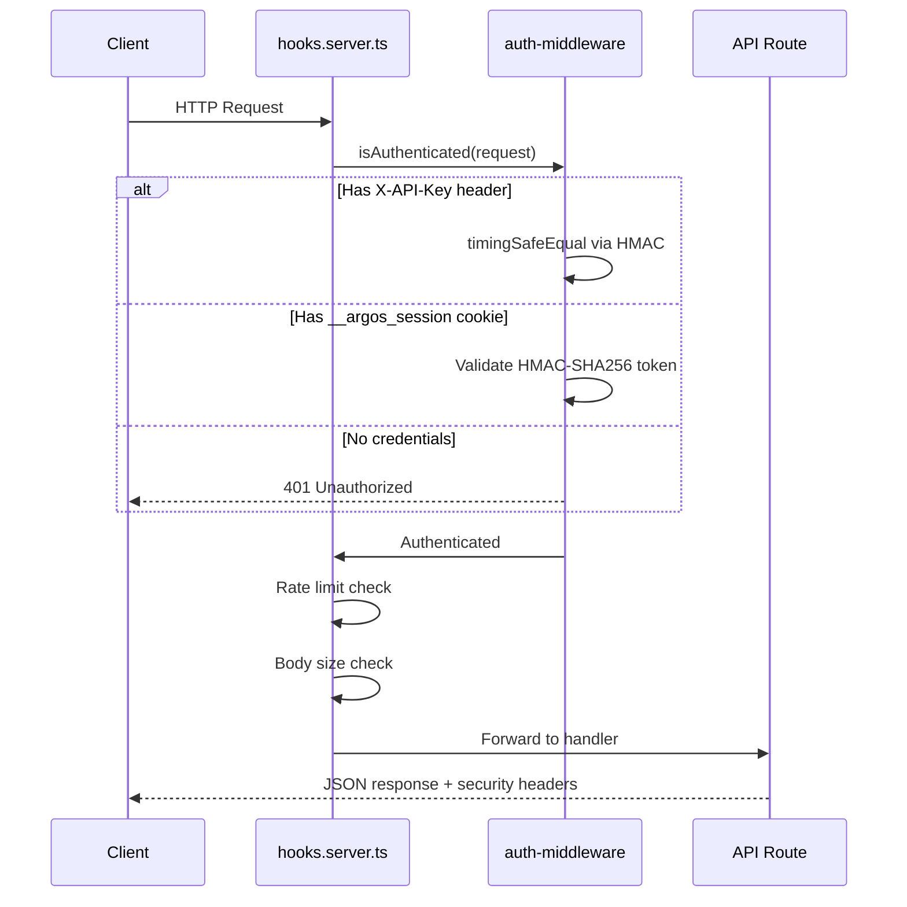
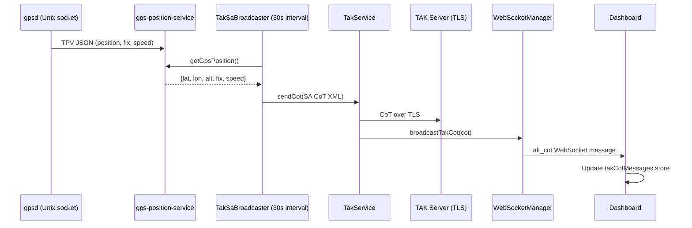

# Codebase Map

> Auto-generated by Cartographer. Last mapped: 2026-04-02T09:02:38Z

## System Overview

Argos is a **SvelteKit SDR & Network Analysis Console** deployed natively on Raspberry Pi 5 (Kali Linux) for Army EW training at NTC/JMRC. It wraps native CLI tools (hackrf_sweep, gpsd, Kismet, grgsm_livemon) into a real-time web dashboard with WebSocket push, MapLibre GL mapping, and MIL-STD-2525C symbology.

```mermaid
graph TB
    subgraph Hardware
        HackRF[HackRF One<br/>SDR Receiver]
        Alfa[Alfa WiFi<br/>Adapter]
        GPS[GPS Dongle<br/>gpsd]
        Serial[Serial Devices<br/>USB/UART]
    end

    subgraph "Server Services (src/lib/server/)"
        SweepMgr[SweepManager<br/>hackrf_sweep wrapper]
        KismetSvc[KismetService<br/>REST polling 2s]
        GsmEvil[GsmEvilService<br/>grgsm_livemon + GsmEvil2]
        GpsSvc[GpsService<br/>gpsd Unix socket, circuit breaker]
        TakSvc[TakService<br/>CoT over TLS + SA Broadcaster]
        HwDetect[HardwareDetector<br/>USB/serial/network scan]
        AgentRT[AgentRuntime<br/>Claude Sonnet 4 tool use]
        APM[APM Runner<br/>Navy propagation model]
    end

    subgraph "Security Layer (hooks.server.ts)"
        Auth[Auth Gate<br/>API Key / HMAC Cookie]
        RateLimit[Rate Limiter<br/>200/min API, 30/min HW]
        BodyLimit[Body Size Limiter<br/>10MB general, 64KB HW]
        CSP[CSP + Security Headers]
        ELD[Event Loop Delay Monitor]
    end

    subgraph "API Layer (src/routes/api/)"
        HackRF_API[/api/hackrf/* + /api/rf/*]
        Kismet_API[/api/kismet/*]
        GSM_API[/api/gsm-evil/*]
        GPS_API[/api/gps/*]
        TAK_API[/api/tak/*]
        System_API[/api/system/* + /api/hardware/*]
        Signals_API[/api/signals/*]
        RFProp_API[/api/rf-propagation/*]
        Agent_API[/api/agent/*]
        Health[/api/health unauthenticated]
    end

    subgraph "WebSocket (ws, noServer)"
        WSS[WebSocketManager<br/>256KB maxPayload]
    end

    subgraph "Client (SvelteKit + Svelte 5)"
        Dashboard[DashboardShell<br/>IconRail + TopStatusBar + Snippets]
        Map[DashboardMap<br/>MapLibre GL + MIL-STD-2525C]
        GsmUI[GSM Evil Console<br/>Full-screen scan + decode]
        Terminal[xterm.js PTY<br/>via WebSocket]
        AgentChat[Agent Chat Panel<br/>SSE streaming]
    end

    subgraph "Stores (src/lib/stores/)"
        GpsStore[gpsStore<br/>Zod-validated]
        KismetStore[kismetStore<br/>Map device cache]
        HackRFStore[hackrfStore<br/>Zod-validated]
        TakStore[takStatus + takCotMessages]
        GsmStore[gsmEvilStore<br/>localStorage 2s debounce]
        ThemeStore[themeStore<br/>Svelte 5 runes, 13 palettes]
        DashStore[dashboardStore<br/>panel routing]
    end

    subgraph "Database (better-sqlite3)"
        DB[(rf_signals.db<br/>WAL mode, R-tree spatial)]
    end

    subgraph "External"
        CloudRF[CloudRF API]
        OpenCellID[OpenCellID API]
        TakServer[TAK Server<br/>TLS CoT]
        Anthropic[Anthropic API<br/>Claude Sonnet 4]
    end

    HackRF --> SweepMgr
    Alfa --> KismetSvc
    GPS --> GpsSvc
    Serial --> HwDetect

    SweepMgr --> WSS
    KismetSvc --> WSS
    GpsSvc --> TakSvc
    TakSvc --> WSS

    Auth --> HackRF_API & Kismet_API & GSM_API & GPS_API & TAK_API & System_API & Signals_API & RFProp_API & Agent_API
    HackRF_API --> SweepMgr
    Kismet_API --> KismetSvc
    GSM_API --> GsmEvil
    GPS_API --> GpsSvc
    TAK_API --> TakSvc
    RFProp_API --> APM
    Agent_API --> AgentRT

    WSS --> GpsStore & KismetStore & HackRFStore & TakStore
    Dashboard --> Map & Terminal & AgentChat & GsmUI
    Map --> GpsStore & KismetStore & HackRFStore
    AgentChat --> Agent_API

    SweepMgr & KismetSvc & GsmEvil & Signals_API --> DB
    RFProp_API --> CloudRF
    AgentRT --> Anthropic
    TakSvc --> TakServer
```

## Directory Structure

```
src/                           # SvelteKit application (512 files, 524k tokens)
├── routes/                    # File-based routing
│   ├── api/                   # 19 API domains, 66 routes (53 via createHandler)
│   │   ├── hackrf/            # HackRF sweep control + SSE data stream
│   │   ├── rf/                # RF abstraction layer (mirrors hackrf)
│   │   ├── kismet/            # Kismet device polling, control, recon
│   │   ├── gps/               # GPS position, satellites
│   │   ├── tak/               # TAK config, connection, certs, enrollment
│   │   ├── gsm-evil/          # GSM scan, IMSI, frames, intelligent scan SSE
│   │   ├── signals/           # Signal CRUD, batch, statistics, cleanup
│   │   ├── system/            # System info, metrics, logs, docker, mesh, latency
│   │   ├── hardware/          # Hardware status, scan, details
│   │   ├── rf-propagation/    # Coverage, P2P, route analysis via CloudRF/APM
│   │   ├── agent/             # AI agent status + SSE stream
│   │   ├── database/          # DB health, query, schema, slow queries
│   │   ├── bluehood/          # Bluetooth scanning control
│   │   ├── wigletotak/        # WiGLE→TAK bridge
│   │   ├── cell-towers/       # OpenCellID nearby lookup
│   │   ├── map-tiles/         # Tile proxy to local tile server
│   │   ├── openwebrx/         # OpenWebRX SDR control
│   │   ├── streaming/         # SSE streaming health
│   │   ├── terminal/          # Available shells for xterm.js
│   │   ├── weather/           # Current weather data
│   │   └── health             # Unauthenticated health check
│   ├── dashboard/             # Main tactical console page
│   ├── gsm-evil/              # GSM monitoring full-screen page
│   └── +layout.svelte         # Root layout (theme, nav)
├── lib/
│   ├── server/                # Server-only code (153 files, 190k tokens)
│   │   ├── auth/              # Fail-closed API key + HMAC session cookie
│   │   ├── api/               # createHandler factory + error utilities
│   │   ├── security/          # Rate limiter, CORS, input sanitizer, audit log
│   │   ├── middleware/        # Rate limit, security headers, WS connection handler
│   │   ├── db/                # RFDatabase facade, repositories, migrations, cleanup
│   │   ├── hardware/          # HardwareRegistry, ResourceManager, USB/serial/network detection
│   │   ├── hackrf/            # SweepManager: process lifecycle, frequency cycling, error recovery
│   │   ├── kismet/            # KismetProxy, WebSocketManager, FusionController, poller
│   │   ├── services/          # Domain services: gps/, gsm-evil/, kismet/, cloudrf/, cell-towers/, bluehood/, wigletotak/
│   │   ├── tak/               # TakService, SA broadcaster, cert manager, package parser
│   │   ├── gsm/               # GSM L3 decoder (pure, no process spawning)
│   │   ├── mcp/               # 7 MCP servers + dynamic server + API client
│   │   ├── agent/             # AgentRuntime + tool dispatch + schemas
│   │   ├── env.ts             # Zod-validated environment variables (process exits on failure)
│   │   ├── exec.ts            # Safe execFileAsync (no shell)
│   │   ├── result.ts          # Result<T,E> discriminated union
│   │   ├── retry.ts           # Async retry with exponential backoff
│   │   ├── timeout.ts         # Promise.race timeout guard
│   │   └── websocket-server.ts # ws noServer mode, auth at upgrade level
│   ├── components/            # UI components (153 files, 148k tokens)
│   │   ├── dashboard/         # DashboardShell, IconRail, TopStatusBar, DashboardMap
│   │   │   ├── map/           # MapLibre helpers, GeoJSON builders, RF overlay
│   │   │   ├── panels/        # Devices table, overview, RF propagation, captures
│   │   │   ├── status/        # Status sub-indicators (GPS, HackRF, Kismet)
│   │   │   ├── tak/           # TAK config view
│   │   │   ├── terminal/      # xterm.js terminal panel
│   │   │   ├── views/         # Full-screen view orchestrators
│   │   │   ├── widgets/       # Sidebar info cards (weather, GPS, signals)
│   │   │   └── shared/        # Shared primitives
│   │   ├── gsm-evil/          # ScanResultsTable, ErrorDialog, channel/decode panels
│   │   ├── status/            # TAKIndicator, connection dots
│   │   └── ui/                # shadcn-svelte primitives (bits-ui): button, table, select, etc.
│   ├── stores/                # Svelte stores (20 files, 18k tokens)
│   │   ├── connection.ts      # ServiceConnectionStatus, SystemHealth
│   │   ├── theme-store.svelte.ts # Svelte 5 runes, 13 MIL-STD palettes, dark-only
│   │   ├── tak-store.ts       # TAK status + CoT message buffer (50 msgs)
│   │   ├── gsm-evil-store.ts  # Scan state, localStorage persistence (2s debounce)
│   │   ├── dashboard-store.ts # Panel routing, active view
│   │   ├── rf-propagation-store.ts # Coverage/P2P/route params + results
│   │   ├── terminal-store.ts  # Terminal sessions, splits, tabs
│   │   ├── agent-context-store.ts # Bridges GPS + Kismet for agent context
│   │   └── tactical-map/      # gpsStore, hackrfStore, kismetStore, mapStore (Zod-validated)
│   ├── schemas/               # Zod validation (8 files)
│   ├── types/                 # TypeScript interfaces (14 files)
│   ├── utils/                 # Logger, geo, MGRS, validation, CSS loader (18 files)
│   ├── hackrf/                # HackRF sweep-manager sub-modules (14 files)
│   ├── kismet/                # Client-side Kismet store + WS handlers (3 files)
│   ├── map/                   # MapLibre layers, symbol factory, visibility engine (4 files)
│   ├── tactical-map/          # GPS/HackRF/Kismet/TAK polling services (7 files)
│   ├── data/                  # Carrier MCC/MNC mappings + tool hierarchy (15 files)
│   ├── websocket/             # BaseWebSocket abstract class + reconnect + heartbeat (4 files)
│   └── styles/                # Lunaris design system CSS tokens
├── hooks.server.ts            # Auth → Rate limit → Body limit → CSP → WS → Hardware → TAK → ELD monitor
├── hooks.client.ts            # Client error handling
├── app.css                    # Tailwind v4 + Lunaris tokens + 13 palettes
└── app.d.ts                   # SvelteKit ambient types

config/                        # Build/lint/test configs (17 files)
├── vite.config.ts             # Host 0.0.0.0:5173, terminalPlugin, chunk splitting
├── vite-plugin-terminal.ts    # Custom WebSocket PTY server (/terminal-ws)
├── eslint.config.js           # Flat config: TS, Svelte, Sonar, import-sort
├── playwright.config.ts       # Chromium only, testDir: ../tests/e2e
└── openwebrx/                 # OpenWebRX SDR config

tests/                         # Multi-layer test suite (55 files, 73k tokens)
├── unit/                      # Component + store unit tests
├── integration/               # Live HTTP API tests + Playwright hybrid
├── security/                  # CORS, rate limiting, CSP, input validation, API key rotation
├── e2e/                       # Playwright: smoke, user flows, a11y, TAK, RF propagation
├── visual/                    # Pi-optimized pixelmatch visual regression
├── performance/               # API benchmarks, memory leak detection, WebSocket load
├── load/                      # SQLite spatial query stress (100k signals)
└── utils/                     # Shared factories + performance monitors

scripts/                       # Ops + dev scripts (46 files, 57k tokens)
├── ops/
│   ├── setup-host.sh          # Bootstrap: Node.js 22, gum, → setup-host-ui.sh
│   ├── setup-host-ui.sh       # Interactive component selector (33 components)
│   ├── setup-host-functions.sh # Install function library (per-component)
│   ├── components.json        # Component registry (core + optional groups)
│   ├── install-services.sh    # Systemd service file installer (template substitution)
│   ├── keepalive-dev.sh       # Vite watchdog (10s poll, circuit breaker, lock file)
│   ├── mem-guard.sh           # Memory-safe command wrapper (flock, 85% threshold)
│   ├── memory-health-check.sh # Audit all memory hardening layers
│   ├── stress-test-memory.sh  # Active memory defense stress tests
│   ├── fix-claude-mem.sh      # claude-mem plugin patcher
│   ├── import-celltowers.sh   # OpenCellID → SQLite import
│   └── build-apm-runner.sh    # Compile native APM binary
├── dev/
│   ├── vite-oom-protect.sh    # Launches Vite with oom_score_adj=-500
│   ├── detect-alfa-adapter.sh # USB WiFi adapter detection
│   ├── start-kismet-with-alfa.sh # Kismet launcher with auto-detect
│   └── debug-headless.sh      # Xvfb + Chromium remote debugging
├── claude-hooks/              # 11 Claude Code lifecycle hooks
│   ├── cleanup-stale-daemons.sh  # SessionStart: kill orphan bun workers
│   ├── block-sensitive-files.sh  # PreToolUse: protect .env, keys, certs
│   ├── memory-check.sh          # PreToolUse: block at ≥95% RAM
│   ├── hardware-check.sh        # PreToolUse: block if SDR in use
│   ├── git-quality-gate.sh      # PreToolUse: typecheck + tests before commit
│   ├── auto-format.sh           # PostToolUse: ESLint --fix + Prettier
│   ├── auto-lint.sh             # PostToolUse: complexity report
│   ├── audit-log.sh             # PostToolUse: JSONL audit trail
│   └── install.sh               # Hook installer
└── db-migrate.ts              # Database migration runner

deployment/                    # Systemd services (11 files)
├── argos-final.service        # Production app (node build, 1GB heap)
├── argos-dev.service          # Dev server (not enabled by default)
├── argos-dev-monitor.service  # Vite keepalive watchdog (user service)
├── argos-kismet.service       # Kismet WiFi scanner (root)
├── argos-cpu-protector.service # CPU thermal protection
├── argos-wifi-resilience.service # WiFi reconnect watchdog
├── argos-process-manager.service # Process lifecycle monitor
├── argos-headless.service     # Headless Chromium kiosk
├── argos-droneid.service      # DroneID receiver (sibling repo)
├── gsmevil-patch.service      # GSM Evil Socket.IO compatibility fix
└── SUDOERS.md                 # Required passwordless sudo entries

docker/                        # Third-party tool containers only (3 files)
├── docker-compose.portainer.yml     # OpenWebRX (512MB) + Bettercap (256MB)
├── docker-compose.portainer-dev.yml # Dev variant
└── Dockerfile                       # CI/CD build image

native/apm-runner/             # Navy APM propagation model (6 files)
├── apm-runner.c               # JSON stdin → APM → JSON stdout
├── apm-bridge.c               # dlopen libapm_linux.so, fork-isolated calls
├── lib/libapmsafe.so          # 64MB mmap pool (LD_PRELOAD mandatory)
└── Makefile                   # Builds binary + memory pool library

tactical/                      # Autonomous pentesting framework (101 files, 131k tokens)
├── modules/                   # 82 Python modules wrapping Kali tools
│   ├── module_runner.ts       # TypeScript orchestrator (spawn, log to DB, timeout)
│   ├── base_module.py         # Python base class (argparse, run_tool, JSON output)
│   └── *.py                   # Per-tool modules (see Tactical section below)
├── workflows/                 # 13 step-by-step playbooks (00-12)
├── wordlists/                 # Default credential files (SSH, FTP, SQL)
└── CLAUDE.md                  # Agent context (module inventory, DB schema, rules)

specs/                         # Feature specifications (70 files)
plans/                         # Architecture plans (104 files)
docs/                          # Documentation (41 files)
.github/                       # CI/CD: validate on push, release on tag
.agents/skills/                # Claude Code agent skills (webapp-testing)
```

## Module Guide

### Server Core (`src/lib/server/`)

#### `env.ts` — Environment Configuration

Zod-validated env vars loaded at module init. Process exits on parse failure. Required: `ARGOS_API_KEY` (≥32 chars). Optional: `KISMET_*`, `ANTHROPIC_API_KEY`, `CLOUDRF_API_KEY`, `OPENCELLID_API_KEY`, `GSMEVIL_DIR`, `GPSD_SOCKET_PATH`.

#### `auth/` — Authentication

Fail-closed single-operator auth. Two paths: `X-API-Key` header (programmatic) or `__argos_session` HMAC-SHA256 cookie (browser). `timingSafeEqual` via HMAC normalization. WebSocket auth at upgrade level only.

#### `api/` — Route Handler Factory

`createHandler(fn, options)` — wraps try/catch, structured logging, optional Zod body validation, JSON response. Used by 53 of 66 routes.

#### `security/` — Security Primitives

`RateLimiter` (sliding window, in-memory), `buildCorsHeaders`, `sanitizeString`, `validateInterfaceName`, `safeJsonParse`, `logAuthEvent`.

#### `middleware/` — Request Pipeline

Rate limit middleware (429 + Retry-After), security headers (CSP, X-Frame-Options, Referrer-Policy, Permissions-Policy), WebSocket upgrade handler.

#### `db/` — SQLite Persistence

`RFDatabase` facade over `better-sqlite3`. WAL mode, 64MB cache, 128MB mmap. Tables: `devices`, `signals`, `relationships`, `spatial_grid`, `signal_stats_hourly`, `tak_server_configs`. Repositories: signal, spatial (bounding-box), network (graph edges), device. Auto-cleanup: 7-day retention, hourly aggregation, 1000-row batches. Migrations tracked in `__migrations` table. `DatabaseOptimizer` for PRAGMA tuning and slow-query tracking.

#### `hardware/` — Hardware Management

`HardwareRegistry` singleton — register, query, filter by category (sdr/wifi/bluetooth/gps/cellular/serial). Event-driven status updates. `ResourceManager` singleton — mutex-based ownership per device, orphan scan on startup + every 30s. Detection pipeline: USB (`lsusb`), network (`iw dev`), serial (`/dev/ttyUSB*`).

#### `hackrf/` — Spectrum Sweep

`SweepManager extends EventEmitter` — spawns `hackrf_sweep`, parses CSV output into `SpectrumData`, frequency cycling, exponential-backoff error recovery. Split across 4 files (<300 LOC each). Acquires resource lock before starting. `testHackrfAvailability()` via `timeout 3 hackrf_info`.

#### `kismet/` — WiFi/RF Monitoring

`KismetProxy` — HTTP client to Kismet REST API. `WebSocketManager` singleton (HMR-safe via `globalThis`) — polls every 2s, deduplicates via device cache, throttles per-device updates (500ms), broadcasts to subscribed WS clients. `FusionKismetController` — Zod-validates Kismet responses with safe fallback stub.

#### `services/gps/` — GPS Position

Unix socket client to gpsd. Sends `?WATCH={"enable":true,"json":true}`, parses TPV events. Circuit breaker on satellite service (exponential backoff). 5m dead-band filter on position updates.

#### `services/gsm-evil/` — GSM Monitoring

Control service (start/stop process/container), health probes, frequency scan pipeline, AI-guided intelligent scan, grgsm_livemon process management, tshark frame capture, GSM protocol parsing (RACH, SDCCH, BCCH, SMS).

#### `tak/` — Team Awareness Kit

`TakService extends EventEmitter` — CoT over TLS via `@tak-ps/node-tak`. Exponential reconnect (1s→30s). `TakSaBroadcaster` — sends SA position every 30s (UID `ARGOS-1`, type `a-f-G-U-C`). Cert manager (P12/PEM/CRT/KEY). TAK package parser (ZIP + manifest.xml).

#### `gsm/` — L3 Decoder

Pure GSM 04.08 Layer 3 PDU decoder. No side effects, no process spawning. Safe to call anywhere.

#### `mcp/` — MCP Servers

7 servers extending `BaseMcpServer` (stdio transport): hardware-debugger, database-inspector, system-inspector, streaming-inspector, gsm-evil, test-runner, api-debugger. `DynamicMcpServer` — hardware-gated tool list. `ArgosApiClient` — HTTP client for MCP servers running outside SvelteKit process.

#### `agent/` — AI Agent

`AgentRuntime` — sends messages to Anthropic API (Claude Sonnet 4), handles `tool_use` content blocks, dispatches to registered tools (DB queries, hardware control), loops until `end_turn` or max iterations.

### Components (`src/lib/components/`)

#### Dashboard Shell

`DashboardShell` — root layout using **Svelte 5 snippet-based composition** (not slots). `IconRail` (data-position attribute for CSS-driven positioning), `TopStatusBar` (status sub-indicators). Mode switches between sidebar and full-width.

#### Dashboard Map

`DashboardMap` + `dashboard-map-logic.svelte.ts` (Svelte 5 runes module). `$derived` GeoJSON from stores via `fromStore()` bridge. Cell towers lazy-fetched after CSS paint frame. RF propagation overlay via `syncRFOverlays()`.

#### Device Panels

`DeviceTable` (fully controlled — all data as props), `DeviceSubRows`, `DeviceToolbar`, `DevicePriorityTable` (threat prioritization), `IntelCategoryView`. Sort/filter logic in pure functions.

#### GSM Evil

Full-screen scan console. `ScanResultsTable`, `ErrorDialog`. State persisted to localStorage with 2s debounced writes, version-checked load, transient key stripping.

#### Terminal

xterm.js connected to PTY WebSocket server (`/terminal-ws`). Session reattachment — server buffers output when no client attached.

#### Agent Chat

SSE streaming via `fetch('/api/agent/stream', {method: 'POST'})`. Manual EventSource-style read. Context bridge from GPS + Kismet stores.

#### UI Primitives

shadcn-svelte via bits-ui: alert-dialog, badge, button, input, select, separator, switch, table. All use `$props()` + `$bindable` pattern.

### Stores (`src/lib/stores/`)

| Store                | Pattern                                      | Key State                                         |
| -------------------- | -------------------------------------------- | ------------------------------------------------- |
| `themeStore`         | **Svelte 5 runes** (`$state`)                | 13 MIL-STD palettes, rail position, dark-only     |
| `gpsStore`           | Legacy writable + Zod validation             | Position, fix, satellites, heading, MGRS          |
| `hackrfStore`        | Legacy writable + Zod validation             | Signals Map, markers, connection status           |
| `kismetStore`        | Legacy writable + batch updates              | Devices Map, markers, distributions, affiliations |
| `takStatus`          | Legacy writable                              | Connected/disconnected, uptime, message count     |
| `gsmEvilStore`       | Legacy writable + localStorage (2s debounce) | Scan results, IMSI captures, tower locations      |
| `dashboardStore`     | Legacy writable                              | Active panel, active view, active bottom tab      |
| `rfPropagationStore` | Legacy writable                              | Coverage/P2P/route params and results             |
| `terminalStore`      | Legacy writable                              | Sessions, splits, height, active tab              |
| `agentContextStore`  | Derived from GPS + Kismet                    | Selected device, workflow, last interaction       |

### API Domains (19 domains, 66+ endpoints)

| Domain                  | Methods   | Key Features                                                                                        |
| ----------------------- | --------- | --------------------------------------------------------------------------------------------------- |
| `/api/hackrf/*`         | GET, POST | Status, start/stop/emergency-stop sweep, SSE data stream                                            |
| `/api/rf/*`             | GET, POST | Abstraction layer mirroring hackrf                                                                  |
| `/api/kismet/*`         | GET, POST | Status, devices (geo-enriched), start/stop, control, recon (enriched WiFi data), WS stub            |
| `/api/gps/*`            | GET       | Location, position, satellites                                                                      |
| `/api/tak/*`            | GET, POST | Config, connection, enrollment, certs, truststore, import-package                                   |
| `/api/gsm-evil/*`       | GET, POST | Status, health, control, scan, intelligent-scan (SSE), IMSI, frames (SSE), activity, tower-location |
| `/api/signals/*`        | GET, POST | CRUD, batch (Zod-validated), statistics, cleanup                                                    |
| `/api/system/*`         | GET, POST | Info, stats, metrics, logs, services, docker control, network-latency, mesh-status, memory-pressure |
| `/api/hardware/*`       | GET, POST | Status, scan, details                                                                               |
| `/api/rf-propagation/*` | GET, POST | Coverage (CloudRF/APM), P2P, route, status                                                          |
| `/api/agent/*`          | GET       | Status, SSE stream                                                                                  |
| `/api/database/*`       | GET, POST | Health, query, schema, slow-queries, cleanup                                                        |
| `/api/bluehood/*`       | POST, GET | Bluetooth scanning control + status                                                                 |
| `/api/wigletotak/*`     | POST, GET | WiGLE→TAK bridge control + status                                                                   |
| `/api/cell-towers/*`    | GET       | Nearby tower lookup (OpenCellID)                                                                    |
| `/api/map-tiles/*`      | GET       | Tile proxy                                                                                          |
| `/api/openwebrx/*`      | POST      | OpenWebRX SDR control                                                                               |
| `/api/streaming/*`      | GET       | SSE streaming health                                                                                |
| `/api/terminal/*`       | GET       | Available shells                                                                                    |
| `/api/weather/*`        | GET       | Current weather                                                                                     |
| `/api/health`           | GET       | Unauthenticated health check                                                                        |

### Tactical Framework (`tactical/`)

**82 Python modules** wrapping Kali tools, invoked via `npx tsx tactical/modules/module_runner.ts <module> [args...]`. All output JSON to stdout. Logged to `module_runs` table in `rf_signals.db`.

| Category            | Count | Key Tools                                             |
| ------------------- | ----- | ----------------------------------------------------- |
| Network Scanning    | 5     | nmap, masscan, netdiscover, nbtscan, snmpwalk         |
| Recon & Enumeration | 5     | dnsrecon, dnsenum, testssl.sh, sslscan                |
| Web Application     | 11    | wapiti, nikto, wfuzz, sqlmap, commix, wpscan, whatweb |
| Credential Testing  | 8     | hydra, medusa, hashcat, john, crackmapexec            |
| AD Enumeration      | 6     | enum4linux-ng, bloodhound-python, impacket, certipy   |
| AD Exploitation     | 6     | impacket (psexec/wmiexec), evil-winrm, certipy        |
| Impacket Grouped    | 6     | 68 Impacket scripts across 6 categories               |
| Network Attacks     | 9     | responder, scapy, tshark, proxychains, socat          |
| Exploitation        | 5     | metasploit, msfvenom, ncat                            |
| WiFi & Wireless     | 9     | aircrack-ng suite, reaver, hostapd, macchanger        |
| SDR & RF            | 4     | hackrf_transfer, hackrf_sweep, grgsm_decode           |
| OSINT               | 7     | amass, theHarvester, recon-ng, shodan, censys         |
| Forensics           | 5     | sleuthkit, binwalk, radare2, jadx                     |

**13 Workflow Playbooks** (tactical/workflows/):

| ID  | Name                 | Risk   | Pipeline                               |
| --- | -------------------- | ------ | -------------------------------------- |
| 00  | recon_only           | LOW    | Passive WiFi/network enumeration       |
| 01  | wifi_killchain       | HIGH   | Deauth → handshake → WPS → crack       |
| 02  | network_survey       | MEDIUM | Host + service discovery               |
| 03  | service_exploitation | HIGH   | Credential brute-force across services |
| 04  | credential_harvest   | HIGH   | Responder → MITM → hash capture        |
| 05  | web_app_pentest      | HIGH   | Full web app assessment pipeline       |
| 06  | ad_attack_chain      | HIGH   | Full AD compromise chain               |
| 07  | osint_recon          | LOW    | Passive external OSINT                 |
| 08  | wireless_full        | HIGH   | Complete wireless attack chain         |
| 09  | mitm_credential      | HIGH   | Capture → poison → sniff               |
| 10  | exploitation_chain   | HIGH   | Exploit search → payload → handler     |
| 11  | forensic_analysis    | LOW    | Disk forensics + reverse engineering   |
| 12  | sdr_sigint           | MEDIUM | Spectrum survey → capture → decode     |

### Deployment & Ops

#### Systemd Services (via `install-services.sh`)

| Service                 | Purpose                                 | Auto-Enabled |
| ----------------------- | --------------------------------------- | ------------ |
| `argos-final`           | Production app (`node build`, 1GB heap) | Yes          |
| `argos-kismet`          | Kismet WiFi scanner (root)              | Yes          |
| `argos-cpu-protector`   | CPU thermal protection                  | Yes          |
| `argos-wifi-resilience` | WiFi reconnect watchdog                 | Yes          |
| `argos-process-manager` | Process lifecycle monitor               | Yes          |
| `argos-dev-monitor`     | Vite keepalive (user service)           | Dev only     |
| `argos-dev`             | Dev server                              | No           |
| `argos-headless`        | Headless Chromium kiosk                 | No           |
| `argos-droneid`         | DroneID receiver (root)                 | No           |
| `gsmevil-patch`         | GSM Evil Socket.IO fix (oneshot)        | No           |

#### Provisioning (`setup-host.sh`)

33 components in `components.json`. Core (always installed): network, system packages, Node.js 22, gpsd, Kismet, OpenSSH, BT disable, SDR udev rules, SoapySDR, npm deps, .env, earlyoom, cgroup memory, memory hardening. Optional: Docker, zram, text-mode, VNC, Tailscale, zsh, tmux, Claude Code, Gemini CLI, ChromaDB, claude-mem.

#### Memory Protection Stack

- earlyoom (`-m 10 -s 50 -r 60`, prefers killing ollama + bun)
- zram (4GB zstd compressed swap)
- cgroup v2 (`user-1000.slice`: MemoryHigh=7G, MemoryMax=7680M)
- Node.js `--max-old-space-size=1024` (production) / `2048` (dev)
- `mem-guard.sh` flock wrapper (blocks at ≥85% RAM)
- `vite-oom-protect.sh` sets `oom_score_adj=-500` on Vite tree
- Docker containers have `mem_limit` hard caps (512MB OpenWebRX, 256MB Bettercap)

### CI/CD (`.github/workflows/`)

**CI** (push/PR → main): checkout → Node 20 → `npm ci` → audit → lint → format:check → typecheck → test → build.
**CD** (tag `v*.*.*`): build → strip devDeps → tar.gz → GitHub Release.

## Data Flow

### Hardware → Dashboard


```mermaid
sequenceDiagram
    participant HW as Hardware (HackRF/Alfa/GPS)
    participant Svc as Server Service
    participant WS as WebSocketManager
    participant Store as Svelte Store
    participant UI as Dashboard Component

    HW->>Svc: Raw data (CLI stdout / Unix socket)
    Svc->>Svc: Parse, validate (Zod), transform
    Svc->>WS: Broadcast to subscribed clients
    WS->>Store: WebSocket message → store update
    Store->>UI: Reactive binding ($derived / fromStore)
    UI->>UI: Re-render (MapLibre / table / chart)
```

### Auth Flow


```mermaid
sequenceDiagram
    participant Client
    participant Hooks as hooks.server.ts
    participant Auth as auth-middleware
    participant Route as API Route

    Client->>Hooks: HTTP Request
    Hooks->>Auth: isAuthenticated(request)
    alt Has X-API-Key header
        Auth->>Auth: timingSafeEqual via HMAC
    else Has __argos_session cookie
        Auth->>Auth: Validate HMAC-SHA256 token
    else No credentials
        Auth-->>Client: 401 Unauthorized
    end
    Auth->>Hooks: Authenticated
    Hooks->>Hooks: Rate limit check
    Hooks->>Hooks: Body size check
    Hooks->>Route: Forward to handler
    Route-->>Client: JSON response + security headers
```

### TAK SA Broadcast


```mermaid
sequenceDiagram
    participant GPS as gpsd (Unix socket)
    participant GpsSvc as gps-position-service
    participant SABcast as TakSaBroadcaster (30s interval)
    participant TakSvc as TakService
    participant TAK as TAK Server (TLS)
    participant WS as WebSocketManager
    participant Client as Dashboard

    GPS->>GpsSvc: TPV JSON (position, fix, speed)
    SABcast->>GpsSvc: getGpsPosition()
    GpsSvc-->>SABcast: {lat, lon, alt, fix, speed}
    SABcast->>TakSvc: sendCot(SA CoT XML)
    TakSvc->>TAK: CoT over TLS
    TakSvc->>WS: broadcastTakCot(cot)
    WS->>Client: tak_cot WebSocket message
    Client->>Client: Update takCotMessages store
```

## Conventions

- **TypeScript strict mode**, no `any` (use `unknown` + type guards)
- **Svelte 5 runes** for new code (`$state`, `$derived`, `$effect`, `$props()`, `$bindable`)
- **Legacy stores bridged** via `fromStore()` in `.svelte.ts` rune modules
- **Logic extraction**: reactive state in `.svelte.ts` modules, not inside `.svelte` files
- **Snippet-based composition** over slots in Svelte 5
- **Fully controlled children**: data + callbacks as props, stores accessed by parent only
- **createHandler factory** for 53/66 API routes
- **Zod validation** at all boundaries: API bodies, store writes, Kismet responses, DB rows
- **No barrel files** — direct imports only (exception: `src/lib/components/ui/`)
- **kebab-case files**, camelCase vars, PascalCase types/components, UPPER_SNAKE constants
- **Max 300 LOC/file**, max 50 LOC/function
- **Singleton + HMR safety** via `globalThis.__argos_*` pattern
- **Result<T,E>** for error handling in critical paths
- **Prepared statement caching** in `Map<string, Statement>` for SQLite

## Gotchas

1. **Memory is scarce**: 8GB RPi shared across Vite (~750MB), ChromaDB, Kismet, MCP servers. `svelte-check` uses ~650MB — never run two instances.
2. **`wlan0` is sacred**: Built-in WiFi must NEVER be used with Kismet (monitor mode kills connectivity).
3. **APM requires LD_PRELOAD**: `libapmsafe.so` mandatory — gfortran ABI mismatch causes heap corruption without the 64MB memory pool.
4. **`npm run dev` vs keepalive**: Dev script calls `kill-dev` first. Keepalive must call `vite-oom-protect.sh` directly to avoid restart storm.
5. **earlyoom matches `comm` name**: `vite` in avoid list never matches (comm=`node`/`esbuild`). Hence `oom_score_adj=-500` workaround.
6. **WebSocket auth at upgrade only**: `WebSocketManager.addClient()` does not re-authenticate. Auth enforced in `websocket-server.ts`.
7. **Parrot OS codename `echo`**: Literal string breaks apt repos. `resolve_debian_codename()` maps to `trixie`.
8. **claude-mem worker accumulation**: Each session spawns orphan `bun worker-service.cjs --daemon` (50–450MB each). `cleanup-stale-daemons.sh` on SessionStart is essential.
9. **`.backup`/`.deleted` files**: Stale files in `tactical-map/` and `kismet/` — not imported but still in repo.
10. **HackRF process cannot be paused**: Frequency cycling requires stop→start. Stale state must be explicitly reset.
11. **GPS circuit breakers are independent**: Satellite service has its own breaker separate from position service — they can be in different states.
12. **TAK CoT throttle**: Duplicate UIDs dropped within 1s window. Pending CoT queued (up to 1s latency, no data loss).
13. **`gridProcessor.js` hex-grid is a stub**: `processSignalsToHexGrid()` returns empty `cells: []` always.
14. **install-services.sh not yet run**: Deployment service files exist as templates but are not installed on the current system. Run `sudo bash scripts/ops/install-services.sh` to install and enable.

## Navigation Guide

**To add a new API endpoint**: Create `src/routes/api/<domain>/+server.ts`, use `createHandler()` from `$lib/server/api/create-handler.ts`, add Zod schema to `$lib/schemas/`, add types to `$lib/types/`.

**To add a new component**: Create in `src/lib/components/<family>/`, extract reactive logic to `.svelte.ts` rune module, use `$props()` pattern, bridge legacy stores via `fromStore()`.

**To add a new store**: Create in `src/lib/stores/`, use Svelte 5 `$state` for new stores, add Zod validation for hardware-sourced data.

**To add a new service**: Create in `src/lib/server/services/<domain>/`, wrap CLI tools via `execFileAsync()`, add error handling with `Result<T,E>`, register in relevant API route.

**To add a new tactical module**: Create `tactical/modules/<name>.py`, subclass `TacticalModule`, implement `_add_module_args()` + `run(args)`, output JSON via `output_result()`.

**To add a new systemd service**: Create `deployment/<name>.service` with `__SETUP_USER__`/`__PROJECT_DIR__` placeholders, add to `SYSTEM_SERVICES` array in `install-services.sh`, run installer.

**To run database migrations**: Add SQL file to `src/lib/server/db/migrations/` or TypeScript migration, run `npm run db:migrate`.

**To modify auth**: Edit `src/lib/server/auth/auth-middleware.ts` (API auth) or `src/hooks.server.ts` (middleware chain). WebSocket auth in `src/lib/server/websocket-server.ts`.

**To add hardware detection**: Add detector to `src/lib/server/hardware/detection/`, register in `hardware-detector.ts`, update `HardwareRegistry` categories if needed.

## Specs & Plans

| ID  | Spec                     | Status | Purpose                                                   |
| --- | ------------------------ | ------ | --------------------------------------------------------- |
| 016 | code-expressiveness      | Draft  | Route handler factory, DRY utilities, dead export cleanup |
| 017 | lunaris-ui-unification   | Draft  | Replace shadcn defaults with Lunaris design tokens        |
| 018 | lunaris-layout-structure | Draft  | Rebuild templates to match pencil-lunaris.pen mockup      |
| 019 | design-parity            | Draft  | Dashboard default state + command bar alignment           |
| 020 | los-rf-range             | Draft  | Live RF range overlay (Friis free-space model)            |
| 021 | gstreamer-media-pipeline | Draft  | GStreamer + Whisper + YOLOX + WebRTC pipeline             |
| 022 | terrain-viewshed         | Draft  | Terrain-aware viewshed (DTED Level 0)                     |
| 025 | tactical-ai-killchain    | Ready  | Tactical AI kill chain framework                          |

| Plan                          | Purpose                                                                                             |
| ----------------------------- | --------------------------------------------------------------------------------------------------- |
| argos-intelligence-roadmap-v2 | Five integration tracks: Kismet deep extract, NFStream, activity profiling, Trunk Recorder, DSD-FME |
| Argos_tools_integration       | Offensive/defensive tool compatibility matrix                                                       |
| Network                       | Distributed mesh via Tailscale + TAK for multi-node SIGINT                                          |
| Deployment_Architecture       | Three-stage RPi 5 deployment plan                                                                   |
