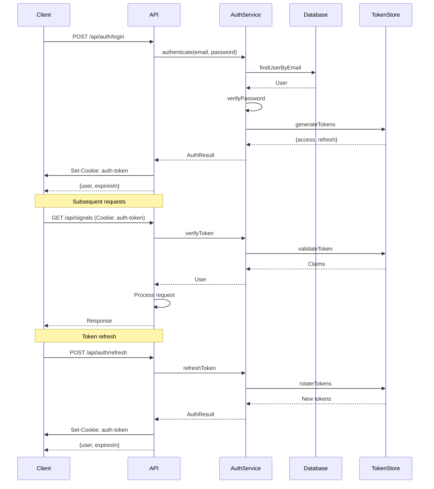

# Backend Architecture

## Service Architecture

### Controller/Route Organization

```text
src/routes/api/
├── signals/
│   ├── +server.ts           # GET /api/signals
│   ├── batch/+server.ts     # POST /api/signals/batch
│   ├── nearby/+server.ts    # GET /api/signals/nearby
│   └── heatmap/+server.ts   # GET /api/signals/heatmap
├── missions/
│   ├── +server.ts           # GET/POST /api/missions
│   └── [id]/
│       ├── +server.ts       # GET/PUT/DELETE /api/missions/:id
│       └── execute/+server.ts # POST /api/missions/:id/execute
├── hardware/
│   ├── +server.ts           # GET /api/hardware/status
│   └── [device]/
│       ├── +server.ts       # GET /api/hardware/:device
│       └── sweep/+server.ts # POST /api/hardware/:device/sweep
└── auth/
    ├── login/+server.ts     # POST /api/auth/login
    └── refresh/+server.ts   # POST /api/auth/refresh
```

### Controller Template

```typescript
// src/routes/api/signals/batch/+server.ts
import type { RequestHandler } from './$types';
import { json } from '@sveltejs/kit';
import { signalService } from '$lib/server/services/signalService';
import { signalBatchSchema } from '$lib/schemas/signal';
import { AppError, errors } from '$lib/server/errors';
import { requireAuth } from '$lib/server/middleware/auth';

export const POST: RequestHandler = async ({ request, locals }) => {
  // Authentication
  const user = await requireAuth(locals);
  
  try {
    // Parse and validate request
    const body = await request.json();
    const validation = signalBatchSchema.safeParse(body);
    
    if (!validation.success) {
      throw errors.validation(validation.error.flatten());
    }
    
    // Process signals
    const result = await signalService.processBatch(
      validation.data.signals,
      user.id
    );
    
    // Return response
    return json({
      success: true,
      processed: result.processed,
      stored: result.stored,
      duplicates: result.duplicates
    }, { status: 201 });
    
  } catch (error) {
    if (error instanceof AppError) {
      return json(
        { error: error.toJSON() },
        { status: error.statusCode }
      );
    }
    
    // Log unexpected errors
    console.error('Unexpected error in signal batch:', error);
    
    return json(
      { error: errors.internal().toJSON() },
      { status: 500 }
    );
  }
};
```

## Database Architecture

### Schema Design

```sql
-- See Database Schema section for complete SQL DDL
```

### Data Access Layer

```typescript
// lib/server/repositories/signalRepository.ts
import { db } from '$lib/server/db';
import type { Signal } from '$lib/types';
import { nanoid } from 'nanoid';

export class SignalRepository {
  async create(signal: Omit<Signal, 'id'>): Promise<Signal> {
    const id = nanoid();
    const timestamp = Date.now();
    
    // Insert into main table
    await db.prepare(`
      INSERT INTO signals (
        id, timestamp, frequency, rssi, 
        latitude, longitude, altitude, 
        drone_id, mission_id, metadata
      ) VALUES (?, ?, ?, ?, ?, ?, ?, ?, ?, ?)
    `).run(
      id,
      timestamp,
      signal.frequency,
      signal.rssi,
      signal.latitude,
      signal.longitude,
      signal.altitude,
      signal.droneId,
      signal.missionId,
      JSON.stringify(signal.metadata || {})
    );
    
    // Update spatial index is handled by trigger
    
    return { ...signal, id };
  }
  
  async findNearby(
    lat: number,
    lon: number,
    radiusMeters: number
  ): Promise<Signal[]> {
    // Convert radius to approximate degrees
    const radiusDeg = radiusMeters / 111320;
    
    // Use R-tree for efficient spatial query
    const results = await db.prepare(`
      SELECT s.* FROM signals s
      JOIN signals_spatial sp ON s.rowid = sp.id
      WHERE sp.min_lat >= ? AND sp.max_lat <= ?
        AND sp.min_lon >= ? AND sp.max_lon <= ?
        AND (
          -- Haversine formula for accurate distance
          6371000 * 2 * ASIN(SQRT(
            POWER(SIN((? - s.latitude) * PI() / 180 / 2), 2) +
            COS(? * PI() / 180) * COS(s.latitude * PI() / 180) *
            POWER(SIN((? - s.longitude) * PI() / 180 / 2), 2)
          )) <= ?
        )
      ORDER BY s.timestamp DESC
      LIMIT 1000
    `).all(
      lat - radiusDeg, lat + radiusDeg,
      lon - radiusDeg, lon + radiusDeg,
      lat, lat, lon, radiusMeters
    );
    
    return results.map(this.mapRow);
  }
  
  async createBatch(signals: Omit<Signal, 'id'>[]): Promise<{
    processed: number;
    stored: number;
    duplicates: number;
  }> {
    const tx = db.transaction(() => {
      let stored = 0;
      let duplicates = 0;
      
      for (const signal of signals) {
        try {
          this.create(signal);
          stored++;
        } catch (error) {
          if (error.code === 'SQLITE_CONSTRAINT_UNIQUE') {
            duplicates++;
          } else {
            throw error;
          }
        }
      }
      
      return { processed: signals.length, stored, duplicates };
    });
    
    return tx();
  }
  
  private mapRow(row: any): Signal {
    return {
      id: row.id,
      timestamp: new Date(row.timestamp * 1000),
      frequency: row.frequency,
      rssi: row.rssi,
      latitude: row.latitude,
      longitude: row.longitude,
      altitude: row.altitude,
      droneId: row.drone_id,
      missionId: row.mission_id,
      modulation: row.modulation,
      bandwidth: row.bandwidth,
      metadata: JSON.parse(row.metadata || '{}')
    };
  }
}

export const signalRepository = new SignalRepository();
```

## Authentication and Authorization

### Auth Flow



### Middleware/Guards

```typescript
// lib/server/middleware/auth.ts
import type { Locals } from '$lib/types';
import { errors } from '$lib/server/errors';
import { authService } from '$lib/server/services/authService';

export async function requireAuth(locals: Locals) {
  if (!locals.user) {
    throw errors.unauthorized();
  }
  
  return locals.user;
}

export async function requireRole(locals: Locals, role: string) {
  const user = await requireAuth(locals);
  
  if (!user.roles.includes(role)) {
    throw errors.forbidden();
  }
  
  return user;
}

// Hook to populate locals.user
export async function handleAuth({ event, resolve }) {
  const token = event.cookies.get('auth-token');
  
  if (token) {
    try {
      const user = await authService.verifyToken(token);
      event.locals.user = user;
    } catch {
      // Invalid token, clear it
      event.cookies.delete('auth-token');
    }
  }
  
  return resolve(event);
}

// WebSocket authentication
export function authenticateWebSocket(request: Request): string | null {
  const cookie = request.headers.get('cookie');
  if (!cookie) return null;
  
  const token = cookie
    .split(';')
    .find(c => c.trim().startsWith('auth-token='))
    ?.split('=')[1];
    
  if (!token) return null;
  
  try {
    const user = authService.verifyTokenSync(token);
    return user.id;
  } catch {
    return null;
  }
}
```
