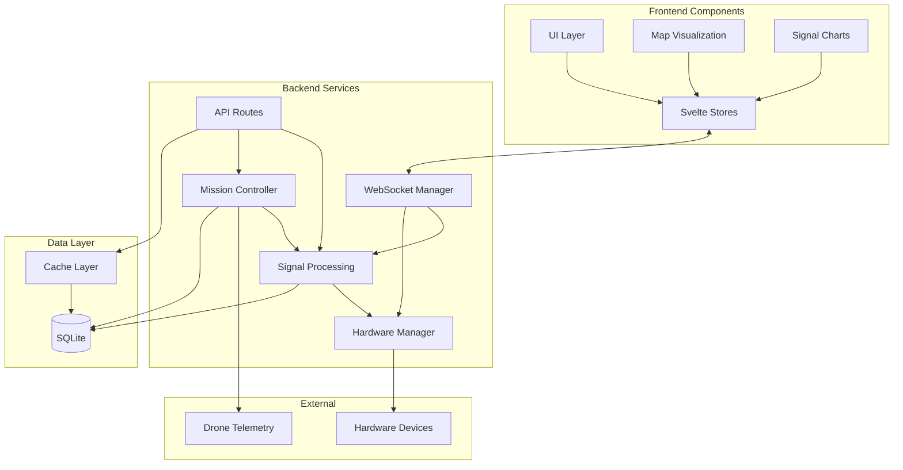

# Components

## Signal Processing Service

**Responsibility:** Processes raw RF data from hardware devices, performs signal detection, classification, and stores results

**Key Interfaces:**
- `processRawSamples(samples: Float32Array, metadata: CaptureMetadata): Signal[]`
- `detectSignals(fftData: Float32Array, threshold: number): DetectedSignal[]`
- `classifyModulation(signal: Signal): ModulationType`

**Dependencies:** Hardware Manager, Database Service, WebSocket Manager

**Technology Stack:** TypeScript, Web Audio API for FFT, SQLite for storage

## Hardware Manager

**Responsibility:** Abstracts hardware SDR devices, manages device lifecycle, handles device-specific protocols

**Key Interfaces:**
- `listDevices(): Promise<HardwareDevice[]>`
- `connect(deviceId: string): Promise<DeviceConnection>`
- `startCapture(params: CaptureParams): Observable<RawSamples>`
- `disconnect(deviceId: string): Promise<void>`

**Dependencies:** Shell script wrappers, USB drivers, Python bindings

**Technology Stack:** TypeScript service layer, Python device drivers, Shell scripts for device control

## Mission Controller

**Responsibility:** Manages mission planning, execution, and monitoring. Coordinates drone movements with signal detection

**Key Interfaces:**
- `planMission(params: MissionParams): Mission`
- `executeMission(missionId: string): Observable<MissionStatus>`
- `abortMission(missionId: string): Promise<void>`
- `calculateOptimalPath(area: Polygon, constraints: FlightConstraints): Waypoint[]`

**Dependencies:** Drone Service, Signal Processing Service, Database Service

**Technology Stack:** TypeScript, Turf.js for geospatial calculations

## WebSocket Manager

**Responsibility:** Manages real-time bidirectional communication for signal streaming and system status

**Key Interfaces:**
- `broadcast(event: string, data: any): void`
- `subscribe(event: string, handler: Function): Unsubscribe`
- `getConnectedClients(): ClientInfo[]`

**Dependencies:** Signal Processing Service, Hardware Manager

**Technology Stack:** ws library, TypeScript, event-driven architecture

## Map Visualization

**Responsibility:** Renders real-time signal data on interactive maps with heatmap overlays

**Key Interfaces:**
- `addSignal(signal: Signal): void`
- `updateHeatmap(signals: Signal[]): void`
- `drawMissionArea(area: Polygon): void`
- `animateDrone(position: Position): void`

**Dependencies:** Signal Store, Mission Store, WebSocket Manager

**Technology Stack:** Leaflet, deck.gl, Svelte components

## Component Diagrams

