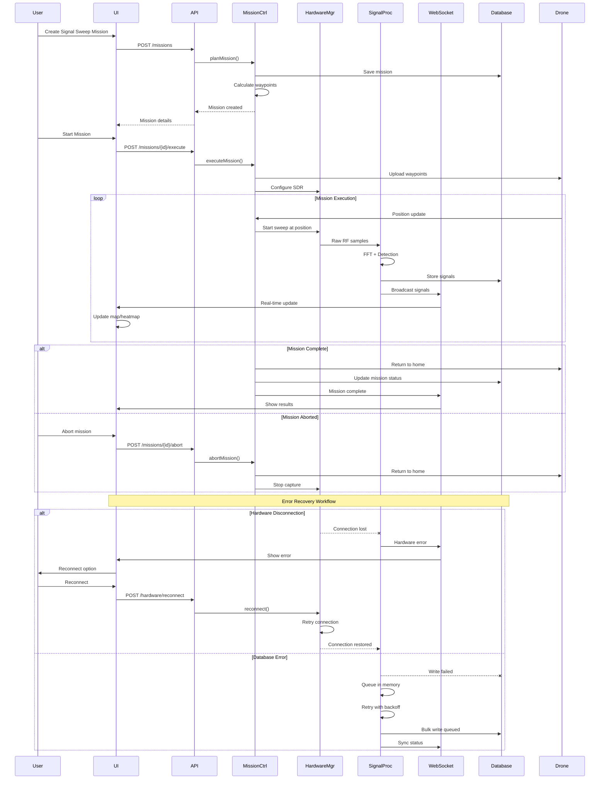

# Core Workflows

```mermaid
sequenceDiagram
    participant User
    participant UI
    participant API
    participant MissionCtrl
    participant HardwareMgr
    participant SignalProc
    participant WebSocket
    participant Database
    participant Drone

    User->>UI: Create Signal Sweep Mission
    UI->>API: POST /missions
    API->>MissionCtrl: planMission()
    MissionCtrl->>Database: Save mission
    MissionCtrl->>MissionCtrl: Calculate waypoints
    MissionCtrl-->>API: Mission created
    API-->>UI: Mission details
    
    User->>UI: Start Mission
    UI->>API: POST /missions/{id}/execute
    API->>MissionCtrl: executeMission()
    MissionCtrl->>Drone: Upload waypoints
    MissionCtrl->>HardwareMgr: Configure SDR
    
    loop Mission Execution
        Drone->>MissionCtrl: Position update
        MissionCtrl->>HardwareMgr: Start sweep at position
        HardwareMgr->>SignalProc: Raw RF samples
        SignalProc->>SignalProc: FFT + Detection
        SignalProc->>Database: Store signals
        SignalProc->>WebSocket: Broadcast signals
        WebSocket->>UI: Real-time update
        UI->>UI: Update map/heatmap
    end
    
    alt Mission Complete
        MissionCtrl->>Drone: Return to home
        MissionCtrl->>Database: Update mission status
        MissionCtrl->>WebSocket: Mission complete
        WebSocket->>UI: Show results
    else Mission Aborted
        User->>UI: Abort mission
        UI->>API: POST /missions/{id}/abort
        API->>MissionCtrl: abortMission()
        MissionCtrl->>Drone: Return to home
        MissionCtrl->>HardwareMgr: Stop capture
    end

    Note over UI,Database: Error Recovery Workflow
    alt Hardware Disconnection
        HardwareMgr--xSignalProc: Connection lost
        SignalProc->>WebSocket: Hardware error
        WebSocket->>UI: Show error
        UI->>User: Reconnect option
        User->>UI: Reconnect
        UI->>API: POST /hardware/reconnect
        API->>HardwareMgr: reconnect()
        HardwareMgr->>HardwareMgr: Retry connection
        HardwareMgr-->>SignalProc: Connection restored
    else Database Error
        SignalProc--xDatabase: Write failed
        SignalProc->>SignalProc: Queue in memory
        SignalProc->>SignalProc: Retry with backoff
        SignalProc->>Database: Bulk write queued
        SignalProc->>WebSocket: Sync status
    end
```
