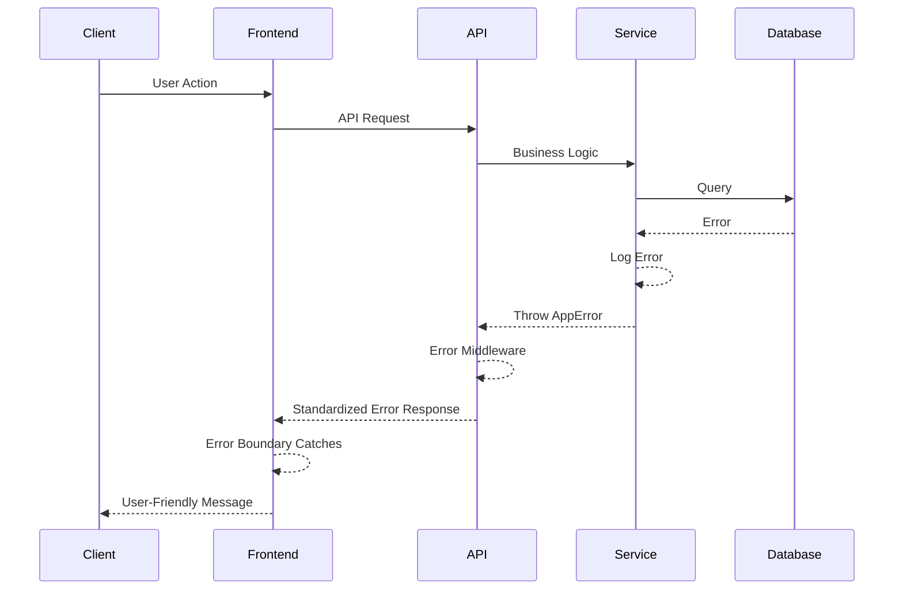

# Error Handling Strategy

## Error Flow



## Error Response Format

```typescript
interface ApiError {
  error: {
    code: string;
    message: string;
    details?: Record<string, any>;
    timestamp: string;
    requestId: string;
  };
}
```

## Frontend Error Handling

```typescript
// lib/services/errorHandler.ts
import { goto } from '$app/navigation';
import { notificationStore } from '$lib/stores/notificationStore';
import { messageQueue } from '$lib/services/messageQueue';
import { reconnectionManager } from '$lib/services/reconnectionManager';

export class FrontendErrorHandler {
  private static readonly errorMessages: Record<string, string> = {
    'AUTH_EXPIRED': 'Your session has expired. Please log in again.',
    'RATE_LIMIT_EXCEEDED': 'Too many requests. Please wait a moment.',
    'HARDWARE_DISCONNECTED': 'Hardware device disconnected. Check connections.',
    'NETWORK_ERROR': 'Connection lost. Your data will sync when reconnected.',
    'VALIDATION_ERROR': 'Please check your input and try again.',
    'WEBSOCKET_ERROR': 'Real-time connection lost. Attempting to reconnect...'
  };

  static async handleApiError(error: ApiError | Error): Promise<void> {
    // Log to monitoring service
    console.error('API Error:', error);
    
    if ('error' in error && error.error.code) {
      const userMessage = this.errorMessages[error.error.code] || error.error.message;
      
      // Handle specific error types
      switch (error.error.code) {
        case 'AUTH_EXPIRED':
          await goto('/login');
          break;
        
        case 'HARDWARE_DISCONNECTED':
          notificationStore.addError(userMessage, {
            action: { label: 'Reconnect', handler: () => window.hardwareManager.reconnect() }
          });
          break;
        
        default:
          notificationStore.addError(userMessage);
      }
    } else {
      // Generic error handling
      notificationStore.addError('An unexpected error occurred');
    }
  }

  static createErrorBoundary() {
    return {
      onError: (error: Error, errorInfo: { componentStack: string }) => {
        console.error('Component Error:', error, errorInfo);
        
        // Check if it's a known error type
        if (error.name === 'ChunkLoadError') {
          notificationStore.addError('Application update available. Please refresh.');
        } else {
          notificationStore.addError('Something went wrong. Please try again.');
        }
      }
    };
  }
}

// WebSocket Error Handler
export const wsErrorHandler = {
  CONNECTION_LOST: async () => {
    // 1. Show connection banner
    notificationStore.setConnectionStatus('reconnecting');
    // 2. Queue outgoing messages
    messageQueue.startQueuing();
    // 3. Attempt reconnection with backoff
    await reconnectionManager.reconnect();
    // 4. Replay queued messages
    await messageQueue.flush();
  },
  
  MESSAGE_FAILED: async (message: any, error: Error) => {
    if (isRetryable(error)) {
      await messageQueue.retry(message);
    } else {
      notificationStore.addError(`Failed to send: ${error.message}`);
    }
  }
};

// WebSocket reconnection manager
class ReconnectionManager {
  private reconnectAttempts = 0;
  private backoffMs = 1000;
  private maxAttempts = 5;
  
  async reconnect(): Promise<void> {
    if (this.reconnectAttempts >= this.maxAttempts) {
      // Fall back to polling
      console.log('Max reconnection attempts reached, switching to polling mode');
      await this.switchToPolling();
      return;
    }
    
    this.reconnectAttempts++;
    
    try {
      await this.attemptReconnection();
      // Success - reset counters
      this.reconnectAttempts = 0;
      this.backoffMs = 1000;
      notificationStore.setConnectionStatus('connected');
    } catch (error) {
      // Failed - try again with backoff
      setTimeout(() => {
        this.reconnect();
      }, this.backoffMs);
      
      this.backoffMs = Math.min(this.backoffMs * 2, 30000); // Cap at 30 seconds
    }
  }
  
  private async attemptReconnection(): Promise<void> {
    // Actual WebSocket reconnection logic
    const ws = new WebSocket(process.env.PUBLIC_WS_URL);
    
    return new Promise((resolve, reject) => {
      ws.onopen = () => resolve();
      ws.onerror = (error) => reject(error);
      
      // Set timeout for connection attempt
      setTimeout(() => reject(new Error('Connection timeout')), 5000);
    });
  }
  
  private async switchToPolling(): Promise<void> {
    // Implement fallback polling mechanism
    notificationStore.setConnectionStatus('polling');
    // Start polling for updates
  }
}

// Use in Svelte components
export function handleError(error: unknown): void {
  if (error instanceof Error || (error && typeof error === 'object' && 'error' in error)) {
    FrontendErrorHandler.handleApiError(error as ApiError | Error);
  } else {
    console.error('Unknown error type:', error);
    notificationStore.addError('An unexpected error occurred');
  }
}

// Helper to determine if error is retryable
function isRetryable(error: Error): boolean {
  const retryableCodes = ['NETWORK_ERROR', 'TIMEOUT', 'SERVICE_UNAVAILABLE'];
  return 'code' in error && retryableCodes.includes((error as any).code);
}
```

## Backend Error Handling

```typescript
// apps/api/src/middleware/errorHandler.ts
import { Request, Response, NextFunction } from 'express';
import { v4 as uuidv4 } from 'uuid';
import { logger } from '../utils/logger';
import { SecurityMonitor } from '../services/securityMonitor';

export class AppError extends Error {
  constructor(
    public code: string,
    public message: string,
    public statusCode: number = 500,
    public details?: Record<string, any>
  ) {
    super(message);
    this.name = 'AppError';
  }
}

export const errorHandler = (
  err: Error | AppError,
  req: Request,
  res: Response,
  next: NextFunction
) => {
  const requestId = uuidv4();
  const timestamp = new Date().toISOString();

  // Log error with context
  logger.error({
    requestId,
    error: err.message,
    stack: err.stack,
    path: req.path,
    method: req.method,
    ip: req.ip,
    userId: req.user?.id
  });

  // Track security-relevant errors
  if (err instanceof AppError) {
    if (['AUTH_FAILED', 'INVALID_TOKEN', 'RATE_LIMIT_EXCEEDED'].includes(err.code)) {
      SecurityMonitor.logEvent({
        timestamp: new Date(),
        eventType: err.code === 'RATE_LIMIT_EXCEEDED' ? 'rate_limit' : 'auth_failure',
        userId: req.user?.id,
        ip: req.ip,
        details: { path: req.path, method: req.method }
      });
    }
  }

  // Prepare error response
  const statusCode = err instanceof AppError ? err.statusCode : 500;
  const response: ApiError = {
    error: {
      code: err instanceof AppError ? err.code : 'INTERNAL_ERROR',
      message: err instanceof AppError ? err.message : 'An unexpected error occurred',
      details: err instanceof AppError ? err.details : undefined,
      timestamp,
      requestId
    }
  };

  // Don't leak internal errors in production
  if (process.env.NODE_ENV === 'production' && !(err instanceof AppError)) {
    response.error.message = 'An unexpected error occurred';
    delete response.error.details;
  }

  res.status(statusCode).json(response);
};

// Common error factories
export const errors = {
  validation: (details: Record<string, any>) => 
    new AppError('VALIDATION_ERROR', 'Invalid input data', 400, details),
  
  unauthorized: () => 
    new AppError('UNAUTHORIZED', 'Authentication required', 401),
  
  forbidden: () => 
    new AppError('FORBIDDEN', 'Insufficient permissions', 403),
  
  notFound: (resource: string) => 
    new AppError('NOT_FOUND', `${resource} not found`, 404),
  
  conflict: (message: string) => 
    new AppError('CONFLICT', message, 409),
  
  rateLimit: () => 
    new AppError('RATE_LIMIT_EXCEEDED', 'Too many requests', 429),
  
  hardware: (device: string, error: string) => 
    new AppError('HARDWARE_ERROR', `${device}: ${error}`, 503, { device }),
  
  database: (operation: string) => 
    new AppError('DATABASE_ERROR', `Database ${operation} failed`, 500),
    
  websocket: (reason: string) =>
    new AppError('WEBSOCKET_ERROR', `WebSocket error: ${reason}`, 500)
};

// Example usage in route
router.post('/api/signals/batch', async (req, res, next) => {
  try {
    const { signals } = req.body;
    
    // Validation
    const validation = signalBatchSchema.safeParse({ signals });
    if (!validation.success) {
      throw errors.validation(validation.error.flatten());
    }
    
    // Business logic
    const result = await signalService.processBatch(signals);
    
    res.status(201).json(result);
  } catch (error) {
    next(error); // Pass to error handler
  }
});
```
