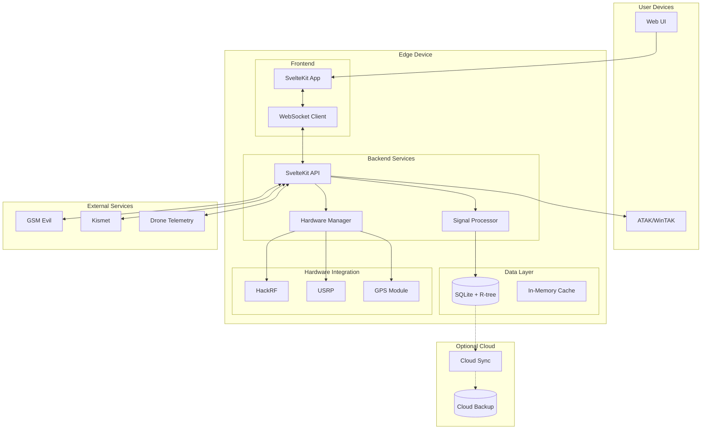

# High Level Architecture

## Technical Summary

Argos employs an edge-first deployment architecture with optional cloud services, built on SvelteKit 2.22.3 as a fullstack framework providing both frontend and backend capabilities. The system integrates hardware SDR devices through a mixed technology stack (TypeScript, Python, Shell) while maintaining real-time WebSocket connections for signal streaming. Infrastructure runs primarily on Linux edge devices with SystemD service management, using SQLite for local data persistence and optional cloud sync. This architecture achieves PRD goals of drone-based RF signal detection through evolutionary modernization of existing systems.

## Platform and Infrastructure Choice

**Platform:** Linux Edge Devices (Raspberry Pi, DragonOS)
**Key Services:** SystemD, SQLite, Node.js runtime, Python 3.9.18
**Deployment Host and Regions:** On-premise edge deployment, optional cloud backup

## Repository Structure

**Structure:** Monorepo
**Monorepo Tool:** npm workspaces (built into npm 7+)
**Package Organization:** apps/ for deployable applications, packages/ for shared code, scripts/ organized by function

## High Level Architecture Diagram

## Architectural Patterns

- **Jamstack Architecture:** Static site generation with serverless APIs - _Rationale:_ Optimal performance and edge deployment with offline capability
- **Component-Based UI:** Reusable Svelte 5 components with TypeScript - _Rationale:_ Type safety and maintainability for complex RF visualization
- **Repository Pattern:** Abstract data access logic for signals and missions - _Rationale:_ Enables future migration from SQLite if needed
- **Hardware Abstraction Layer:** Unified interface for SDR devices - _Rationale:_ Handles device-specific quirks and enables hot-swapping
- **Event-Driven Updates:** WebSocket for real-time signal streaming - _Rationale:_ Low-latency updates critical for tactical operations
- **Offline-First Design:** Service worker with background sync - _Rationale:_ Field operations often lack reliable connectivity
