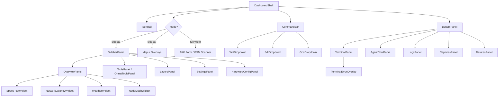

# Data Model: Lunaris Layout Structure

**Feature**: 018-lunaris-layout-structure
**Date**: 2026-02-25

## Overview

This spec is a **UI restructuring** — no database schema changes, no new API routes, no new stores. The "data model" describes the **component model**: the entities, their props/state, and relationships that drive the layout.

## Component Entities

### 1. DashboardShell

The root layout frame shared by all 11 dashboard screens.

**Props**:
| Prop | Type | Default | Description |
|------|------|---------|-------------|
| `mode` | `'sidebar' \| 'full-width'` | `'sidebar'` | Content area layout mode |
| `sidebarOpen` | `boolean` | `true` | Whether the left panel is visible (sidebar mode only) |

**Slots** (Svelte 5 snippets):
| Slot | Rendered When | Description |
|------|---------------|-------------|
| `sidebar` | `mode === 'sidebar'` | 280px left panel content |
| `content` | `mode === 'sidebar'` | Main content right of sidebar (map + overlays) |
| `fullWidthContent` | `mode === 'full-width'` | Full-width content replacing sidebar + map |
| `bottomPanel` | Always | Bottom panel (below content or full-width) |

**Internal Structure**:

```
DashboardShell
├── IconRail (48px, always rendered)
├── .shell-right (flex: 1, column)
│   ├── CommandBar (40px, always rendered)
│   ├── .content-area (flex: 1)
│   │   ├── [sidebar mode]
│   │   │   ├── .left-panel (280px, scrollable)
│   │   │   │   └── {sidebar} slot
│   │   │   └── .main-content (flex: 1)
│   │   │       └── {content} slot
│   │   └── [full-width mode]
│   │       └── .full-width (flex: 1)
│   │           └── {fullWidthContent} slot
│   └── .bottom-area
│       └── {bottomPanel} slot
```

### 2. CommandBar (TopStatusBar)

Persistent 40px horizontal bar with mission-critical status segments.

**Segments** (left to right):
| Position | Segment | Data Source | Typography |
|----------|---------|-------------|------------|
| 1 | ARGOS brand mark | Static | Fira Code 14px 600 `--primary`, letter-spacing 2 |
| 2 | Collection status | Recording state (TBD) | Red dot indicator |
| 3 | Node callsign | Config / hostname | Fira Code 12px 500, letter-spacing 1 |
| — | Spacer | — | flex: 1 |
| 4 | Network latency | `/api/system/metrics` | Fira Code 12px, signal icon |
| 5 | Mesh node count | TAK store / mesh API | Fira Code 12px, "X/Y" format |
| 6 | Weather summary | `/api/weather/current` | Fira Code 12px |
| 7 | Date | System clock | Fira Code 12px `#666666`, letter-spacing 0.5 |
| 8 | Zulu time | System clock | Fira Code 12px 600, letter-spacing 1 |

**State**:

- `openDropdown: 'wifi' | 'sdr' | 'gps' | 'weather' | null` — which dropdown is open
- Hardware data fetched from `/api/hardware/status` + `/api/hardware/details` (5s refresh)
- GPS data from `gpsStore` (real-time)
- Weather data from `/api/weather/current` (10-min polling)

### 3. BottomPanel

240px resizable tabbed panel with 5 content areas.

**Tabs**:
| Index | Label | Component | Data Source |
|-------|-------|-----------|-------------|
| 0 | Terminal | `TerminalPanel` | `terminalPanelState` store, WebSocket per session |
| 1 | Chat | `AgentChatPanel` | `/api/agent/stream` (SSE) |
| 2 | Logs | `LogsPanel` | `scripts/tmux/tmux-logs.sh` stream |
| 3 | Captures | `CapturesPanel` | `/api/signals` endpoint |
| 4 | Devices | `DevicesPanel` | `kismetStore`, `/api/kismet/devices` |

**State**:

- `activeBottomTab: string | null` — persisted in localStorage
- `bottomPanelHeight: number` — persisted, default 300px
- `mountedTabs: Set<string>` — tracks which tabs have been rendered (preserves terminal scrollback)

### 4. SidebarPanel (per-screen content)

280px left panel whose content varies by active screen.

**Screen → Panel Mapping**:
| Screen | Panel Component | Content Summary |
|--------|----------------|-----------------|
| System Overview | `OverviewPanel` | 9 metric sections (CPU, Disk, Memory, Power, Network, Hardware, Tools, Services, Events) |
| OFFNET Tools | `ToolsPanel` | 4 category cards (RECON, ATTACK, DEFENSE, UTILITIES) |
| ONNET Tools | `OnnetToolsPanel` | 2 category cards (RECON, ATTACK) |
| Map Layers | `LayersPanel` | 4 sections (Provider, Filter, Layers, Legend) |
| Settings | `SettingsPanel` | 4 category cards (Appearance, Connectivity, Hardware, Logs) |
| Hardware Config | `HardwareConfigPanel` | 3 device cards (GPS, SDR, WiFi) |
| TAK Server Config | — (full-width mode) | No sidebar |
| GSM Scanner | — (full-width mode) | No sidebar |

### 5. SidebarWidget

264px-wide self-contained data card with header/content/footer pattern.

**Shared Structure**:

```
Widget
├── .widget-header
│   ├── label (Fira Code 10px 600 --foreground-tertiary)
│   ├── spacer
│   └── close icon (12px --muted-foreground)
├── .widget-content
│   └── [type-specific content]
└── .widget-footer
    ├── status dot + quality label + timestamp
    ├── spacer
    └── refresh icon + action label (Fira Code 10px --muted-foreground)
```

**Props** (shared):
| Prop | Type | Description |
|------|------|-------------|
| `title` | `string` | Widget header label (uppercase) |
| `onClose` | `() => void` | Close/dismiss callback |
| `onAction` | `() => void` | Footer action callback (Retest, Ping, Refresh) |
| `actionLabel` | `string` | Footer action text |
| `statusDot` | `'healthy' \| 'warning' \| 'error'` | Footer status color |
| `statusLabel` | `string` | Footer status text |
| `timestamp` | `string` | Footer timestamp |

### 6. HardwareDropdown

260px-wide popup menu triggered from command bar hardware indicators.

**Shared Structure**:

```
Dropdown
├── .dropdown-title (Fira Code 10px 600 --foreground-secondary, letter-spacing 1.5)
├── .dropdown-divider (--border)
└── .dropdown-rows
    └── .dropdown-row (repeated)
        ├── label (Geist 12px --foreground-secondary)
        └── value (Fira Code 12px --foreground-bright)
```

**Types**:
| Type | Title | Row Count | Special Rows |
|------|-------|-----------|-------------|
| WiFi | "WIFI ADAPTER" | 7 | "Used by" value in `--status-healthy` 600 weight |
| SDR | "SOFTWARE DEFINED RADIO" | 6 | "Used by" value in `--status-healthy` 600 weight |
| GPS | "GPS RECEIVER" | 8 | "Fix" value color-coded, divider before Device/Protocol |

### 7. TerminalErrorOverlay

Conditional overlay rendered within the terminal content area when WebSocket connection fails.

**Props**:
| Prop | Type | Description |
|------|------|-------------|
| `errorMessage` | `string` | Descriptive error text |
| `recoveryCommand` | `string` | Suggested recovery command |
| `onRecovery` | `() => void` | Recovery action callback |

**Rendered when**: Terminal WebSocket connection fails after max retry attempts.

## State Transitions

### GSM Scanner States

```
[No scan data] → EMPTY
[Scan started or results exist] → ACTIVE
[User toggles expand] → EXPANDED
[User exits expand] → ACTIVE
[Scan cleared] → EMPTY
```

### Terminal Connection States

```
[WebSocket open] → CONNECTED (normal terminal)
[WebSocket close + retrying] → RECONNECTING (show reconnecting indicator)
[Max retries exceeded] → ERROR (show TerminalErrorOverlay)
[User clicks recovery] → RECONNECTING → CONNECTED
```

### Content Area Mode States

```
[activeView = 'map' | tools | etc.] → SIDEBAR mode
[activeView = 'tak-config'] → FULL-WIDTH mode (TAK form)
[activeView = 'gsm-evil'] → FULL-WIDTH mode (GSM scanner)
[ESC key or back button] → SIDEBAR mode (return to map)
```

## Relationships


