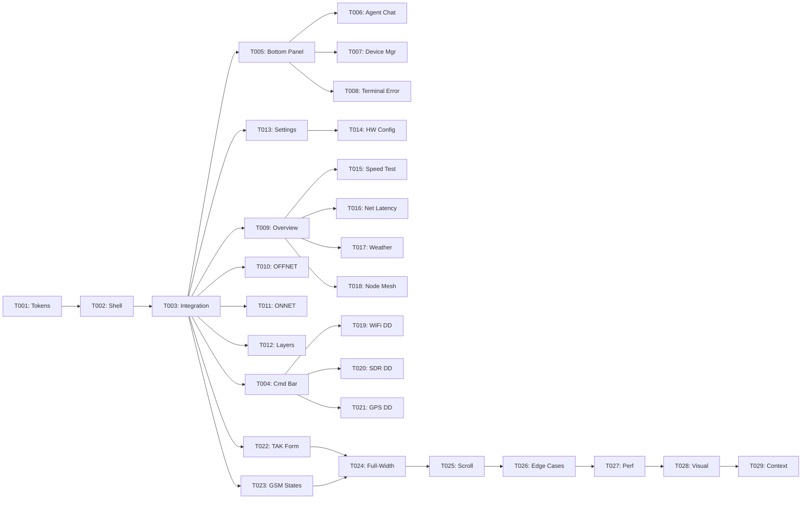

# Implementation Plan: Lunaris Layout Structure

**Branch**: `018-lunaris-layout-structure` | **Date**: 2026-02-25 | **Spec**: [spec.md](./spec.md)
**Input**: Rebuild Svelte component templates to match pencil-lunaris.pen mockup structures — sidebar content, command bar, bottom panel, screen-specific layouts, widgets, panels, and dropdowns.

## Summary

Spec-017 replaced the visual tokens (colors, fonts, shadows). This spec replaces the structural templates — the actual Svelte markup, content hierarchy, and layout slots — to match the pencil-lunaris.pen mockups pixel-for-pixel.

**Technical approach**: Refactor the dashboard page (`+page.svelte`) to use a shared shell component with two content modes (sidebar/full-width), rebuild the command bar segment order, restructure bottom panel tabs, and create new screen-specific sidebar content components, widgets, and hardware dropdowns. All changes are template/markup only — no new API routes, no backend changes, no new stores.

## Technical Context

**Language/Version**: TypeScript 5.x (strict mode), Svelte 5 (runes)
**Primary Dependencies**: SvelteKit 2, Tailwind CSS v4, MapLibre GL, xterm.js, ws (WebSocket)
**Storage**: N/A (no schema changes — UI restructuring only)
**Testing**: Vitest (unit), Playwright (E2E), svelte-check (type validation)
**Target Platform**: Chromium on Raspberry Pi 5 (Kali Linux, 8GB RAM, ARM64)
**Project Type**: Web (SvelteKit monolith — client + server in one repo)
**Performance Goals**: Initial load < 3s, tab switch < 100ms, WebSocket msg < 16ms, no layout jank on resize
**Constraints**: < 200MB heap, < 15% CPU, 1920×1080 primary viewport, dark mode only
**Scale/Scope**: 11 dashboard screens, ~100 component files, ~9K lines in dashboard tree

## Constitution Check

_GATE: Must pass before Phase 0 research. Re-check after Phase 1 design._

| Article                 | Gate                                          | Status   | Notes                                                     |
| ----------------------- | --------------------------------------------- | -------- | --------------------------------------------------------- |
| 1.1 Comprehension Lock  | End state, current state, constraints defined | ✅ PASS  | Spec defines all 11 screens, 22 FRs, 15 SCs               |
| 1.2 Codebase Inventory  | Existing implementations surveyed             | ✅ PASS  | Full inventory below (100 files, 9K lines)                |
| 2.1 TypeScript Strict   | No `any`, no `@ts-ignore`                     | ✅ GATE  | Template-only changes — no new types expected             |
| 2.2 Modularity          | Max 300 lines/file, 50 lines/function         | ✅ GATE  | New components will be small; split if exceeding          |
| 2.3 Naming              | kebab-case files, PascalCase components       | ✅ GATE  | All new files follow convention                           |
| 2.5 Documentation       | JSDoc for public functions                    | ✅ GATE  | Layout components have minimal logic — JSDoc where needed |
| 2.6 Forbidden           | No barrel files, no hardcoded hex             | ⚠️ WATCH | Spec references specific hex values — must map to tokens  |
| 3.1 Test-First          | Tests before/alongside implementation         | ✅ GATE  | Component state tests for each new component              |
| 4.1 Lunaris Design      | Matches pencil-lunaris.pen                    | ✅ CORE  | This spec's entire purpose                                |
| 4.3 State Communication | All states handled                            | ✅ GATE  | Empty, Loading, Error, Default for each panel             |
| 5.1 Real-Time           | WebSocket < 16ms, interaction < 100ms         | ✅ GATE  | No new WebSocket logic — layout only                      |
| 5.2 Load                | Initial load < 3s                             | ✅ GATE  | Lazy-load screen-specific panels                          |
| 5.3 Resources           | < 200MB heap                                  | ✅ GATE  | No new stores or data fetching                            |
| 9.1 Spec-Kit            | spec.md → plan.md → tasks.md                  | ✅ PASS  | This document                                             |
| 9.2 Task Granularity    | 5 min–2 hr, ≤5 files per task                 | ✅ GATE  | Tasks will be phased by component group                   |

### Hex-to-Token Mapping (Article 2.6 Compliance)

The spec references ~15 unique hex values from the .pen mockup. These must map to existing Lunaris design tokens (from spec-017) or be added as new tokens in `src/app.css`:

| Hex Value   | Lunaris Token                                      | Usage                                           |
| ----------- | -------------------------------------------------- | ----------------------------------------------- |
| `#111111`   | `var(--background)`                                | Page/input backgrounds                          |
| `#151515`   | `var(--card-elevated)` or new `--surface-elevated` | Widget/form card fills                          |
| `#1A1A1A`   | `var(--card)`                                      | Card backgrounds, dropdown fills, panel headers |
| `#1E1E1E`   | `var(--card-hover)` or new `--surface-hover`       | Selected row, active filter fills               |
| `#181818`   | `var(--muted)` or new `--surface-header`           | Table header rows                               |
| `#2E2E2E`   | `var(--border)`                                    | Borders everywhere                              |
| `#0D0D0D`   | new `--surface-inset`                              | GSM empty result area                           |
| `#0A0A0A`   | new `--surface-terminal`                           | Terminal-like body areas                        |
| `#0E1116E6` | new `--overlay-backdrop`                           | Terminal error overlay                          |
| `#809AD0`   | `var(--primary)`                                   | Accent (brand, active state, save buttons)      |
| `#4A8AF4`   | new `--interactive` or map to `--primary`          | Interactive blue (Device Manager, Chat send)    |
| `#8BBFA0`   | `var(--healthy)` or `--status-healthy`             | Healthy/connected status, "Used by" values      |
| `#D4A054`   | `var(--warning)` or `--status-warning`             | Warning, weather sunrise/sunset                 |
| `#C45B4A`   | `var(--error-muted)` or `--status-error-muted`     | Offline/error in panels                         |
| `#FF5C33`   | `var(--destructive)`                               | High-vis error                                  |
| `#555555`   | `var(--muted-foreground)`                          | Inactive icons, placeholder text                |
| `#666666`   | existing `--muted-foreground` variant              | Date text, footer actions                       |
| `#888888`   | new `--foreground-secondary`                       | Labels, section headers                         |
| `#999999`   | new `--foreground-tertiary`                        | Widget header labels                            |
| `#BBBBBB`   | existing or new `--foreground-muted`               | Panel titles                                    |
| `#DDDDDD`   | `var(--foreground)`                                | Primary text, error titles                      |
| `#FFFFFF`   | `var(--foreground-bright)`                         | Values, data text                               |

**Decision**: New surface tokens (`--surface-elevated`, `--surface-hover`, `--surface-header`, `--surface-inset`, `--surface-terminal`, `--overlay-backdrop`) and foreground tokens (`--foreground-secondary`, `--foreground-tertiary`) will be added to `src/app.css` in Phase 1 (Token Extension task). The `#4A8AF4` interactive blue will be investigated — it may be the accent color at a different lightness or a dedicated interactive token.

## Codebase Inventory

### Files to Modify (Existing)

| File                                                              | Lines                | Role                     | Changes                                                                                  |
| ----------------------------------------------------------------- | -------------------- | ------------------------ | ---------------------------------------------------------------------------------------- |
| `src/routes/dashboard/+page.svelte`                               | 223                  | Root layout orchestrator | Extract shell into shared component, add sidebar/full-width mode switching               |
| `src/lib/components/dashboard/TopStatusBar.svelte`                | 280                  | Command bar              | Restructure segment order to match FR-002, add brand mark, collection status, mesh count |
| `src/lib/components/dashboard/IconRail.svelte`                    | 254                  | Icon navigation rail     | Minor: tab order may need reordering (Devices moves to bottom panel)                     |
| `src/lib/components/dashboard/PanelContainer.svelte`              | 276                  | Sidebar panel host       | Refactor to enforce 280px left sidebar with independent scroll (FR-016)                  |
| `src/lib/components/dashboard/ResizableBottomPanel.svelte`        | 217                  | Bottom panel frame       | Restructure tab order: Terminal, Chat, Logs, Captures, Devices (FR-005)                  |
| `src/routes/dashboard/BottomPanelTabs.svelte`                     | 229                  | Tab bar                  | Rename tabs, reorder, add Captures tab                                                   |
| `src/lib/components/dashboard/panels/overview/`                   | 5 files, ~900 lines  | System Overview cards    | Restructure to match FR-003/FR-004 section order and hero metrics                        |
| `src/lib/components/dashboard/panels/ToolsPanel.svelte`           | 17 lines             | Tools category view      | Add OFFNET/ONNET distinction (FR-007/FR-008)                                             |
| `src/lib/components/dashboard/panels/LayersPanel.svelte`          | 231 lines            | Map layers controls      | Restructure to 4-section layout (FR-009)                                                 |
| `src/lib/components/dashboard/panels/SettingsPanel.svelte`        | 296 lines            | Settings categories      | Restructure to 4 category cards (FR-010)                                                 |
| `src/lib/components/dashboard/panels/devices/DevicesPanel.svelte` | 172 lines            | Kismet device table      | Rebuild as toolbar + 8-column table (FR-020)                                             |
| `src/lib/components/dashboard/AgentChatPanel.svelte`              | 270 lines            | Agent chat interface     | Restructure to header/body/input layout (FR-021)                                         |
| `src/lib/components/dashboard/TerminalPanel.svelte`               | 256 lines            | Terminal sessions        | Add error overlay state (FR-022)                                                         |
| `src/lib/components/dashboard/tak/TakConfigView.svelte`           | 247 lines            | TAK config form          | Rebuild as full-width 7-section form (FR-019)                                            |
| `src/routes/gsm-evil/+page.svelte`                                | 350+ lines           | GSM scanner page         | Restructure for 3 layout states (FR-014)                                                 |
| `src/lib/components/dashboard/status/`                            | 7 files, ~1.4K lines | Hardware dropdowns       | Rebuild WiFi/SDR/GPS dropdowns (FR-013)                                                  |
| `src/app.css`                                                     | ~400 lines           | Design tokens            | Add new surface/foreground tokens                                                        |
| `src/lib/styles/dashboard.css`                                    | 129 lines            | Dashboard layout CSS     | Update layout dimensions and flex patterns                                               |

### Files to Create (New)

| File                                                               | Purpose                                               | Estimated Lines |
| ------------------------------------------------------------------ | ----------------------------------------------------- | --------------- |
| `src/lib/components/dashboard/DashboardShell.svelte`               | Shared shell: icon rail + command bar + content modes | ~120            |
| `src/lib/components/dashboard/panels/OnnetToolsPanel.svelte`       | ONNET Tools sidebar (FR-008)                          | ~80             |
| `src/lib/components/dashboard/panels/HardwareConfigPanel.svelte`   | Hardware Config sub-panel (FR-011)                    | ~120            |
| `src/lib/components/dashboard/widgets/SpeedTestWidget.svelte`      | Speed Test widget (FR-012)                            | ~80             |
| `src/lib/components/dashboard/widgets/NetworkLatencyWidget.svelte` | Network Latency widget (FR-012)                       | ~80             |
| `src/lib/components/dashboard/widgets/WeatherWidget.svelte`        | Weather widget (FR-012)                               | ~80             |
| `src/lib/components/dashboard/widgets/NodeMeshWidget.svelte`       | Node Mesh widget (FR-012)                             | ~100            |
| `src/lib/components/dashboard/TerminalErrorOverlay.svelte`         | Terminal error state (FR-022)                         | ~60             |
| `src/lib/components/dashboard/panels/CapturesPanel.svelte`         | Captures tab content (new tab)                        | ~80             |

### Files Unchanged (Confirmed No-Touch)

| File                                                      | Reason                                    |
| --------------------------------------------------------- | ----------------------------------------- |
| All `src/routes/api/**`                                   | No API changes (spec scope boundary)      |
| All `src/lib/server/**`                                   | No backend changes                        |
| All `src/lib/stores/**`                                   | No new stores — layout restructuring only |
| `src/lib/components/dashboard/DashboardMap.svelte`        | Map rendering unchanged                   |
| `src/lib/components/dashboard/map/`                       | Map overlays unchanged                    |
| `src/lib/components/dashboard/terminal/terminal-theme.ts` | Terminal colors unchanged                 |
| `src/hooks.server.ts`                                     | Auth/security unchanged                   |

## Project Structure

### Documentation (this feature)

```text
specs/018-lunaris-layout-structure/
├── spec.md              # Feature specification (complete)
├── plan.md              # This file
├── research.md          # Phase 0 output
├── data-model.md        # Phase 1 output (component model, not DB)
├── quickstart.md        # Phase 1 output
├── contracts/           # Phase 1 output (component contracts)
│   ├── dashboard-shell.md
│   ├── command-bar.md
│   ├── bottom-panel.md
│   ├── sidebar-panels.md
│   ├── widgets.md
│   └── dropdowns.md
├── checklists/
│   └── requirements.md  # Quality checklist (complete)
└── tasks.md             # Phase 2 output (NOT created by /speckit.plan)
```

### Source Code (repository root)

```text
src/
├── app.css                                      # Token extensions (surface/foreground)
├── lib/
│   ├── styles/
│   │   └── dashboard.css                        # Layout dimension updates
│   ├── components/
│   │   └── dashboard/
│   │       ├── DashboardShell.svelte            # NEW: Shared shell (icon rail + cmd bar + content slots)
│   │       ├── TopStatusBar.svelte              # MODIFY: Command bar segment restructure
│   │       ├── IconRail.svelte                  # MODIFY: Minor tab reordering
│   │       ├── PanelContainer.svelte            # MODIFY: 280px sidebar + scroll isolation
│   │       ├── ResizableBottomPanel.svelte      # MODIFY: Tab reorder + Captures tab
│   │       ├── TerminalPanel.svelte             # MODIFY: Error overlay integration
│   │       ├── TerminalErrorOverlay.svelte      # NEW: Error state overlay
│   │       ├── AgentChatPanel.svelte            # MODIFY: Header/body/input layout
│   │       ├── panels/
│   │       │   ├── overview/                    # MODIFY: Hero metrics + section reorder
│   │       │   ├── ToolsPanel.svelte            # MODIFY: OFFNET 4-card layout
│   │       │   ├── OnnetToolsPanel.svelte       # NEW: ONNET 2-card layout
│   │       │   ├── LayersPanel.svelte           # MODIFY: 4-section layout
│   │       │   ├── SettingsPanel.svelte         # MODIFY: 4 category cards
│   │       │   ├── HardwareConfigPanel.svelte   # NEW: Hardware sub-panel
│   │       │   ├── devices/DevicesPanel.svelte  # MODIFY: Toolbar + 8-col table
│   │       │   └── CapturesPanel.svelte         # NEW: Captures tab content
│   │       ├── widgets/
│   │       │   ├── SpeedTestWidget.svelte       # NEW
│   │       │   ├── NetworkLatencyWidget.svelte  # NEW
│   │       │   ├── WeatherWidget.svelte         # NEW
│   │       │   └── NodeMeshWidget.svelte        # NEW
│   │       ├── status/                          # MODIFY: Dropdown restructure
│   │       └── tak/TakConfigView.svelte         # MODIFY: Full-width 7-section form
│   └── ...
├── routes/
│   ├── dashboard/
│   │   ├── +page.svelte                         # MODIFY: Use DashboardShell, mode switching
│   │   └── BottomPanelTabs.svelte               # MODIFY: Tab reorder + rename
│   └── gsm-evil/
│       └── +page.svelte                         # MODIFY: 3-state layout
└── ...

tests/
├── unit/
│   └── components/
│       ├── dashboard-shell.test.ts              # NEW
│       ├── command-bar.test.ts                   # NEW
│       ├── bottom-panel-tabs.test.ts             # NEW
│       └── widgets/                              # NEW
└── ...
```

**Structure Decision**: SvelteKit monolith (no structural changes to project layout). New components go into existing `src/lib/components/dashboard/` tree. New `widgets/` subdirectory created for the 4 sidebar widget components. Tests alongside source in `tests/unit/components/`.

## Implementation Phases

### Phase 0: Token Extension & Shell Foundation

**Goal**: Extend the Lunaris design token set and create the shared DashboardShell component.

1. **T001 — Token Extension**: Add ~10 new CSS custom properties to `src/app.css` for surface levels, foreground shades, and overlay backdrop. Update `src/lib/styles/palantir-design-system.css` bridge if needed.
2. **T002 — DashboardShell Component**: Extract the shell layout (icon rail + command bar + content area) from `+page.svelte` into a reusable `DashboardShell.svelte` with two content modes:
    - `sidebar` mode: 280px left panel slot + fill-width right (map + bottom panel)
    - `full-width` mode: entire content area as a single slot
3. **T003 — Shell Integration**: Refactor `+page.svelte` to use DashboardShell. All existing functionality must pass through unchanged.

### Phase 1: Command Bar & Bottom Panel

**Goal**: Restructure the two shared horizontal bars that appear on every screen.

4. **T004 — Command Bar Restructure**: Rebuild `TopStatusBar.svelte` segment order to match FR-002: ARGOS brand → collection status → node callsign → spacer → latency → mesh count → weather → date → Zulu time.
5. **T005 — Bottom Panel Tab Reorder**: Update `BottomPanelTabs.svelte` and `ResizableBottomPanel.svelte`: rename tabs to Terminal/Chat/Logs/Captures/Devices, reorder, add Captures tab placeholder.
6. **T006 — Agent Chat Layout**: Restructure `AgentChatPanel.svelte` to header/body/input three-part layout per FR-021.
7. **T007 — Device Manager Layout**: Restructure `DevicesPanel.svelte` to toolbar + 8-column table per FR-020.
8. **T008 — Terminal Error Overlay**: Create `TerminalErrorOverlay.svelte` and integrate into `TerminalPanel.svelte` per FR-022.

### Phase 2: Sidebar Panel Restructuring

**Goal**: Rebuild all screen-specific left panel content.

9. **T009 — System Overview Sidebar**: Restructure overview panel components to match FR-003/FR-004: hero metrics, progress bars, correct section order.
10. **T010 — OFFNET Tools Panel**: Restructure `ToolsPanel.svelte` with 4 category cards (FR-007).
11. **T011 — ONNET Tools Panel**: Create `OnnetToolsPanel.svelte` with 2 category cards (FR-008).
12. **T012 — Map Layers Panel**: Restructure `LayersPanel.svelte` to 4-section layout (FR-009).
13. **T013 — Settings Panel**: Restructure `SettingsPanel.svelte` to 4 category cards (FR-010).
14. **T014 — Hardware Config Panel**: Create `HardwareConfigPanel.svelte` sub-panel (FR-011).

### Phase 3: Widgets & Dropdowns

**Goal**: Create the 4 sidebar widgets and 3 hardware dropdown menus.

15. **T015 — Speed Test Widget**: Create `SpeedTestWidget.svelte` per FR-012.
16. **T016 — Network Latency Widget**: Create `NetworkLatencyWidget.svelte` per FR-012.
17. **T017 — Weather Widget**: Create `WeatherWidget.svelte` per FR-012.
18. **T018 — Node Mesh Widget**: Create `NodeMeshWidget.svelte` per FR-012.
19. **T019 — WiFi Dropdown**: Restructure WiFi dropdown per FR-013.
20. **T020 — SDR Dropdown**: Restructure SDR dropdown per FR-013.
21. **T021 — GPS Dropdown**: Restructure GPS dropdown per FR-013.

### Phase 4: Full-Width Screens & GSM States

**Goal**: Implement the two full-width content mode screens and GSM scanner states.

22. **T022 — TAK Server Config Form**: Rebuild `TakConfigView.svelte` as full-width 7-section form (FR-019).
23. **T023 — GSM Scanner States**: Restructure `gsm-evil/+page.svelte` for 3 layout states: empty, active, expanded (FR-014).
24. **T024 — Full-Width Mode Integration**: Wire TAK Config and GSM Scanner into the shell's full-width mode. Verify sidebar hides on these screens.

### Phase 5: Polish & Verification

**Goal**: Cross-cutting polish, scroll behavior, responsive edge cases, performance validation.

25. **T025 — Sidebar Scroll Isolation**: Ensure sidebar scrolls independently (FR-016), no map/bottom panel interference.
26. **T026 — Layout Edge Cases**: Handle narrow viewports, long callsigns, collapsed bottom panel, no-hardware states (edge cases from spec).
27. **T027 — Performance Validation**: Verify < 3s load, < 100ms tab switch, < 200MB heap on RPi 5.
28. **T028 — Visual Regression**: Compare each screen against pencil-lunaris.pen mockups. Screenshot-based verification.
29. **T029 — Agent Context Update**: Run `.specify/scripts/bash/update-agent-context.sh claude` to sync CLAUDE.md.

## Risk Assessment

| Risk                                                 | Likelihood | Impact | Mitigation                                                                        |
| ---------------------------------------------------- | ---------- | ------ | --------------------------------------------------------------------------------- |
| Shell extraction breaks existing layout              | Medium     | High   | T003 is a pure refactor — run full test suite before proceeding                   |
| New tokens conflict with spec-017 palette themes     | Low        | Medium | All 13 palettes only override `--primary`; surface tokens are palette-independent |
| Bottom panel tab reorder breaks terminal persistence | Medium     | High   | `mountedTabs` Set preserves state across tab switches — verify after T005         |
| GSM Evil iframe isolation complicates layout modes   | Medium     | Medium | GSM Evil page is a separate route — shell mode only affects the `/dashboard` page |
| Heap budget exceeded with new widget components      | Low        | High   | Widgets are lightweight (no stores, no fetching) — just presentational markup     |
| File size limits exceeded (300 lines)                | Medium     | Low    | Split large components into sub-components proactively                            |

## Complexity Tracking

No constitution violations anticipated. All new components are small presentational Svelte files (< 120 lines each). The largest refactoring task (T003 — Shell Integration) modifies one file (`+page.svelte`) and can be verified immediately via `npm run build`.

## Dependencies



**Parallelization opportunities**: After T003 completes, Phases 1–3 (T004–T021) can be parallelized. T004/T005 (bars) are independent of T009–T014 (sidebars), which are independent of T015–T021 (widgets/dropdowns). Phase 4 (T022–T024) depends on the shell but not on other phases.
